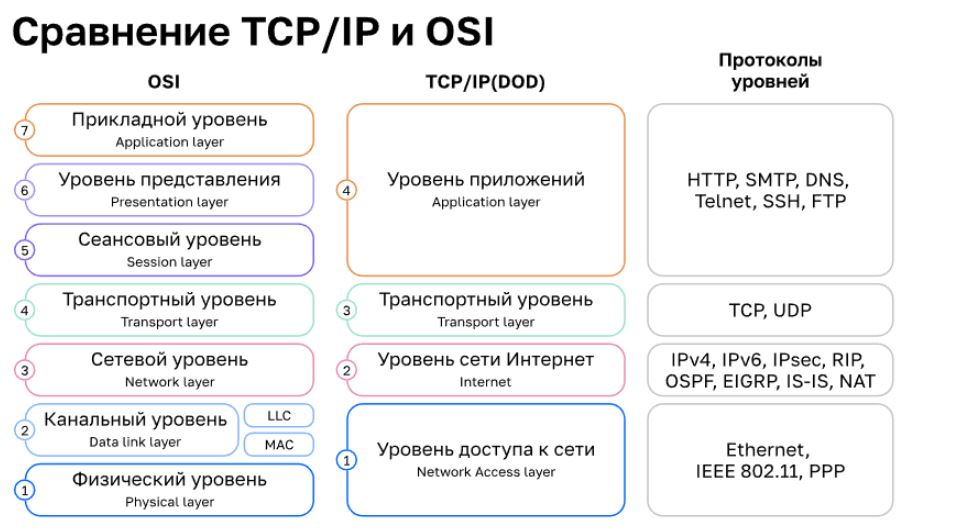

# Уровни представления информации

* физический уровень - витые пары и хабы (биты и боды)
* канальный уровень - стевые карты и коммутаторы (кадр)
* сетевой уровень - IP адреса, маршрутизатор, IP протоколы (пакеты)
* транспортный уровень - контрл передачи и доставки данных - протколы TCP/UDP (сегмент/датаграмма)
* сеансовый уровень - поддержание сеанса связи. завершение по времени H.245, NetBios
* уровень представления - формат данных. ASCII,EBCDIC.  JPG, TXT, EXE (файл)
* прикладной - доступ к сетевым службам SSH, HTTP, DHS, Telnet

## Канальный уровень
\

 Коммутатор

 Маршрутизатор
