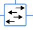
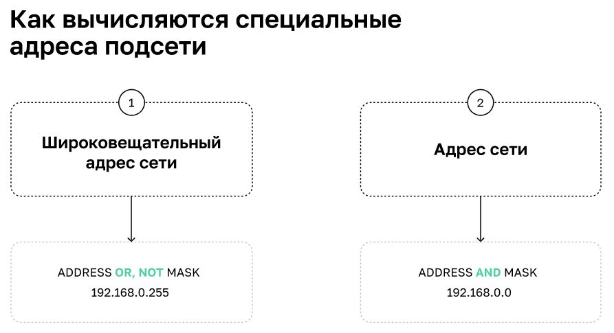

# Уровни представления информации


* физический уровень - витые пары и хабы (биты и боды) **L1**
* канальный уровень - стевые карты и коммутаторы (кадр) **L2**
* сетевой уровень - IP адреса, маршрутизатор, IP протоколы (пакеты) **L3**
* транспортный уровень - контрл передачи и доставки данных - протколы TCP/UDP (сегмент/датаграмма) **L4**
* сеансовый уровень - поддержание сеанса связи. завершение по времени H.245, NetBios **L5**
* уровень представления - формат данных. ASCII,EBCDIC.  JPG, TXT, EXE (файл)
* прикладной - доступ к сетевым службам SSH, HTTP, DHS, Telnet


# Физический уровень - L1
на физическом уровен могут воникать коллизии - устройства пеердают данные в среду пеердачи одновременно

# Канальный уровень L2 - MAC-адреса, карды
**Протоколы ARP, Ethernet, STP**
Канальный уровень обеспечивает связь в одном сегменте сети где устройства "физически" связаны
"Физически" - алегория один сегмент сети может образован логически путем виланов. Но в одном сегменте сети нет маршрутизаторов

Канальный уровень решаемые проблемы
* Обнаружение ошибок физического уровня
* Одновременная передача данных разным устройствам
* Аппаратная адресация


Какой трафик Broadcast- всем кто в сети, Unicast - конкретному узлу, Multycast - нескольким узлам


 Хаб - раздает потоки всем

 Коммутатор

 Маршрутизатор

**Канальный уровень - L2 - протокол ETHERNET IEEE 802.3 - передача кадрами


ETHERNET - в рамках одного сегмента сети - адерсация по MAC адресам

**MTU - max transmition unit Максимальный размер кадра**


### Цель разделения сети на сегменты 
* Оптимизациясетевого трафика
* и/или Повышение безопасности сети

Когда возникает необходимость разделить сеть на сегменты, а также в интернете - нужна двухуровневая адресация (по MAC адерсу и по IP)\
Также нужен маршрутизатор\
Address Resolution Protocol - ARP -протокол опеределения адреса - сопоставления MAC и IP\
Таблица ARP хранится на компе\


`ip` - утилита для работы с канальным уровнем\
`ip link` - постомтерь сетевые интерфейсф иих физические (канальные) адреса\
`p neigh show dev eth1` - посмотреть ARP таблицу в ответеЖ\
*REACHABLE* - связь недавно была адрес, `lladdres` - link layer addres\
*STAIL* - запись желательно проверить
*FAILD* - не нашли узел
`ip neigh add 192.168.11.100 lladdr 00:00:00:00:00:AA dev eth1` - добавить запись в ARP таблицу для конкретного интерфейса\
`ip neighb del 192.168.11.100 dev eth1` - удалить.
*PERMANENT* - статическая запись ее нужно удалять в ручную, сама не удалится

Тамже с таблицей можно работать с помощью утилиты ARP. Для этого утанавливаем пакет **nettools**\
`arp -i eth1` - посмотерть таблицу\
`arp -s 192.168.11.100 00:00:00:00:00:AA` - добавить соответствие\
`arp -d 192.168.11.100` - удалить соответсвие

`arping` - утилита для отправки запросов на устройства в обход ограничений ICMP. Работает внутри одного сегмента сети\
`sudo arping -c 1 -I eth0 10.0.2.3`

`tcpdump` - анализ трафика проходящего через сетевой интерфейс\
`tcpdump -i any arp -nn -v -A -e`


**Broadcast шторм - зацикленная циркуляция широковещательных сообщений - возникает при закольцевании коммутаторов**\
для анализа циркуляции широковещательных запросов можно воспользоваться `tcpdump`
`Spanning Tree Protocol (STP)` - протокол остовного дерева - предотвращает развитие широковещательного шторма, работает на какальном уровне, устраняет петли в сети\
STP - можно использовать для резервирвоания - но не очень удобно - он меделнный

`Virtual Local Area Network (VLAN)` - технология в логического разделения сетей в одном коммутатора. Взаимодействие сетей идет через маршрутизатор\
\
физический канал, который объединяет несколько vlan - называется trunk\
с помощью vlan можно строить сегменты сетей независимо от физической структуры

### Настройка vlan на сетевом интерфейсе Linux. за него отвечает модуль ядра 8021q
1. Загружаем модуль ядра 8021q\
2. Создаём новый виртуальный интерфейс с нужной меткой\
3. Назначаем IP-адрес\
4. Поднимаем интерфейс\
5. После работы удаляем его

```bash
smod | grep 8021q
sudo modprobe 8021q # если появляется ошибка “Maybe you need to load the 8021q module"
ip link add link eth0 name eth0.10 type vlan id 10
ip -d link show eth0.10# ip addr add 192.168.1.200/24 brd 192.168.1.255 dev eth0.10
ip link set dev eth0.10 up

ip link set dev eth0.10 down
ip link delete eth0.10
```
чтобы vlan сохранился после перезагрузки:
1. Включаем загрузку модуля ядра 8021q при старте системы (echo 8021q >> /etc/modules-load.d/8021q.conf)
2. Создаём новую автоматическую конфигурацию виртуального интерфейса с нужной меткой:\
    для Debian через конфигурацию /etc/network/interfaces\
    CentOS через создание конфигурации в /etc/sysconfig/network-scripts/ifcfg-vlan**\
    Ubuntu (с 17.10 версии) через редактирование /etc/netplan/*.yaml\
      ifcfg-vlan** — необходимая метка\
      
      ```bash
      # nano /etc/netplan/01-netcfg.yaml
      network:
        version: 2
          ethernets:
            eth0:
            dhcp4: true
        vlans:
          vlan200:
            id: 200
            link: eth0
            dhcp4: no
            addresses: [192.168.200.2/24]
            gateway4: 192.168.200.1
            routes:
              - to: 192.168.100.1/24
              via: 192.168.200.3
              on-link: true
       ```


# Сетевой уровень L3 - ip адресация, пакеты
**Протоколы IPv4 (RFC 791), IPv6, ICMP**
**На L3 работатю маршрутизаторы**

Решаемые проблемы
* Логическая адресация
* Построение маршрутов между сетями
* Диагностика сети

Назначение IPv4
* Логическая адресация хостов на основе IP-адреса
* Инкапсуляция данных вышестоящих протоколов
* Маршрутизация данных между хостами
* Фрагментация IP-пакетов

* Не устанавливает соединение
* Не гарантирует доставку
* Не обеспечивает сохранение последовательности данных при передаче
* Не устраняет возможное дублирование пакетов

IP адрес состоит из 2х частей: адрес сети и адрес хоста
Сейчас используется CIRD Classless Inter- Domain Routing - без классовая доменная машрутизация


        vagrant@vagrant:~$ ip -4 addr show eth0
        2: eth0: <BROADCAST,MULTICAST,UP,LOWER_UP> mtu 1500 qdisc fq_codel state UP
        group default qlen 1000
            inet 10.0.2.15/24 brd 10.0.2.255 scope global dynamic eth0
                valid_lft 49201sec preferred_lft 49201sec

## Арес сети и маска CIDR
для вычисления адреса сети и хоста есть специальная утилита\
`ipcalc 192.168.0.10/24`

* В каждой сети должны присутствовать два особых адреса: адрес сети и широковещательный адрес, на который будут рассылаться broadcast-запросы
* Маска подсети позволяет вычислять адрес сети и широковещательный адрес. Всё адресное пространство между этими адресами будет ёмкостью сегмента
* Существует большое количество специальных диапазонов IP-адресов. Для создания локальных сетей используют диапазоны 192.168.0.0/16 172.16.0.0/12 и 10.0.0.0/8. Для обращения к самому себе — диапазон 127.0.0.0/8




IPv6 -128 бит вместо 32 в IPv4 в IPv6 - нет широковещательных запросов, есть запрос наиболее близкому узлу

Преимущества IPv6:
* Увеличенное адресное пространство (128 бит)
* Автоконфигурация (не нужно настраивать адреса вручную)
* Jumbogram (передача до 4 ГБ данных в одном пакете)

        IPv6 — это работа над ошибками, выявленными при использовании IPv4:
        * увеличенное адресное пространство, передача Jumbogram, автоконфигурация адресации
        * IPv6 активно распространяется и рано или поздно полностью вытеснит IPv4
        * В IPv6 отказались от широковещательных сообщений, но добавили новый тип трафика — anycast, к ближайшему узлу,
        с точки зрения адресации


## Маршрутизация между сетями
Сам хост по целевому адресу и маске определяет - находится ли данный IP в нашей сети или в другой
Если в другой - запрос отправляется на шлюз (на мак адрес. IP всеравно целевой) по умолчанию (маршрутизатор). Если в одной сети, то на нужный мак из ARP таблицы или APR запрос.
У маршрутизатора два и более интерфейсов

Маршрутизация бывает статическая (заданная в ручную) и динамическая - таблицы строятся средствами протокола
### Статическая маршрутизация комманды 
`ip ro show`\
`ip ro add NET via HOST`\
`ip ro del NET via HOST`

### Динамическая маршрутизация
маршруты строятся динамически
передаются от одного роутера к другому. Роутеры должны доверяют друг другу. Тогда настраиваем один роутер и он передает остальным маршруты.

## Программы для диагностики сетей на L3

TTL - time to live - максимальное время жизни пакета (0-255)\
Одна еденица - одно прохождение через маршрутизатор

`traceroute ADDRESS` - постепенно отправляет запросы c разным tll и определяет количество маршурутизаторов. По молчанию протокол UDP. Иногда такой протокол не доступен\
`-T` - использовать TCP\
`-I` - использовать ICMP\
`-n NUMBER` - максимальное количество прыжков

`mtr ADDRESS` -  статистика с накоплением прохождения пакетов по трассе

`ping ADDESS` - отправка запросов по ICMP\
`-c NUMBER` - количество пакетов\
`-M do -s $((2000-28))` - отправка пакетов заданого размера\
28 - длина заголовков IP - 20 байт, ICMP - 8 байт

`ip -4 addr` - посмотреть адреса интерфейсов L3
`ip link` - посмотреть адреса на уровне L2

`tcpdump -nn -i eth1` - посмотреть трафик на интерфейсе - какие приходят запросы\
`-nn` - вывод всего в цисловом виде\
`-i INTERFECE` - на каком интерфейсе\ 
если маска в настройках указана не правлиьно- машина принимает ARP запросы, но ответить не может

