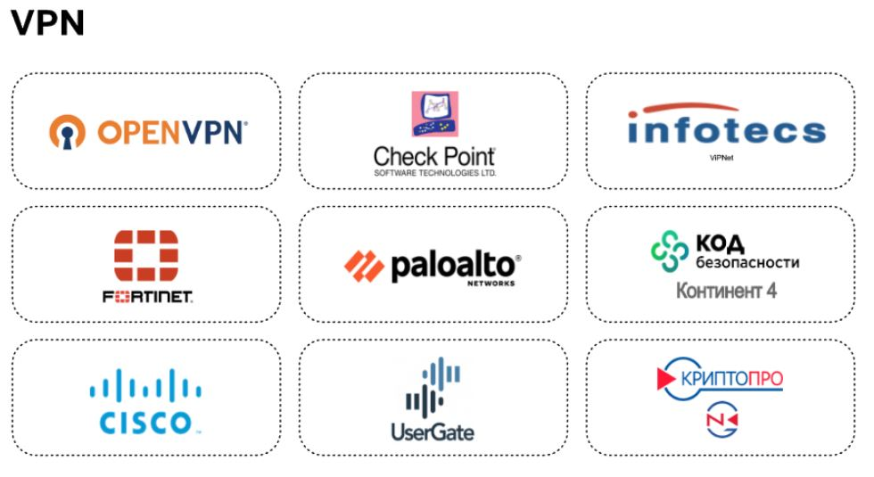

# Firewall
Эволюция фаирвола ipfwadm (linux 2.0) - ipchains (linux 2.2) - netfilter/iptables  (linux 2.4)

* Руководство по [ipfwadm](http://www.kulichki.com/moshkow/SECURITY/ipfwadm/paper.txt) на английском языке
* Руководство по [ipchains](https://tldp.org/HOWTO/pdf/IPCHAINS-HOWTO.pdf)  на английском и на перевод [русский](https://www.opennet.ru/docs/HOWTO-RU/Ipchains.koi8-r.html)
* Руководство по [iptables](https://www.opennet.ru/docs/RUS/iptables/) (Iptables Tutorial 1.1.19) на русском. [Оригинал](https://github.com/frznlogic/iptables-tutorial) (1.2.2) на английском на GitHub ([здесь](https://www.frozentux.net/iptables-tutorial/iptables-tutorial.html) на одной странице)
* Man [iptables](https://www.opennet.ru/man.shtml?topic=iptables&category=8&russian=0) на русском языке
* [Статья](https://ru.wikibooks.org/wiki/Iptables) в Викиучебнике

## Netfilter - встроен в ядро LInux начиная с вервии 2.4 - Работает на LEVEL 3 OSI по IP адресам
**Iptables** - специальная утилита для работы с фаирволом Netfilter [iptables](https://ru.wikibooks.org/wiki/Iptables)\
аналог firewalld в операционных системах CentOS, Fedora, OpenSUSE, Red Hat Enterprise Linux, SUSE Linux Enterprise\
\

**Iptables** - правила, цепочки, таблицы

цепочки, правила = условие - действие - счетчик

**В зависимоти от адреса пакета он проходит разные таблицы по определенной цепочке**

базовые цепочки: 
* PREROUTING - обрабатывает все входящие пакеты на все интерфейсы, работает до маршрутизации, включая  NAT  и маруировку пакетов. Прохождение таблиц: raw - conntrack - mangle - nat (если пакет не для локальной машины) - другие цепочки
* INPUT - обрабатывает все входящие пакеты адресованные локальной машине. prerouting - mangle - filter - security - nat - local proc
* FORWARD - обрабатываются все пакеты, которые пересылаются дальше. Применяются как к входящему, так и исходящему трафику. Происходит фильтрация трафика prerouting - mangle - filter - security - postrouting
* OUTPUT - исходящие пакеты сгенерированные локальной машиной. local - raw - conntrack - mangle - nat - filter - security - postrouting
* POSTROUTING - окончательная обработка ихсодящиех пакетов, после маршрутизации (исходящих как наружу, так и вовнутрь защищаемой сети) - mangle - nat (если пакет не для локальной машины) - исходящий интерфейс

Таблица iptables — совокупность базовых и пользовательских цепочек, имеющих общее назначение:
* Filter - фильтрация пакетов по IP и порту
* NAT - в заголовке пдменядтся IP адреса и порты
* Mangle  - изменение метаданных пакета
* RAW - действия над сырыми пакетами для обрабокти остальной систмой
* Security-Enhanced Linux (SELinux) — улучшенный механизм управления доступом, который разработало Агентство национальной безопасности США для предотвращения злонамеренных вторжений (можно ввесит ограничения на определеный брацзеи или приложение) - отдельный пакет

IPtables использует систему отслеживания соединений **Conntrack** (англ. отслеживание соединения) — специальная подсистема, отслеживающая состояния соединений и позволяющая использовать эту информацию при принятии решенийо судьбе отдельных пакетов:
* NEW Пакет является первым в соединении
* ESTABLISHED Пакет относится к уже установленному соединению
* INVALID Установить принадлежность пакета не удалось
* RELATED Пакет открывает новое соединение, логически связанное с уже установленными
* UNTRACKED Отслеживание состояния соединения для данного пакета было отключено

Host — любое устройство, подключённое к сети TCP/IP, принимающее или создающее подключения\
Localhost — официально зарезервированное доменное имя для IP-адресов 127.0.0.1/8\

### Работа с IPTables, краткая справка по netstat
`netstat -an | grep “:22”` - Посмотреть, слушает ли сервер порт 22
`netstat -s` - Узнать статистику для каждого протокола
`netstat -l` - Посмотреть все сокеты с состоянием LISTEN
`man netstat` - Посмотреть руководство по netstat

`iptables [-t table] command [match]  [target/jump]`\
`-t` указывает на таблицу (RAW, mangle, NAT, security), по умолчанию без указания параметра выбирается таблица filter\
`match` задаёт критерии проверки, по которым определяется, подпадает ли пакет под действие этого правила или нет\
`target` указывает, какое действие должно быть выполнено при условии выполнения критериев в правиле 

Основные принципы:
* Чем выше правило (меньше порядковый номер), тем раньше оно будет обработано, поэтому порядок правил имеет огромное значение.
* Если ни одно правило не подошло, будет выполнено действие по умолчанию. Действия по умолчанию задавать **ОБЯЗАТЕЛЬНО**

**При начальной настройке всегда нужно задавать политику обработки пакетов по умолчанию для каждой цепочки**\
`sudo iptables -P INPUT DROP` `sudo iptables -P FORWARD DROP`

Просмотр таблиц:\
`sudo iptables -nvL -t raw`\
`sudo iptables -nvL -t nat`\
`sudo iptables -nvL -t mangle`\
`sudo iptables -nvL -t filter (по умолчанию)`\
`-nvL` - все в числовом виде, в расширенном виде, список правил
`--line-number` - нумерация строк

Изменение таблиц:\
`iptables  {-t таблица} -A ЦЕПОЧКА[...]` append, добавляет правило в конец цепочки\
`iptables  {-t таблица} -I ЦЕПОЧКА {номер правила}[...]` insert, добавляет правило перед правилом с указанным номером\
`iptables  {-t таблица} -R ЦЕПОЧКА {номер правила}[...]` replace, заменяет правило с указанным номером\
`iptables  {-t таблица} -D ЦЕПОЧКА {номер правила}[...]` delete, удаляет правило с указанным номером из цепочки\
`iptables  {-t таблица} -F ЦЕПОЧКА` flush, удаляет все правила из таблицы и цепочки

Пример:\
Необходимо разрешить подключение к локальной машине на порт 22 из локальной сети 192.168.0.0/24\
`sudo iptables -A INPUT -p tcp --dport 22 -m state --state NEW,ESTABLISHED -s 192.168.0.0/24 -j ACCEPT`\
`-A INPUT` — (append, добавить) указывает цепочку (например, INPUT ) для добавления правила\
`-p tcp` — указываем сетевой протокол (например, tcp или udp )\
`--dport 22` — порт назначения пакетов\
`-m state` — критерий, свойство пакета, которое мы хотим сопоставить (например, state )\
`--state NEW, ESTABLISHED` — состояние(-я) пакета для соответствия\
`-s 192.168.0.0/24` — (source, источник) IP-адрес и маска источника, из которого исходят пакеты\
`-j ACCEPT` — цель или указание, что делать с пакетами (например, ACCEPT, DROP, REJECT и т. д.)\

## Ebtables - альтернатива IPTables - работает на LEVEL 2 - по мак адресам, срабатывает раньше
Ebtables — средство для фильтрации пакетов для программных мостов Linux. Работает преимущественно на втором (канальном) уровне модели OSI\
Ebtables предназначена для фильтрации трафика в bridge

Чтобы отбросить трафик от конкретного MAC адреса в ebtables, необходима следующая команда:\
`ebtables -A INPUT -s 08:00:27:47:88:CE -j DROP` - более бычтрый вариант

Вариант, который мы использовали в iptables:\
`sudo iptables -A INPUT -m mac --mac-source 08:00:27:47:88:CE -j DROP`

# Настройка firewall - доступа по порту
Дано 3 машины. Шлюз eth1  172.28.128.70/26, eth1  172.28.128.10/26\
client eth1  172.28.128.60/26, remote eth1  172.28.128.90/26\
заптер доступа по 22 порту `sudo iptables -A INPUT -p tcp --dport 22 -j DROP`\
разрешение доступа `sudo iptables -A INPUT -p tcp --dport 22 -j ACCEPT`\
NAT-маскарадинг. ПО умолчанию на шлюзе запрещен обмен данными между сетевыми инерфейчасами\
`sysctl net.ipv4.ip_forward` ... =0
разрешить: `sysctl -w net.ipv4.ip_forward=1`\
или отредактировать `nano /etc/sysctl.conf` и перечитать настройки `sysctl -p /etc/sysctl.conf` \
и, далее разрешить пересылку пакетов между интерфецсами\
\
разрешить доступ по 22 порту:

блокировка по мак адресу:

# NAT
Блоки частных адресов
10.0.0.0/8  10.0.0.0-10.255.255.255 16 млн. адресов
172.16.0.0/12 от 172.16.0.0 до 172.31.255.255 1 млн адресов
192.168.0.0/16 от 192.168.0.0 до 192.168.255.255 - 60 тыс. адресов

для отправки запросов из частных сетей в интерент можно использвать PROXY сервер или технологию NAT\
PROXY - два сетевых адреса частный и общедоступный. По сути это кеш интернета, но работает с ограниченным количеством простоколов.\
Клиент работает с ПРОКСИ как с интерентом, а ПРОКСИ выполняет за него все запросы

NAT - подменяет адрес отправителя на свой и добавляет уникальынй номер порта при отправке пакетов наружу, подменяет обратно адрес получателя при приеме пакетов.\
**Виды NAT**\
* Static NAT / One-to-one NAT - публикация одной машины в интернете, все порты целиком. при прохождение маршрутизатора меняются IP адреса получателя и отправителя. Хост работает как внутри, так и с наружи
* Dynamic NAT - при выходе во внещнюю сеть адреса компов подменятются на релаьыне, выданные провайдером IP адреса. Выдаются внутренним компад динамически - на время, в аренду. Больше компов, чем выдано адресов нуружу не выйдут
* **Source NAT (SNAT)** / NAT Overload / **Masquerade** / Many-to-one NAT Формируется динамическая таблица тарнсляции которая содержит для преобразования наружу  IPисходный:port - IPназначения:port преобразуется в IPROUTER:NEWport - IPназначения:port, а затем в обратную сторону. ТО ЕСТЬ это NAT оперирует сокетами. SNAT - если есть статический белый IP - он должен быть прописан в правилах, Masquerade - если белый IP динамический берется из интерфейса.
* Destination NAT (PAT) (DNAT) публикация одного внутреннего сервиса наружу по определенному порту. в таблице трансляции записан сокет для преобразования изнутри наружу.

### настройка NAT шлюза Маскарадинг
1 Разрешим пересылку между интерфейсами\
до перезагрузки `sudo sysctl -w net.ipv4.ip_forward=1`\
навсегда `nano /etc/sysctl.conf строка net.ipv4.ip_forward=1 раскоментировать` `sysctl -p /etc/sysctl.conf`\
2 Разрешим пересылку пакетов из внутреннего на внещний интерфейс\
`sudo iptables -A FORWARD -j ACCEPT -m conntrack --ctstate ESTABLISHED,RELATED -m comment --comment "established traffic"` - пересылка уже установленных соединений\
`sudo iptables -A FORWARD -j ACCEPT -i enp0s8 -o enp0s3 -m comment --comment "forward"` - разрешаем пересылку пакетов с внутреннего на внешний интерфейс\
`sudo iptables -A FORWARD -j ACCEPT -m state --state RELATED,ESTABLISHED -m comment --comment "established traffic"` - разрешаем для уже установленных или связанных соединений\
`sudo iptables -t nat -A POSTROUTING -o enp0s3 -j MASQUERADE -m comment --comment "masquerade"` - ко всем исходящим с интерфейса пакетам применяем маскарадинг\ 
`-m` - подключение модуля
### настройка NAT клиента
`ip addr add 192.168.123.20/24 via 192.168.123.1` - добавляем маршрут на шлюз\
проверяем\
`sudo iptables -nvL --line-number` - таблица filter\
`sudo iptables -t nat -nvL --line-number` - таблица nat\
### настройка NAT шлюза SNAT
1 Разрешим пересылку между интерфейсами\
до перезагрузки `sudo sysctl -w net.ipv4.ip_forward=1`\
навсегда `nano /etc/sysctl.conf строка net.ipv4.ip_forward=1 раскоментировать` `sysctl -p /etc/sysctl.conf`\
2 Разрешим пересылку пакетов из внутреннего на внещний интерфейс\
`sudo iptables -A FORWARD -j ACCEPT -i enp0s8 -o enp0s3 -m comment --comment "forward"` - разрешаем пересылку пакетов с внутреннего на внешний интерфейс\
`sudo iptables -A FORWARD -j ACCEPT -m state --state RELATED,ESTABLISHED -m comment --comment "established traffic"` - разрешаем для уже установленных или связанных соединений\
`sudo iptables -t nat -A POSTROUTING -s 172.28.128.0/24 -o enp0s3 -j SNAT --to_source 10.0.2.15 -m comment --comment "SNAT"` - ко всем исходящим с интерфейса пакетам из подсети 172.24.172.0 будут преобразованы в адрес источника 10.0.2.15

`sudo iptables -t nat -R POSTROUTING 1 -s 172.28.128.0/24 -o enp0s3 -j SNAT --to_source 10.0.2.15 -m comment --comment "SNAT"` - ЗАМЕНИТЬ правило с номером 1
`-m` - подключение модуля

### настройка NAT шлюза DNAT
1 Разрешим пересылку между интерфейсами\
до перезагрузки `sudo sysctl -w net.ipv4.ip_forward=1`\
навсегда `nano /etc/sysctl.conf строка net.ipv4.ip_forward=1 раскоментировать` `sysctl -p /etc/sysctl.conf`\
2 Разрешим пересылку пакетов из внутреннего на внещний интерфейс\
`sudo iptables -A FORWARD -j ACCEPT -i enp0s8 -o enp0s3 -m comment --comment "forward"` - разрешаем пересылку пакетов с внутреннего на внешний интерфейс\
`sudo iptables -I FORWARD 1 -j DROP -o enp0s3 -s 116.71.64.0/24` - блокировка запросов на интерфейс из подсети 64.0\
`sudo iptables -t nat -A PREROUTING -p tcp --dport 80 -i enp0s3 -j DNAT --to_destination 172.28.128.60 -m comment --comment "DNAT"` - все входящие на интерфейс пакеты на порт 80 будут перенаправлены на 172.28.128.60 с заменой адреса назначения.\
`sudo iptables -t nat -A PREROUTING -p tcp --dport 443 -i enp0s3 -j DNAT --to_destination 172.28.128.60:80 -m comment --comment "DNAT"` - все входящие на интерфейс пакеты на порт 443 будут перенаправлены на 172.28.128.60:80 с заменой адреса назначения и порта.

# VPN VIRTUAL PRIVAT NETVORK
основа VPN - туннель между двумя точками и шифрование трафика (контроль сети. шифрование, единая адресация, упрвление доступом, контрль сотрудников)\
промежуточные узлы организации vpn тунеля скрываются
виды VPN:\
* точка-точка - объединяем два устройства (point-to-point, p2p) можно даже в локлаьной сети для шифрования
* точка - сеть - подключение удаленных пользователей (vpn remote access ) по минимуму нужен только браузер. Технологии Clientless SSL VPN. Так часто реализуется подключение к Outlook Web Access (OWA) clien. HTTPS. Через браузер доступ к ресерсам сети (Cisco, UserGate, Palo Alto ...) Доступ даеют через авторизацию. ПО Cisco Anyconnect VPN или браузер
* сеть - сеть - объединение сетей офиса и филиалов (site-to-site) Провайдер предоставляет тауие соединения уровня L2 (сети поключены через виртуальный коммутатор, узлы нужно настраивать самостоятельно ), L3 (через виртуальынй маршрутизатор, провайдер дает сам IP адреса)
* VPN сервис в браузере

поставщики VPN

## протоколы VPN
* PPTP point-to-point tunneling protocol (Microsoft) Работает на 4 уровне, предоставляет сервисы второго. (1723 порт для управления TCP, второе для инкапсуляции данных проткол GRE - замена TCP/UDP). Большая скорость, низкая надежность
* WireGuard - полностью открытый. работает на L4 UDP. Простой и быстрый
* L2TP/IPSec Layer 2 tunneling protocol/IP Security (Microsoft). Работает на 4 уровне поверх UDP, предоставляет сервисы второго. IPsec для шифрования (3DES, AES). Нужен порт 500 который часто блокируется 
* OpenVPN - проприетарный, но код открытый. на 4 уровне tcp udp. часто проверяется . Нужно специальное ПО альтернатива IPsec
* SSTP Secure socket tunneling protocol (Microsoft) работет на 7 уровне, сервисы второго уровня. Отправляет трафик по SSL через 443 порт TCP. Надежен. Трафик не блокируется
* SSL - тоже можно отнести к протоколам шифрования

### IPsec (18 спецификаций RFC 2401 — RFC 2412) работает на 3 уровне
Стека протоколов для передачи в сетях IP\
Обеспечивает:
* Аутентификацию 
* Шифрование
* Проверку целостности передаваемых данных

Два режима работы\
* Транспортный - шфруются данный начиная с 4 уровня, адреса отпрвителя и получателя не шифруются - использвется для соединения хостов влоклаьной сети
* Тунельный - шифруется весть исходный пакет и помещается в новый - используется для передачи чере интернет

Туннелирование (tunneling) метод передачи полезной нагрузки (кадра или пакета) одного протокола с использованием межсетевой инфраструктуры другого протокола\

базовые понятия IPSEC:\
* SA - Security association - Ассоциация безопасности (базовое понятие IPsec. Включает в себя информацию о криптографических протоколах и алгоритмах, ключах шифрования,определяет, какие данные будут проходить через туннель). Для создания используется протокол nternet security association and key management protocol (ISAKMP)
* Ключи. Для работы с ключами протокол Internet key exchange (IKE)
* Соединение проходит в две фазы. Первая - происходит взаимная идентификация, определение  метода идентификации, алгоритма шифрования, хеш-алгоритм, группа Diffie Hellman. создаётся SA первой фазы (Phase 1 SA, или IKE SA)
* Вторая фаза - генерируются ключи и узлы договариваются об используемой политике. создаётся Phase 2 SA, или IPSec SA

## VPN сервисы (серверная часть предоставляется как сервис)
* для браузера - Opera, Google Chrome + Browsec addon, Epic Privacy Browser, TOR
* отдельыне приложения Hotspot, Shield Betternet — есть реклама, но бесплатная версия работает хорошо, Kaspersky Secure Connection, Hola VPN — много рекламы, не рекомендуется к установке
* Опасные сервисы  в апреле 2022 года у 6 популярных VPN-сервисов (Surfshark, Atlas VPN, VyprVPN, VPN Proxy Master, Sumrando VPN и Turbo VPN) выявили проблему установки доверенных корневых сертификатов
* Необходимо всегда быть в курсе локальных законодательств, чтобы избежать возможных последствий.

