# Troubleshooting

Траблшутинг (troubleshooting) — форма решения проблем, часто применяемая к ремонту неработающих устройств или процессов

\
Рекомендации:
* Попробовать подключение с другого оператора(4G-роутера, резервного канала и т. д.)
* Выяснить у сетевого администратора или коллег, не были ли внесены изменения в конфигурационные файлы

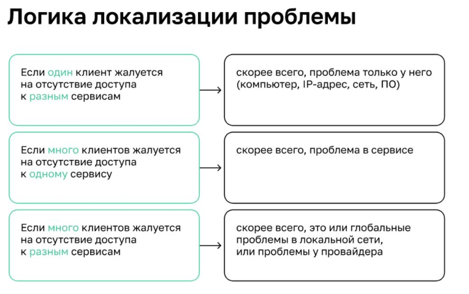
Л — логика. Л — локализация проблемы:
* Если один клиент жалуется на отсутствие доступа к разным сервисам, скорее всего, проблема только у него (  компьютер, IP-адрес, сеть, ПО
* Если много клиентов жалуется на отсутствие доступа к одному сервису — скорее всего, проблема в сервисе
* Если много клиентов жалуется на отсутствие доступа к разным сервисам — скорее всего, это или глобальные проблемы в локальной сети, или проблемы у провайдера

## Проблемы L1,L2
Физические проблемы. Вопросы, на которые нужно иметь положительный ответ:\
Есть ли электричество на оборудовании? Включена ли VM? Подключён ли кабель? Если подключён, уверены ли вы, что он целый?\
Проблемы с connectivity (L1, L2) Вопросы, на которые нужно иметь положительный ответ:\
Если кабель подключён и в порядке — горит ли лампочка (есть ли «линк»)? Не заблокирован ли порт в настройках коммутатора/сервера? Не заблокирован ли MAC-адрес на коммутаторе?

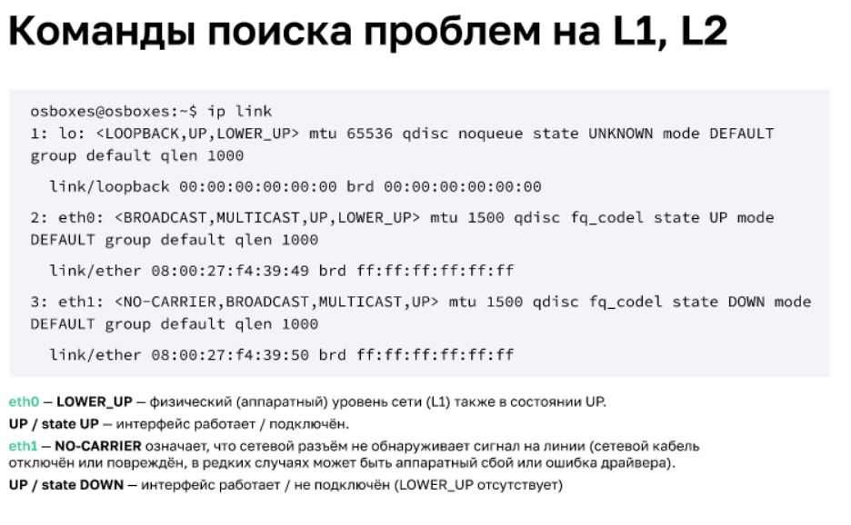

## Проблемы L1,L2,L3,L4

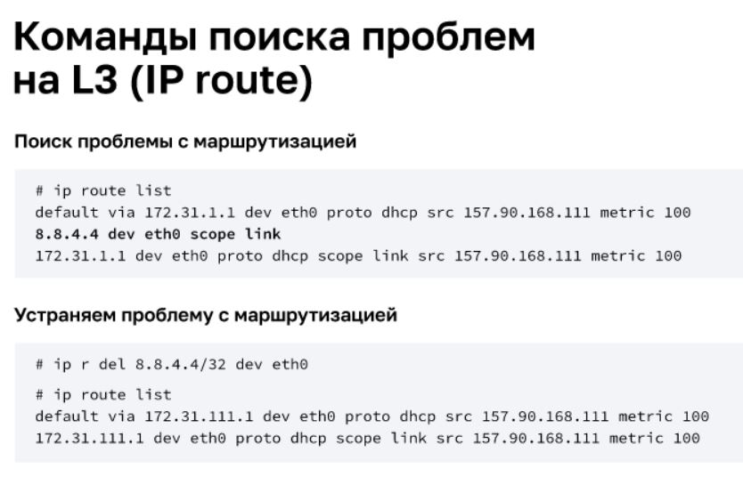

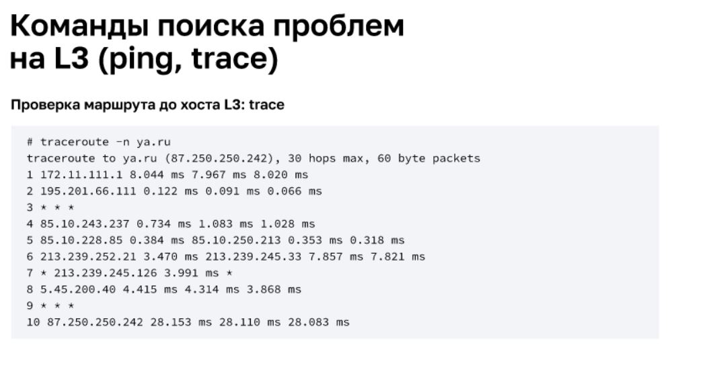
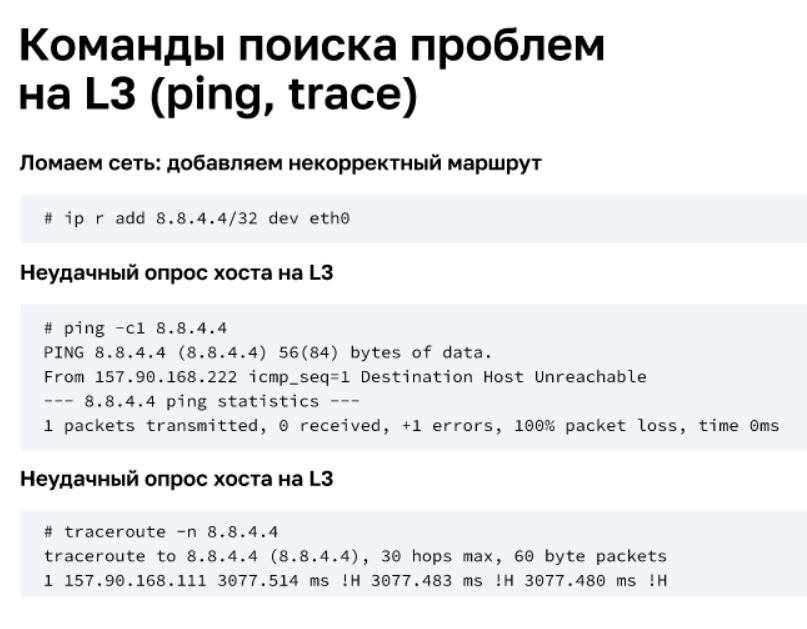
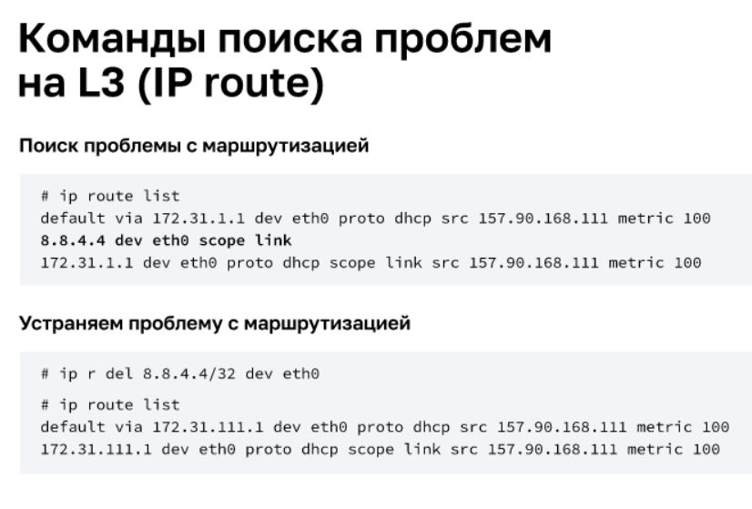\
Очень важно, чтобы на хосте был маршрут до конечной точки либо маршрут по умолчанию + маршрут до конечной точки на роутере

## DNS
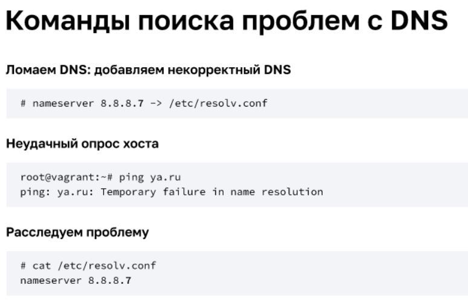

**Настройка DNS в ОС Linux:**
[Link1](https://tokmakov.msk.ru/blog/item/522)\
[Link2](https://itgap.ru/post/lokalnyj-dns-server-na-linux)

## L4/L7 проблемы

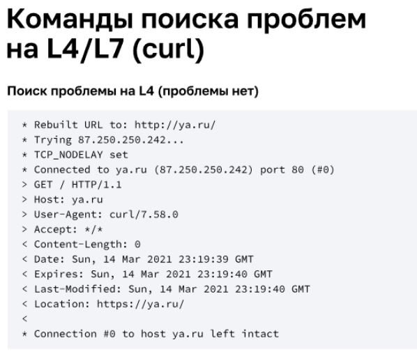
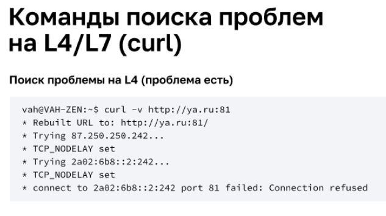\
Если нет связи по нужному нам порту, притом что хост доступен, пытаемся подключиться ещё куда-то (TCP/UDP), чтобы понять, не блокируется ли подключение нашим сетевым администратором на пограничном роутере.\
Также просматриваем правила нашего по тому же порту firewall
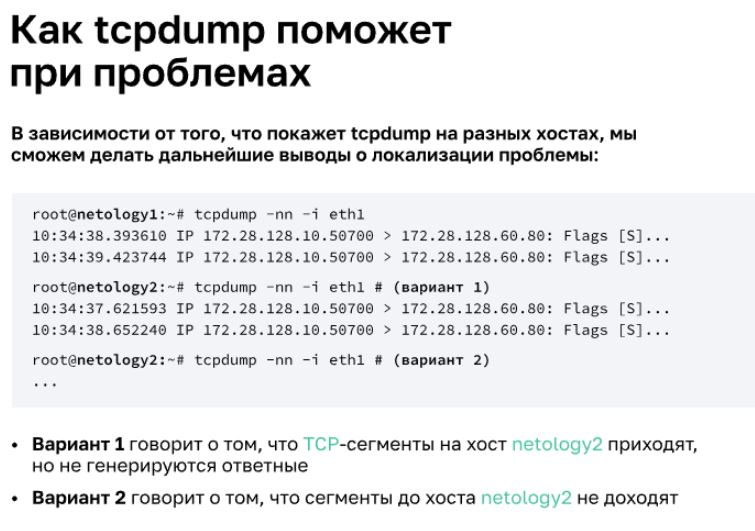

* Для диагностики проблем на уровне L2 лучше всего использовать возможности ARP: смотреть таблицу соответствия, проводить диагностику утилитой arping
* На уровне L3 используются прежде всего утилиты ping и traceroute. Также необходимо проверять настройку сетевых адресов и маршрутов утилитой ip
* Базовая утилита диагностики L4/L7 — telnet
* Утилита tcpdump может помочь в поиске проблем на уровнях L2 — L4 модели OSI

## Некорректная работа ПО (L5 — L7)
Вопросы, на которые нужно иметь положительный ответ:\
* Есть ли связь на L4 по тем же портам с другими хостами?
* Корректно ли работает ПО со стороны клиента?
* Корректно ли работает ПО со стороны сервера?

**Если нет доступа к серверу**
Если у клиента есть связь по тем же популярным портам с другими хостами, это означает, что с клиентской стороны, скорее всего, всё в порядке.\
При этом без доступа к серверу понять причину будет невозможно, но попробовать можно.\
Если речь идёт о подключении к высокодоступным сервисам , проблема чаще на стороне пользователя или провайдера. Можно попробовать изменить внешний IP-адрес и проверить ещё раз\

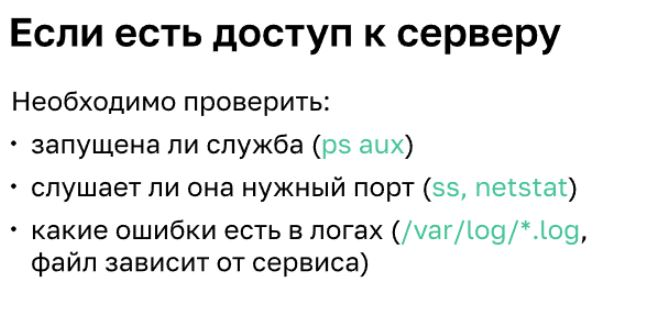\

`ps` — утилита для сбора информации о запущенных процессах\
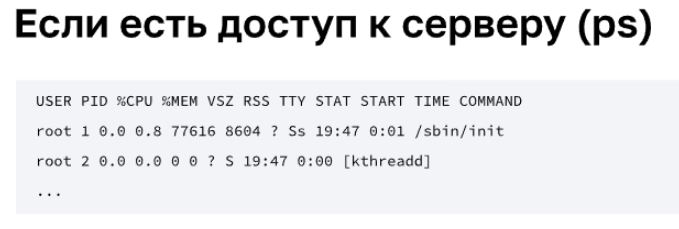

`socket statistics (ss)` — наиболее актуальная утилита для сбора информации о сокетах, в частности сетевых сокетах; является аналогом netstat\
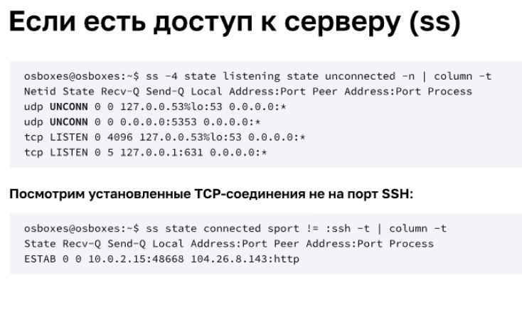

lsof — мощная утилита, которая служит для вывода информации о том, какие файлы используются теми или иными процессами
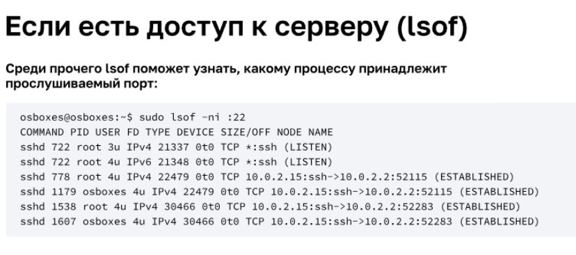

## Загрузка канала
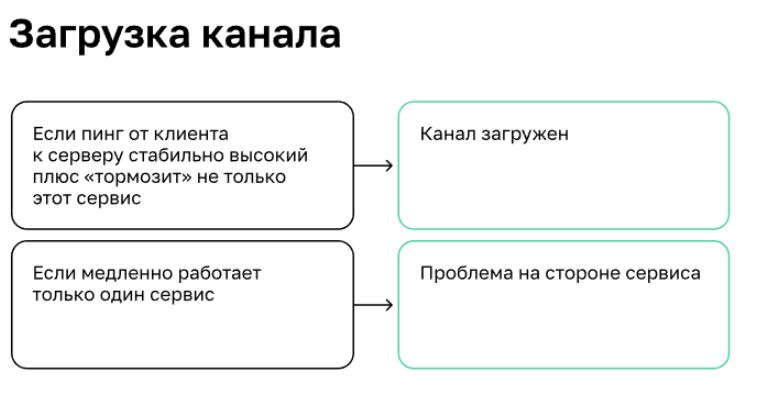

**Репозиторий epel-release**

**IFTOP**
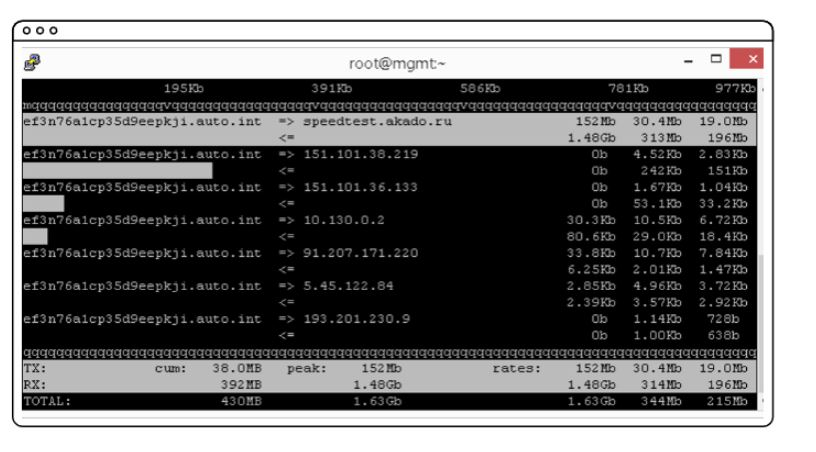

**BMON**
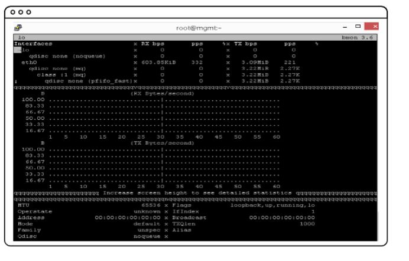

**NLOAD**

показывает входящий и исходящий трафик

* Причинами загрузки канала могут быть как узкие места — «бутылочные горлышки» — аппаратной части, так и высокое количество служебного широковещательного трафика
* Существует широкий выбор утилит, для анализа пропускной способности канала: iftop, bmon и nload 

  Давайте подведем итоги занятия “Сеть и сетевые протоколы: траблшутинг”. Отметим основные мысли, которые стоит вынести из лекции.
  
  Troubleshooting (траблшутинг) — форма решения проблем, часто применяемая к ремонту неработающих устройств или процессов.
  
  Траблшутинг использует системный подход для выявления и устранения проблемы, поэтому важно иметь системные знания о работе сети в целом.
  Главный инструмент инженера при траблшутинге — логика.
  Поиск проблем на уровнях L1, L2 всегда необходимо начинать с проверки самых обычных вещей: наличия питания на оборудовании, физического соединения информационных кабелей, работоспособности портов.
  
  В качестве утилиты диагностики можно использовать информационный вывод утилиты ip link.
  Диагностика проблем на разных уровнях сети
  
  Для диагностики проблем на уровне L2 лучше всего использовать возможности ARP: смотреть таблицу соответствия, проводить диагностику утилитой arping.
  На уровне L3 используются прежде всего утилиты ping и traceroute. Также необходимо проверять настройку сетевых адресов и маршрутов утилитой ip.
  Базовая утилита диагностики L4/L7 — telnet
  Утилита tcpdump может помочь в поиске проблем на уровнях L2 — L4 модели OSI.
  При диагностике проблем на уровнях L5 — L7 необходимо прежде всего определить, где она возникает: на клиенте, в сегменте сети или на сервере. Для проверки можно использовать популярные высоконагруженные серверы (Яндекс, Mail.ru, Google). Если есть доступ к серверу, то в поисках проблем помогут утилиты ps, ss и lsof.
  Причинами загрузки канала могут быть как узкие места — «бутылочные горлышки» — аппаратной части, так и высокое количество служебного широковещательного трафика.
  
  Существует широкий выбор утилит, для анализа пропускной способности канала: iftop, bmon и nload.
