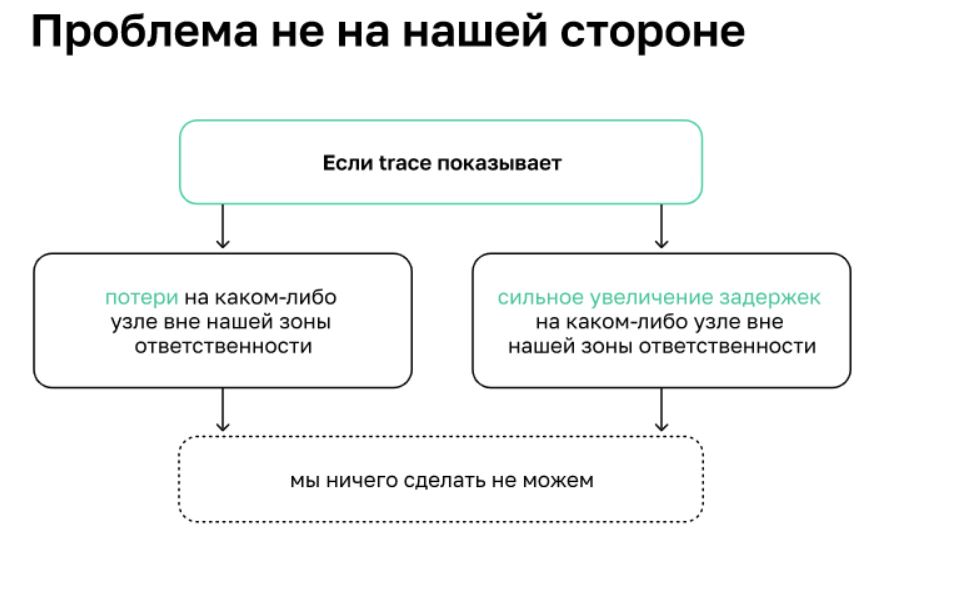
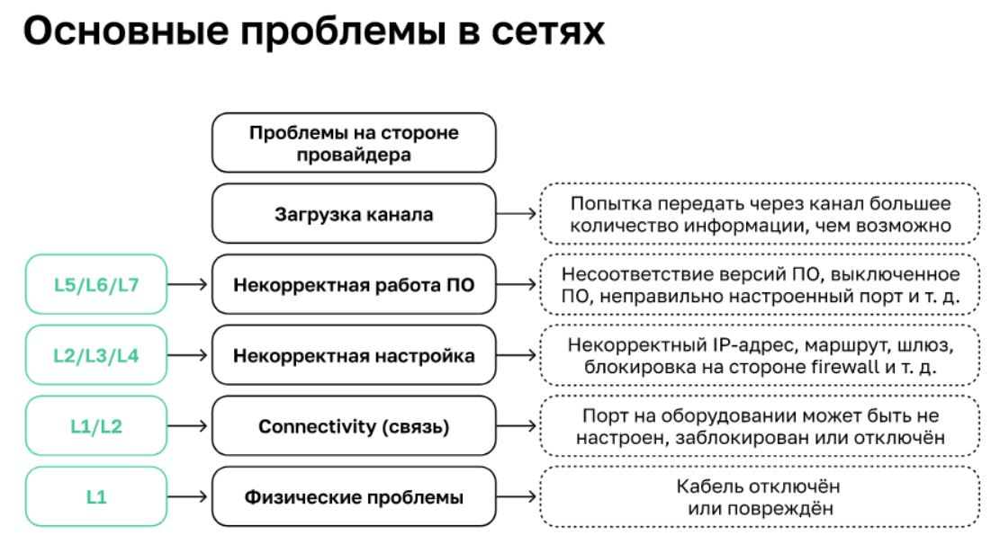
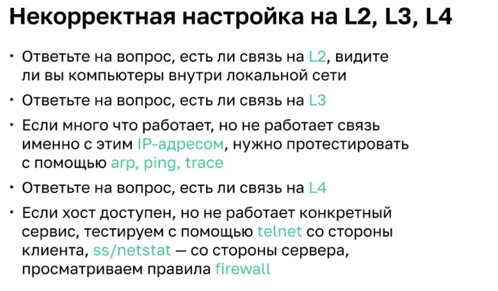
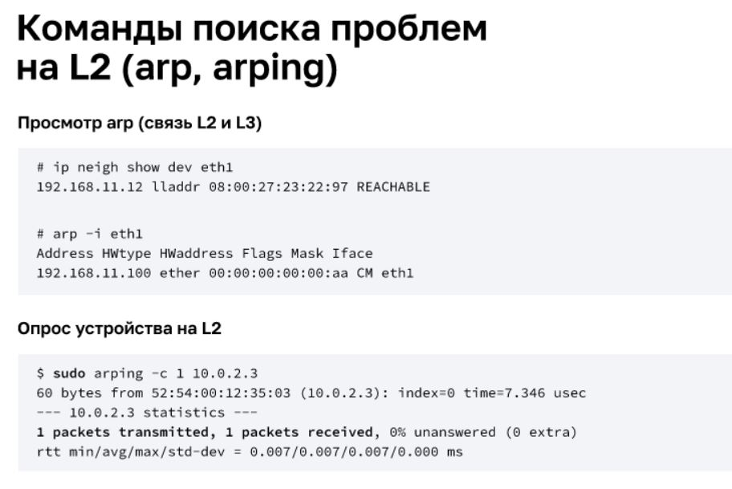
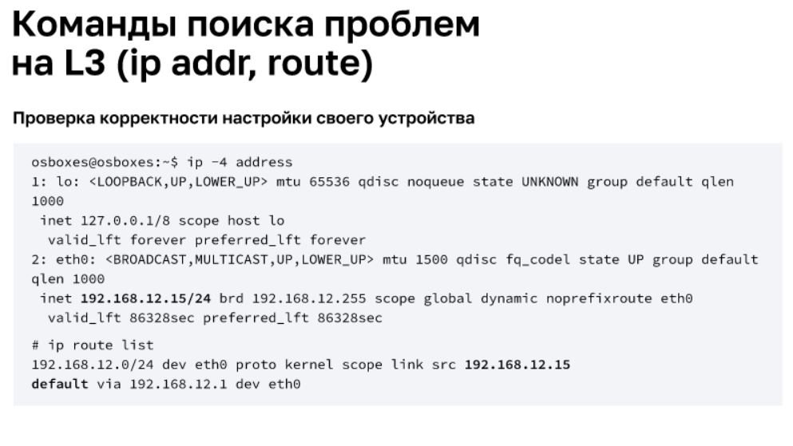
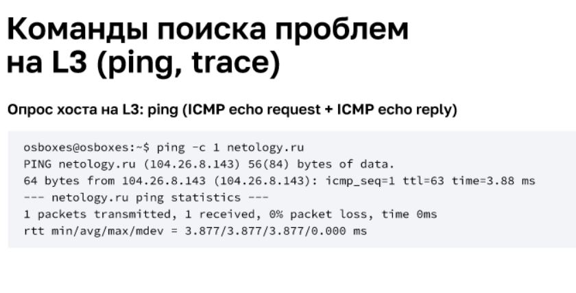

# Troubleshooting

Траблшутинг (troubleshooting) — форма решения проблем, часто применяемая к ремонту неработающих устройств или процессов

\
Рекомендации:
* Попробовать подключение с другого оператора(4G-роутера, резервного канала и т. д.)
* Выяснить у сетевого администратора или коллег, не были ли внесены изменения в конфигурационные файлы

Л — логика. Л — локализация проблемы:
* Если один клиент жалуется на отсутствие доступа к разным сервисам, скорее всего, проблема только у него (  компьютер, IP-адрес, сеть, ПО
* Если много клиентов жалуется на отсутствие доступа к одному сервису — скорее всего, проблема в сервисе
* Если много клиентов жалуется на отсутствие доступа к разным сервисам — скорее всего, это или глобальные проблемы в локальной сети, или проблемы у провайдера

## Проблемы L1,L2
Физические проблемы. Вопросы, на которые нужно иметь положительный ответ:\
Есть ли электричество на оборудовании? Включена ли VM? Подключён ли кабель? Если подключён, уверены ли вы, что он целый?\
Проблемы с connectivity (L1, L2) Вопросы, на которые нужно иметь положительный ответ:\
Если кабель подключён и в порядке — горит ли лампочка (есть ли «линк»)? Не заблокирован ли порт в настройках коммутатора/сервера? Не заблокирован ли MAC-адрес на коммутаторе?

## Проблемы L1,L2,L3,L4

## DNS

**Настройка DNS в ОС Linux:**
[Link1](https://tokmakov.msk.ru/blog/item/522)\
[Link2](https://itgap.ru/post/lokalnyj-dns-server-na-linux)

