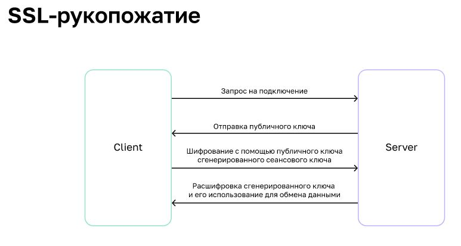
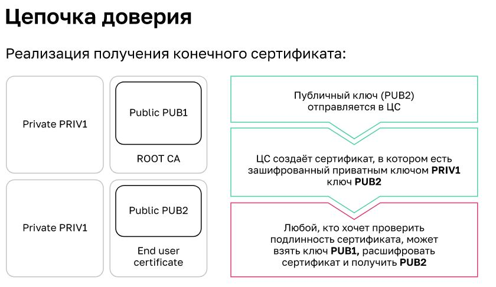
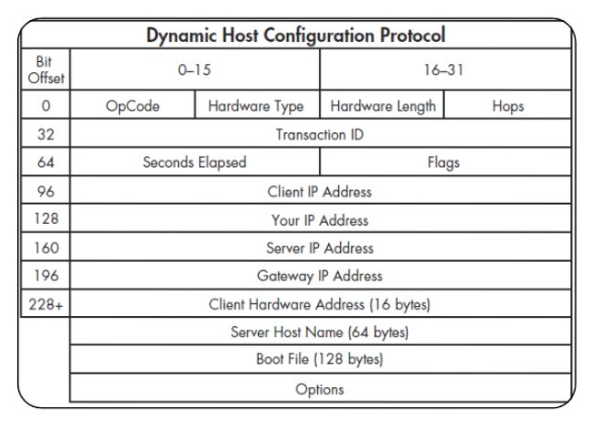

# Высокоуревненые протоколы
* HTTP (80,443) - передача веб страниц
* DNS (53 порт) имена-IP адреса
* IMAP
* SSH - протокол уаделнного управленяи с шифрованием. Пердыдущий - Rlogin - Без шифрования
* FTP - для пеердачи файлов - два потока (порта 20,21) управления и передачи данных. Режимы - активный, пассивный. В Активном - сервер подключается к клиенту и передает ему данные (FileZilla, WinCPS)
* XMPP — мощный, открытый, безопасный протокол обмена сообщениями и информацией о присутствии, основанный на стандартах Используется вовнутренних сетях, поскольку позволяет полцчить информацию о всех пользователях. [ПО для XMPP](https://xmpp.org/software/) На нем работает Whatsapp

## Шифрование
RSA - по именам содателей - основа на вычислении простых чисел.  один из старейших методов асимметричного шифрования. По производительности он уступает алгоритмам симметричного шифрования AES и IDEA\
У каждого учатника два ключа - открытый и закрытый.\
Открытый может только шифровать данные. Приватный - расшифровывать те, что были зашифрованы открытым ключем. Это асинхронное шифрование - меделенно и используется только для обмена сеансовыми ключами для шифрования.\
Сеансовый ключ может щифровать и расшифровыать сообщения - содается в момент рукопожатия\
Принцип генерации ключей:\
Берём 2 простых числа:
 **p** = 7; **q** = 11\
Рассчитываем произведение:
 n = p × q = 77\
Вычисляем функцию Эйлера:
 F = (p – 1) × (q – 1) = 6 × 10 = 60\
Выбираем число **e** — простое, меньше **F** и взаимно простое с ним: например, **13**\
теперь пара чисел {e, n} {13, 77} — мой открытый ключ \
Теперь нужно вычислить число **d**, обратное **е** по модулю **F**:
 \
(d × е) % F = 1 (остаток отделения) или   \
(d × 13) % 60 = 1 Возьмём его равным **37**\
Теперь {d, n} {37, 77} — мой закрытый ключ \
Зашифруем сообщение «50» с помощью ключа {13, 77}:\
получаем  (50 ^ 13) mod 77 = 29 (%, так же остаток от деления)\

Расшифруем закрытым ключом:
\
(29 ^ d) mod n = \
(29 ^ 37) mod 77 = 50\


### Генерирование ключей SSH
```bash
Устанавливаем сервер OpenSSH (Ubuntu):
sudo apt-get install openssh-server
Генерируем ключ:
ssh-keygen -t rsa
Получаем файлы:
/home/user/.ssh/id_rsa
/home/user/.ssh/id_rsa.pub

Записываем публичный ключ:
cat /home/user/.ssh/id_rsa.pub >> /home/user/.ssh/authorized_keys
Пробуем подключиться с использованием ключа:
ssh -i /home/user/.ssh/id_rsa localhost
```

## SSL - secyrity socket layer. 
При установлении соединения SSL используется алгоритм RSA для создания сеансового ключа. Дальнейший обмен происходит с помощью более быстрого симметричного шифрования\
SSL-сертификат — технология, которая создаёт безопасную связь между браузером пользователя и веб-сервером путём шифрования данных\
\

**Работа с SSL**
OpenSSL — основная утилита для работы с SSL\
```bash
openssl req -x509 -newkey rsa:4096 -keyout key.pem -out cert.pem -days 365 — сгенерировать новый сертификат
openssl s_client -connect ya.ru:443 — подключение к серверу и запрос на получение сертификатов
```
\


**Установка сертификата в систему**
```bash
Ubuntu
sudo mkdir /usr/share/ca-certificates/extra
sudo cp foo.crt /usr/share/ca-certificates/extra/foo.crt
sudo update-ca-certificates

CentOS
sudo cp foo.crt /etc/pki/ca-trust/source/anchors/foo.crt
sudo update-ca-trust
```
**Создание своего центра сертификации**
Генерируем ключ и корневой сертификат. Поля в сертификате указываем любые:\
```bash
openssl genrsa -out ca.key 2048 && openssl req -x509 -new -nodes -key ca.key -sha256 -days 720 -out ca.pem
Сразу же сделаем сертификат в формате .crt:
openssl x509 -in ca.pem -inform PEM -out ca.crt
Устанавливаем сертификат в систему:
sudo cp ca.crt /usr/local/share/ca-certificates/myca.crt && sudoupdate-ca-certificates
Приступаем к выпуску самого сертификата, генерируем ключи:
openssl genrsa -out certificate.key 2048
На основе ключа создаём CSR:
openssl req -new -key certificate.key -out certificate.csr
Подписываем CSR нашим корневым сертификатом, тем самым создаём конечный сертификат:
openssl x509 -req -in certificate.csr -CA ca.pem -CAkey ca.key -CAcreateserial -out certificate.crt -days 360 -sha256

При создании запроса на подпись важно указать CommonName (CN), предоставляющее IP-адрес или доменное имядля службы. Без этого сертификат не может быть проверен
```
## ACME letsEncrypt
ACME — протокол, который описывает методы тестирования домена, а также приватных и публичных ключей для запрашиваемого сертификата\


**Настройка LE для работы с Nginx**
```bash
Устанавливаем Сertbot:
sudo yum install certbot
Устанавливаем плагин для работы с Nginx:
sudo yum install python-certbot-nginx
Проверяем конфигурацию Nginx и запускаем Сertbot:
sudo certbot --nginx -d example.com
```

# DHCP
рабо
Dnamic Host Configuration Protocol (RFC2131) протокол UDP порты 67/68\
DHCP - расширение BOOTP Bootstrap Protocol (RFC951) - протокол первоначальной загрузки\
BOOTP хост отправляет широковещательны запрос по UDP - получает свой IP И IP для загрузки. Загрузка по протоколу TFPT простой протокол без атентификации\
DHCPv6 - новый протокол, создани с нуля. RFC3315. Раотает по UDP порты 546/547.\

**Термины DHCP**
* Scope (область) диапазон IP-адресов, из которого сервер будет предлагать адреса клиенту в аренду
* Lease (аренда) период, в течение которого клиент может использовать IP-адрес
* Reservation (резервирование) закрепление IP-адреса за конкретным устройством
* Exclusion range (исключаемый диапазон) диапазон IP-адресов, которые не могут быть назначены клиенту
* Address pool (пул адресов) свободные IP-адреса, готовые к выдаче клиентам

**Механизмы выделения IP-адресов сервером DHCP**
* Динамическое присвоение IP-адрес выдаётся сервером по общим правилам на ограниченное время
* Ручной режим работы DHCP-сервера IP-адрес выдаётся вручную системным администратором
* Автоматическое назначение статистических адресов IP-адрес выдаётся сервером на основании MAC-адреса клиента. База соответствий ведётся в конфигурационных файлах сервера системным администратором

**Кадр DHCP**


Формат кадра DHCP
* Opcode (op) — тип DHCP-сообщения 0×01 — запрос от клиента к серверу BOOTREQUEST 0×02 — ответ DHCP-сервера или BOOTREPLY
* Hardware Type (htype) — тип адреса на канальном уровне. 0x01 — для протокола Ethernet и MAC-адресов. Список допустимых значений — в RFC1700
* Hardware Length (hlen) — длина аппаратного адреса в байтах Для Ethernet значение — 0×06
* Hops — количество промежуточных маршрутизаторов, которые находятся на пути между клиентом и сервером. DHCP-клиенты всегда ставят значение 0×00
* Transaction ID (xid) — случайное значение для идентификации диалога
* Seconds Elapsed (secs) — время в секундах с момента начала процесса получения IP-адреса
* Flags — поле для флагов или специальных параметров DHCP
* Client IP Address (ciaddr) — IP-адрес клиента. Клиент заполняет его в случае, если хочет продлить аренду IP-адреса
* Your ID Address (yiaddr) — IP-адрес, который DHCP-сервер предлагает клиенту
* Server IP Address (siaddr) — IP-адрес сервера
* Gateway IP Address (address) — IP-адрес промежуточного DHCP Relay Agent
* Client Hardware Address (chaddr) — если используется протокол Ethernet, то в это поле записывается MAC-адрес клиента
* Server Host Name (sname) — доменное имя сервера, поле не является обязательным
* Boot File (file) — указатель файла для загрузки бездисковым станциям, не является обязательным
* Options — опции для динамической конфигурации хоста

Виды DHCP-сообщений
* DHCPDISCOVER обнаружение DHCP
* DHCPOFFER предложение DHCP
* DHCPREQUEST запрос DHCP
* DHCPACK подтверждение DHCP

[Дополнительыне опции на сайте IBM](https://www.ibm.com/support/knowledgecenter/ru/ssw_aix_72/network/tcpip_dhcp_options.html)\
[На сайте OPENBSD](https://man.openbsd.org/dhcp-options.5)

МОгут дополнительно передаваться имя DNS, почтового сервера, сервера для загрузки ПО

## Настройка DHCP сервера
установить apt install isc-dhcp-server\
првоерим статус `systemctl status dhcpd `\
отредактировать конфигурационный файл по адресу `/etc/dhcp/dhcpd.conf`, примеры лежать по адресу `/usr/share/doc/dhcp-4.2.5/dhcpd.conf.example`\
пример конфиграции\
```
default-lease-time 600;
max-lease-time 7200;

# подсеть для выделения адресов
subnet 192.168.1.0 netmask 255.255.255.0 {
range 192.168.1.26 192.168.1.30;
option routers 192.168.1.1;
option broadcast-address 192.168.1.255;
default-lease-time 600;
max-lease-time 7200;
}

#фиксация IP хоста
host fantasia {
hardware ethernet 08:00:07:26:c0:a5;
fixed-address 192.168.1.55;
}
```
включим dhcp в ubuntu\
```bash
systemctl enable-now dhcpd или systemctl (запустить и запускать при перезагрузке) start dhcpd (до перезагрузки)

#разрешить в фаирвеле
firewall-cmd --permanent --add-service=dhcp
firewall-cmd --reload
/etc/default/isc-dhcp-server
```

## DHCP клиент
настройка с помощью утилиты `nmtui` - в графическом интерфейсе указываем - автоматик\
перезагрузить интерфейс `ifdown eth1; ifup eth1`\
проверить, что после перезугрзуки DHCP работает\

прверки конфиграйии для RHEl систем
`/etc/sysconfig/networ`k \
NETWORKING=yes

`/etc/sysconfig/network- scripts/ifcfg-*`\
DEVICE=eth0\
OOTPROTO=dhp\ONBOOT=yes\

## Безопасность DHCP
угрозы исходят из внутрененй сети
1. DHCP Starvation Исчерпание адресов - злонамерено. Защита DHCP SNOOPING - должна быть поддержка коммутарором
2. Rogue DHCP Server - мошеннический DHCP. Защита - Защита DHCP SNOOPING - отслеживание DHCP

Анализаторы трафика — снифферы:
* Tcpdump — классическая утилита для сбора трафика. `tcpdump -i eth0 udp port 67 or port 68 -vvv -e -n`
* Wireshark — кроссплатформенная программа, имеет графический интерфейс

# PXE - ЗАгрузка и установка ОС по сети Preboot eXecution Environment
Используется в тонких клиентах\
Для запуска компьютера достаточно иметь:
* Клиент, поддерживающий PXE Большинство современных компьютеров поддерживает PXE
* DHCP-сервер Экземпляр сервера, который поддерживает необходимые опции и сконфигурирован для отправки ответов
* TFTP-сервер Сервер, на котором размещены файлы загрузки

## Установка 
добавим две строки в настройку DHCP сервера
```
default-lease-time 600;
max-lease-time 7200;

# подсеть для выделения адресов
subnet 192.168.1.0 netmask 255.255.255.0 {
range 192.168.1.26 192.168.1.30;
option routers 192.168.1.1;
option broadcast-address 192.168.1.255;
default-lease-time 600;
max-lease-time 7200;
next-server 192.168.1.2; #TFTP сервер
filename "pxelinux.0"; #файл для загрузки
}

#фиксация IP хоста
host fantasia {
hardware ethernet 08:00:07:26:c0:a5;
fixed-address 192.168.1.55;
}
```

`sysctl restart dhcp`

в Centos7
```bash
yum install tftp tftp-server syslinux wget
vim /etc/xinetd.d/tftp
    server_args = -s /tftpboot
    disable = no
vim /usr/lib/systemd/system/tftp.service
    ExecStart=...... -s /tftpboot
vim /etc/dhcp/dhcpd.conf #конфигурация DHCP выше
mkdir /tftpboot; mkdir /tftpboot/pxelinux.cfg; chmod 777 /tftpboot
chmod 777 /tftpboot
cp -v /usr/share/syslinux/pxelinux.0 /tftpboot
cp -v /usr/share/syslinux/menu.c32 /tftpboot
cp -v /usr/share/syslinux/vesamenu.c32 /tftpboot
cp -v /usr/share/syslinux/memdisk /tftpboot
cp -v /usr/share/syslinux/mboot.c32 /tftpboot
cp -v /usr/share/syslinux/reboot.c32 /tftpboot
cp -v /usr/share/syslinux/chain.c32 /tftpboot
#можно устанвоить дополнительыне опции, напрмер memtest86 www.memtest86.com/downloads/
vim /tftpboot/pxelinux.cfg/default - создаем меню 
systemctl restart dhcpd
systemctl restart tftp
```
![пример части меню](./pict/pxe_menu.JPG]\
![пример конца меню](./pict/pxe_menu_end.JPG]

Дополнительно для загрузки больших образов можно использовать настройку FTP-сервера, как, например, VSFTPD Server
