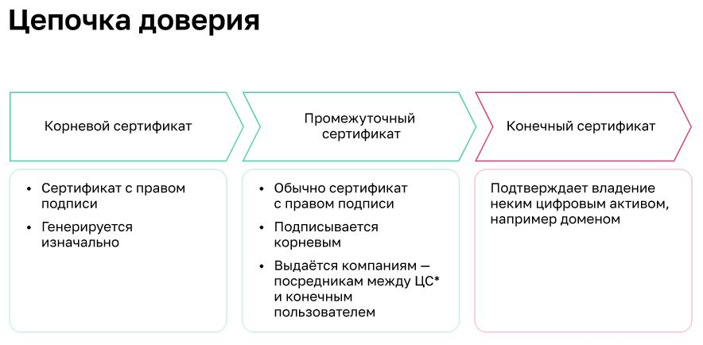
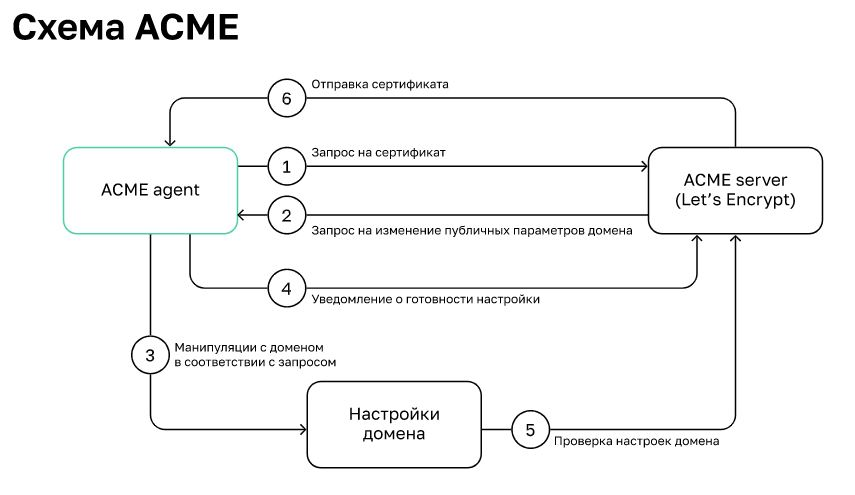

# Высокоуревненые протоколы
* HTTP (80,443) - передача веб страниц
* DNS (53 порт) имена-IP адреса
* IMAP
* SSH - протокол уаделнного управленяи с шифрованием. Пердыдущий - Rlogin - Без шифрования
* FTP - для пеердачи файлов - два потока (порта 20,21) управления и передачи данных. Режимы - активный, пассивный. В Активном - сервер подключается к клиенту и передает ему данные (FileZilla, WinCPS)
* XMPP — мощный, открытый, безопасный протокол обмена сообщениями и информацией о присутствии, основанный на стандартах Используется вовнутренних сетях, поскольку позволяет полцчить информацию о всех пользователях. [ПО для XMPP](https://xmpp.org/software/) На нем работает Whatsapp

## Шифрование
RSA - по именам содателей - основа на вычислении простых чисел.  один из старейших методов асимметричного шифрования. По производительности он уступает алгоритмам симметричного шифрования AES и IDEA\
У каждого учатника два ключа - открытый и закрытый.\
Открытый может только шифровать данные. Приватный - расшифровывать те, что были зашифрованы открытым ключем. Это асинхронное шифрование - меделенно и используется только для обмена сеансовыми ключами для шифрования.\
Сеансовый ключ может щифровать и расшифровыать сообщения - содается в момент рукопожатия\
Принцип генерации ключей:\
Берём 2 простых числа:
 **p** = 7; **q** = 11\
Рассчитываем произведение:
 n = p × q = 77\
Вычисляем функцию Эйлера:
 F = (p – 1) × (q – 1) = 6 × 10 = 60\
Выбираем число **e** — простое, меньше **F** и взаимно простое с ним: например, **13**\
теперь пара чисел {e, n} {13, 77} — мой открытый ключ \
Теперь нужно вычислить число **d**, обратное **е** по модулю **F**:
 \
(d × е) % F = 1 (остаток отделения) или   \
(d × 13) % 60 = 1 Возьмём его равным **37**\
Теперь {d, n} {37, 77} — мой закрытый ключ \
Зашифруем сообщение «50» с помощью ключа {13, 77}:\
получаем  (50 ^ 13) mod 77 = 29 (%, так же остаток от деления)\

Расшифруем закрытым ключом:
\
(29 ^ d) mod n = \
(29 ^ 37) mod 77 = 50\


### Генерирование ключей SSH
```bash
Устанавливаем сервер OpenSSH (Ubuntu):
sudo apt-get install openssh-server
Генерируем ключ:
ssh-keygen -t rsa
Получаем файлы:
/home/user/.ssh/id_rsa
/home/user/.ssh/id_rsa.pub

Записываем публичный ключ:
cat /home/user/.ssh/id_rsa.pub >> /home/user/.ssh/authorized_keys
Пробуем подключиться с использованием ключа:
ssh -i /home/user/.ssh/id_rsa localhost
```

## SSL - secyrity socket layer. 
При установлении соединения SSL используется алгоритм RSA для создания сеансового ключа. Дальнейший обмен происходит с помощью более быстрого симметричного шифрования\
SSL-сертификат — технология, которая создаёт безопасную связь между браузером пользователя и веб-сервером путём шифрования данных\
\

**Работа с SSL**
OpenSSL — основная утилита для работы с SSL\
```bash
openssl req -x509 -newkey rsa:4096 -keyout key.pem -out cert.pem -days 365 — сгенерировать новый сертификат
openssl s_client -connect ya.ru:443 — подключение к серверу и запрос на получение сертификатов
```
\


**Установка сертификата в систему**
```bash
Ubuntu
sudo mkdir /usr/share/ca-certificates/extra
sudo cp foo.crt /usr/share/ca-certificates/extra/foo.crt
sudo update-ca-certificates

CentOS
sudo cp foo.crt /etc/pki/ca-trust/source/anchors/foo.crt
sudo update-ca-trust
```
**Создание своего центра сертификации**
Генерируем ключ и корневой сертификат. Поля в сертификате указываем любые:\
```bash
openssl genrsa -out ca.key 2048 && openssl req -x509 -new -nodes -key ca.key -sha256 -days 720 -out ca.pem
Сразу же сделаем сертификат в формате .crt:
openssl x509 -in ca.pem -inform PEM -out ca.crt
Устанавливаем сертификат в систему:
sudo cp ca.crt /usr/local/share/ca-certificates/myca.crt && sudoupdate-ca-certificates
Приступаем к выпуску самого сертификата, генерируем ключи:
openssl genrsa -out certificate.key 2048
На основе ключа создаём CSR:
openssl req -new -key certificate.key -out certificate.csr
Подписываем CSR нашим корневым сертификатом, тем самым создаём конечный сертификат:
openssl x509 -req -in certificate.csr -CA ca.pem -CAkey ca.key -CAcreateserial -out certificate.crt -days 360 -sha256

При создании запроса на подпись важно указать CommonName (CN), предоставляющее IP-адрес или доменное имядля службы. Без этого сертификат не может быть проверен
```
## ACME letsEncrypt
ACME — протокол, который описывает методы тестирования домена, а также приватных и публичных ключей для запрашиваемого сертификата\


**Настройка LE для работы с Nginx**
```bash
Устанавливаем Сertbot:
sudo yum install certbot
Устанавливаем плагин для работы с Nginx:
sudo yum install python-certbot-nginx
Проверяем конфигурацию Nginx и запускаем Сertbot:
sudo certbot --nginx -d example.com
```
