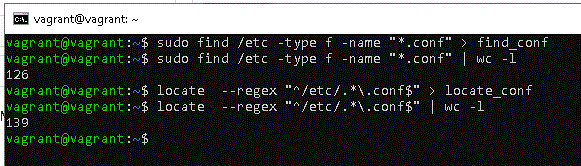
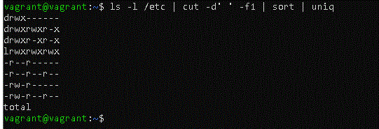
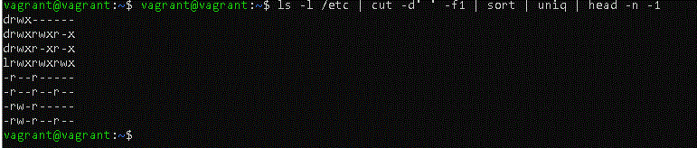
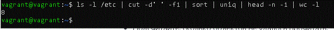
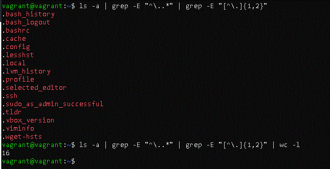

# Домашнее задание к занятию "Работа с текстовыми утилитами" 

### Цель задания
В результате выполнения этого задания вы научитесь:
1. Использовать команды для поиска файлов в Linux;
2. Перенаправлять потоки в различные файлы;
3. Подсчитывать количество строк в выводе;
4. Использовать сортировку.
------

### Чеклист готовности к домашнему заданию

1. Установлена операционная система Ubuntu на виртуальную машину или локально и имеется доступ к терминалу (удаленный или из графической оболочки)
2. Просмотрены скрипты, рассматриваемые на лекции, которые находятся по [ссылке](5-04/)
3. Установлена утилита mlocate `sudo apt-get install mlocate`

------

### Задание 1.

- Найдите все файлы с расширением `.conf` в /etc сначала с помощью команды `find`, а потом с помощью команды `locate`;
- Перенаправьте результаты работы каждой команды в разные файлы;
- Подсчитайте количество найденных файлов в каждом случае с помощью `wc`.

\
[find_conf](find_conf)\
[locate_conf](locate_conf)

------
### Задание 2.

 - Выведите с помощью `cat` содержимое всех файлов в директории /etc `cat /etc/*`;
 - Направьте ошибки в отдельный файл в вашей домашней директории;
 - Стандартный поток вывода направьте в другой файл;
 - Подсчитайте, сколько объектов не удалось прочитать.

\
[content](content)\
[erros_cat](erros_cat)
 
------
### Задание 3.

 - Перенаправьте результат работы команды `ls -l` в каталоге с большим количеством файлов в утилиту `cut`, чтобы отобразить только права доступа к файлам;
 - Отправьте в конвейере этот вывод на `sort` и `uniq`, чтобы отфильтровать все повторяющиеся строки;
 - Уберите из подсчета строку `total`;
 - С помощью `wc` подсчитайте различные типы разрешений в этом каталоге.
 
 \
 \
 \
 
 

------
## Дополнительные задания (со звездочкой*)

Эти задания дополнительные (не обязательные к выполнению) и никак не повлияют на получение вами зачета по этому домашнему заданию. Вы можете их выполнить, если хотите глубже и/или шире разобраться в материале.

### Задание 4.

В ОС Linux скрытыми файлами считаются те, имена которых начинаются с точки.

Сколько скрытых файлов в вашем домашнем каталоге?

------
