# Дипломный практикум в Yandex.Cloud
  * [Цели:](#цели)
  * [Этапы выполнения:](#этапы-выполнения)
     * [Создание облачной инфраструктуры](#создание-облачной-инфраструктуры)
     * [Создание Kubernetes кластера](#создание-kubernetes-кластера)
     * [Создание тестового приложения](#создание-тестового-приложения)
     * [Подготовка cистемы мониторинга и деплой приложения](#подготовка-cистемы-мониторинга-и-деплой-приложения)
     * [Установка и настройка CI/CD](#установка-и-настройка-cicd)
  * [Что необходимо для сдачи задания?](#что-необходимо-для-сдачи-задания)
  * [Как правильно задавать вопросы дипломному руководителю?](#как-правильно-задавать-вопросы-дипломному-руководителю)

**Перед началом работы над дипломным заданием изучите [Инструкция по экономии облачных ресурсов](https://github.com/netology-code/devops-materials/blob/master/cloudwork.MD).**

---
## Цели:

1. Подготовить облачную инфраструктуру на базе облачного провайдера Яндекс.Облако.
2. Запустить и сконфигурировать Kubernetes кластер.
3. Установить и настроить систему мониторинга.
4. Настроить и автоматизировать сборку тестового приложения с использованием Docker-контейнеров.
5. Настроить CI для автоматической сборки и тестирования.
6. Настроить CD для автоматического развёртывания приложения.

---
## Этапы выполнения:


### 1,2. Создание облачной инфраструктуры

Для начала необходимо подготовить облачную инфраструктуру в ЯО при помощи [Terraform](https://www.terraform.io/).

Особенности выполнения:

- Бюджет купона ограничен, что следует иметь в виду при проектировании инфраструктуры и использовании ресурсов;
Для облачного k8s используйте региональный мастер(неотказоустойчивый). Для self-hosted k8s минимизируйте ресурсы ВМ и долю ЦПУ. В обоих вариантах используйте прерываемые ВМ для worker nodes.

Предварительная подготовка к установке и запуску Kubernetes кластера.

1. Создайте сервисный аккаунт, который будет в дальнейшем использоваться Terraform для работы с инфраструктурой с необходимыми и достаточными правами. Не стоит использовать права суперпользователя ✔️
2. Подготовьте [backend](https://developer.hashicorp.com/terraform/language/backend) для Terraform:  
   а. Рекомендуемый вариант: S3 bucket в созданном ЯО аккаунте(создание бакета через TF) ✔️  
  **<не используется>**  б. Альтернативный вариант:  [Terraform Cloud](https://app.terraform.io/)  **</не используется>**  
3. Создайте конфигурацию Terrafrom, используя созданный бакет ранее как бекенд для хранения стейт файла. Конфигурации Terraform для создания сервисного аккаунта и бакета и основной инфраструктуры следует сохранить в разных папках. ✔️
4. Создайте VPC с подсетями в разных зонах доступности. ✔️
5. Убедитесь, что теперь вы можете выполнить команды `terraform destroy` и `terraform apply` без дополнительных ручных действий. ✔️

**<не используется>**  
6. В случае использования [Terraform Cloud](https://app.terraform.io/) в качестве [backend](https://developer.hashicorp.com/terraform/language/backend) убедитесь, что применение изменений успешно проходит, используя web-интерфейс Terraform cloud.  
**</не используется>**  


Ожидаемые результаты:

1. Terraform сконфигурирован и создание инфраструктуры посредством Terraform возможно без дополнительных ручных действий, стейт основной конфигурации сохраняется в бакете или Terraform Cloud ✔️  
2. Полученная конфигурация инфраструктуры является предварительной, поэтому в ходе дальнейшего выполнения задания возможны изменения. ✔️

-------------------------
#### РЕШЕНИЕ 1,2


Конфигурация терраформ для первоначальной настройки [project_code/01_terraform_init/](project_code/01_terraform_init/)  
хранится в папке 01_terraform_init, запускается в самом начале

получаем файл доступа к сервисному аккаунту

`terraform output -json terraform-account-key > ~/.terraform-account-key.json`

в output получаем комманду для настройки бекенда во втором наборе файлов

`terraform output -raw terraform-backend-key`

примерный вид  
`terraform init -backend-config="access_key=******" -backend-config="secret_key=*****"`

получаем файл доступа к аккаунту для cicd

`terraform output -json cicd-account-key > ~/.cicd-account-key.json`

ключи доступа к сервисному аккаунту сохраняются в *home*

Переходим в папку создания инфраструктуры *02_terraform_infrastructure*  
[project_code/02_terraform_infrastructure/]

запускаем комманду `terraform init -backend-config="access_key=******" -backend-config="secret_key=*****"`

запускаем apply проверяем инфаструктуру (скрины приведены из первоначальной конфирурации настроек, дальше добавились машины)

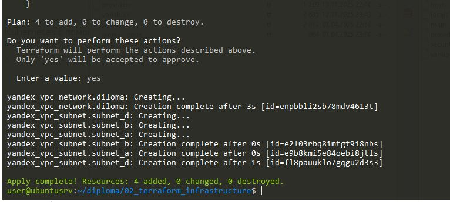

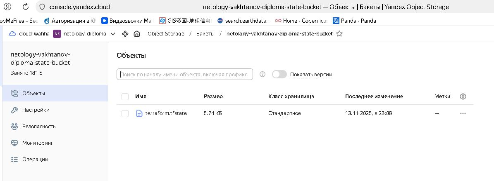

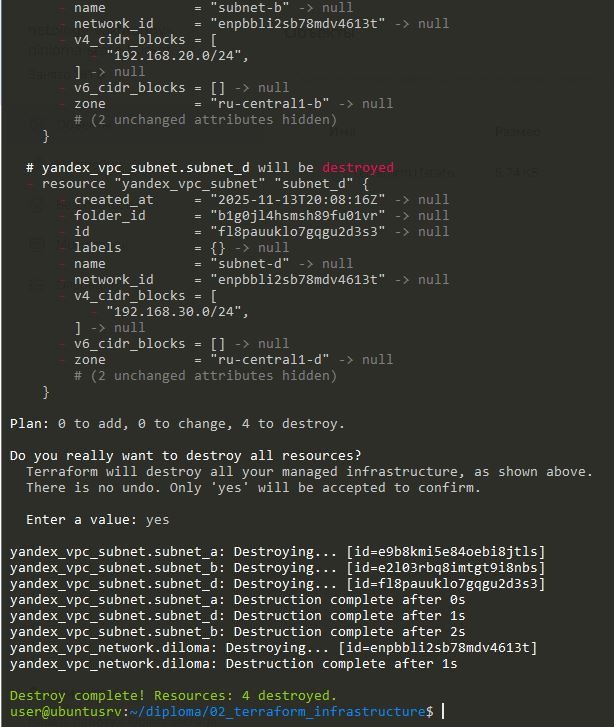

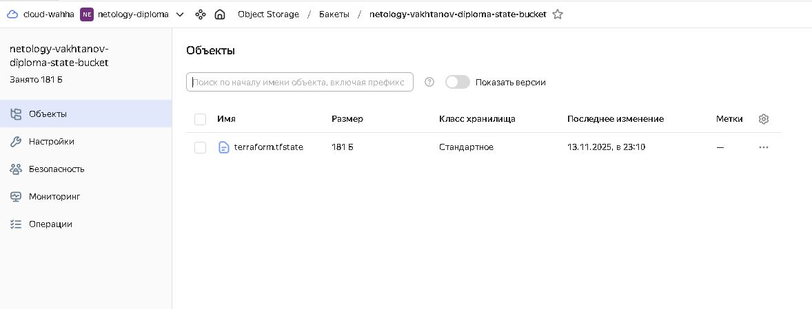

----------------------

---
### 3. Создание Kubernetes кластера

На этом этапе необходимо создать [Kubernetes](https://kubernetes.io/ru/docs/concepts/overview/what-is-kubernetes/) кластер на базе предварительно созданной инфраструктуры.   Требуется обеспечить доступ к ресурсам из Интернета.

Это можно сделать двумя способами:

1. Рекомендуемый вариант: самостоятельная установка Kubernetes кластера.  
   а. При помощи Terraform подготовить как минимум 3 виртуальных машины Compute Cloud для создания Kubernetes-кластера. Тип виртуальной машины следует выбрать самостоятельно с учётом требовании к производительности и стоимости. Если в дальнейшем поймете, что необходимо сменить тип инстанса, используйте Terraform для внесения изменений.  ✔️  
   б. Подготовить [ansible](https://www.ansible.com/) конфигурации, можно воспользоваться, например [Kubespray](https://kubernetes.io/docs/setup/production-environment/tools/kubespray/)  ✔️
   в. Задеплоить Kubernetes на подготовленные ранее инстансы, в случае нехватки каких-либо ресурсов вы всегда можете создать их при помощи Terraform. ✔️  

**<не используется>**  
2. Альтернативный вариант: воспользуйтесь сервисом [Yandex Managed Service for Kubernetes](https://cloud.yandex.ru/services/managed-kubernetes)  
  а. С помощью terraform resource для [kubernetes](https://registry.terraform.io/providers/yandex-cloud/yandex/latest/docs/resources/kubernetes_cluster) создать **региональный** мастер kubernetes с размещением нод в разных 3 подсетях      
  б. С помощью terraform resource для [kubernetes node group](https://registry.terraform.io/providers/yandex-cloud/yandex/latest/docs/resources/kubernetes_node_group)
  **</не используется>**

Ожидаемый результат:

1. Работоспособный Kubernetes кластер.
2. В файле `~/.kube/config` находятся данные для доступа к кластеру.
3. Команда `kubectl get pods --all-namespaces` отрабатывает без ошибок.

-------------------------
#### РЕШЕНИЕ 3

по результатам предыдущего этапа создан файл `inventory.ini` в *home* (в готовом кластере IP могут поменяться)

```ini
[all]

[kube_control_plane]
control-node-subnet-a   ansible_host=158.160.110.213 #fqdn=control-node-subnet-a.ru-central1.internal
control-node-subnet-b   ansible_host=51.250.19.103 #fqdn=control-node-subnet-b.ru-central1.internal
control-node-subnet-d   ansible_host=51.250.34.28 #fqdn=control-node-subnet-d.ru-central1.internal


[etcd:children]

kube_control_plane


[kube_node]
worker-node-1   ansible_host=84.201.175.124 #fqdn=worker-node-1.ru-central1.internal
worker-node-2   ansible_host=89.169.182.144 #fqdn=worker-node-2.ru-central1.internal


[calico_rr]


[k8s_cluster:children]
kube_control_plane
kube_node
calico_rr

[kube_control_plane:vars]
#IP control_node
supplementary_addresses_in_ssl_keys = [ "158.160.110.213" ]
```

создан файл `parameters.json` в *home*

```json
{
    "helm_enabled" : true,
    "ingress_nginx_enabled" : true,
    "cluster_name" : "cluster.local",
    "kubectl_localhost" : true,
    "kubeconfig_localhost" : true,
    "persistent_volumes_enabled" : true,
    "dashboard_enabled" : true,
}

```

Дополнительные настройки нужны для установки ingress, helm, kubectl, копирвоание файла конфигруации, добавления в сертификат внешнего IP control node

для развертки использовался Kubespray. control node и worker node на базе Rocky Linux 9 
*(на Ubuntu 22, 24 Kubespray завершается не корректно при проверке работы kubectl на control node. Исправить не смог)*

**последовательность развертки**   
Находимся в дирректории *03_ansible_kubernetes* в ней также лежит `inventory.ini`, созданный на предыдущем этапе

```bash
python3 -m venv venv
source venv/bin/activate
git clone https://github.com/kubernetes-sigs/kubespray.git
cd kubespray
#git 9975b5d525e38b40ec3ca415f7b00d68d3df4782 !!!
#git checkout v2.29.0 ??
#git checkout 5488e7d805851249c3d1813a736ad6027c3a2bc1???
pip install -r requirements.txt

*настройка инвентори* 
cp -rfp inventory/sample inventory/mycluster
cp ../inventory.ini inventory/mycluster
cp ../parameters.json parameters.json

ansible-playbook -i inventory/mycluster/inventory.ini -u wahha -b -v --private-key=~/.ssh/wahha_rsa cluster.yml --extra-vars "@parameters.json"

ждем завершения установки - минут 15-20

копируем конфиг kubectl
cp  inventory/mycluster/artifacts/admin.conf ~/.kube/config

в ~/.kube/config меняем адрес подключения на внешний адрес первой ноды

проверяем работу
kubectl cluster-info
kubectl get po -A
kubectl get nodes
```

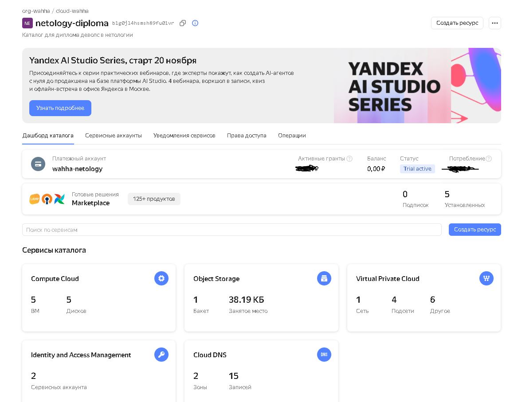

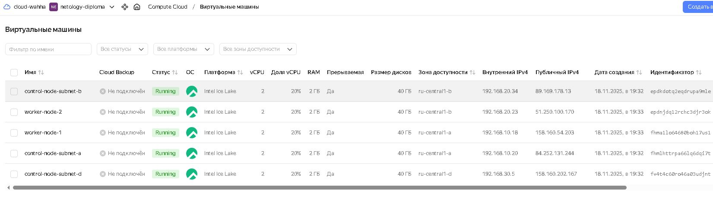

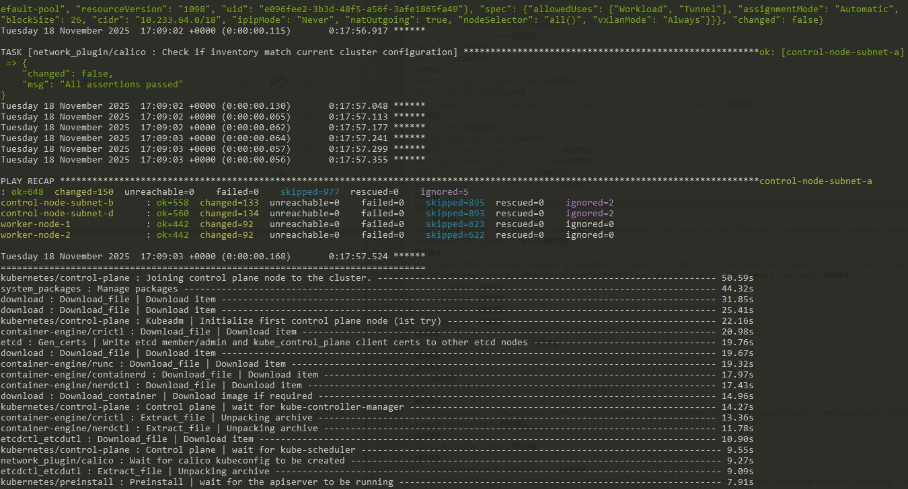

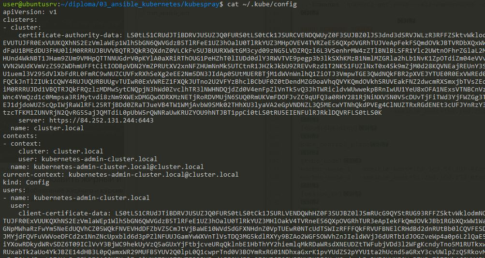

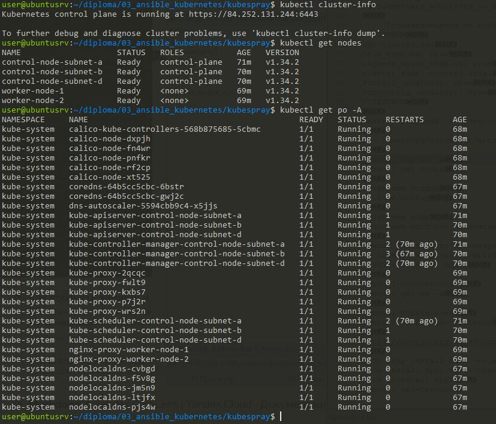

попробуем задеплоить чтото и установим и проверим Helm
`kubectl create namespace netology`
`sudo snap install helm --classic`

запускаем тестовый деплоймент [test_deploy](project_code/03_ansible_kubernetes/test_deploy/)

`sh start.sh`

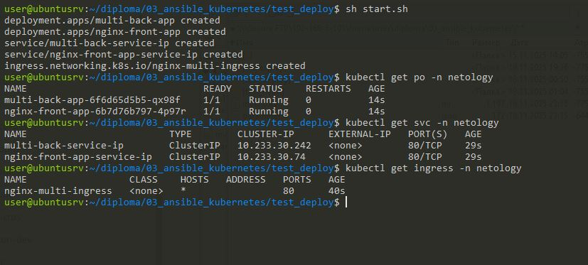  
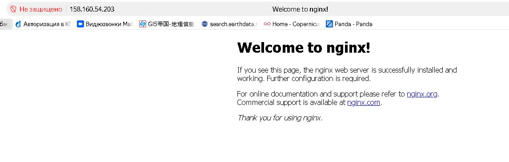  
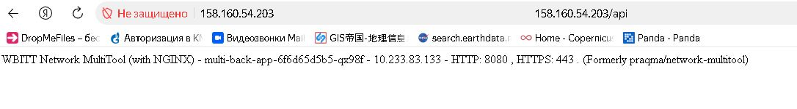  
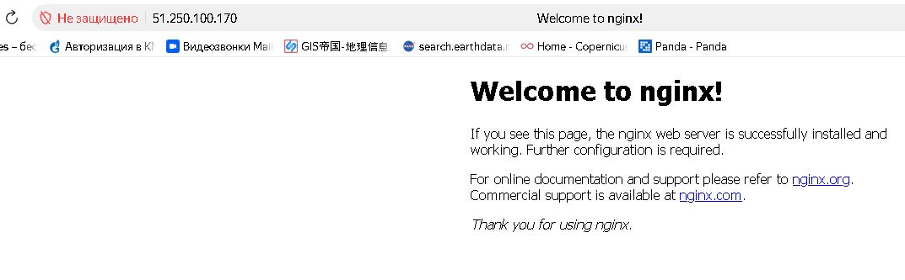  
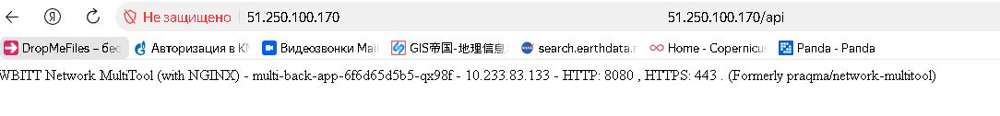  

`stop.sh`

запускаем тестовый helm [test_helm](project_code/03_ansible_kubernetes/test_helm/)

`helm install app1 nginx-chart`

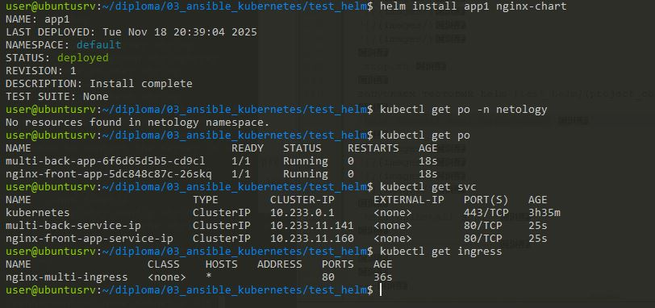

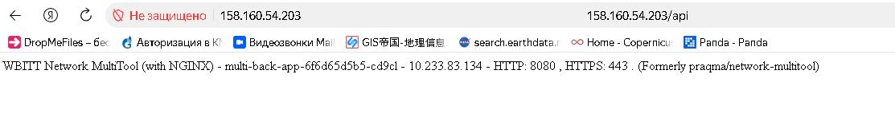

`helm uninstall app1` 

----------------------


---
### 4. Создание тестового приложения

Для перехода к следующему этапу необходимо подготовить тестовое приложение, эмулирующее основное приложение разрабатываемое вашей компанией.

Способ подготовки:

1. Рекомендуемый вариант:  
   а. Создайте отдельный git репозиторий с простым nginx конфигом, который будет отдавать статические данные. ✔️    
   б. Подготовьте Dockerfile для создания образа приложения. ✔️    
   
   **<не используется>**  
2. Альтернативный вариант:  
   а. Используйте любой другой код, главное, чтобы был самостоятельно создан Dockerfile.  
   **</не используется>**

   
Ожидаемый результат:  
1. Git репозиторий с тестовым приложением и Dockerfile. ✔️    
2. Регистри с собранным docker image. В качестве регистри может быть **<не используется>** DockerHub **</не используется>** или [Yandex Container Registry](https://cloud.yandex.ru/services/container-registry), созданный также с помощью terraform. ✔️    


-------------------------
#### РЕШЕНИЕ 4
Репозиторий  
[https://github.com/vakhtanov/netology-diploma-app](https://github.com/vakhtanov/netology-diploma-app)

[nginx_app](project_code/04_nginx_app/nginx_app/)

Yandex Container Registry - создается в первой стадии иницализации [project_code/01_terraform_init/](project_code/01_terraform_init/)  
на первом этапе terraform выдет комманду для docker build с ID реджистри  

комманды для создания image и загрузки в реджистри. 
```bash
# настраиваем репозиторий (docker установлен и настроен заранее)
cat ~/.cicd-account-key.json | docker login --username json_key --password-stdin cr.yandex

# собираем образ
docker build . -t cr.yandex/crpefno6d2dqdrf96gqk/nginx-app:v0.0.1

#проверяем, что запускается
docker run --name nginx-app  -p 8080:80 cr.yandex/crpefno6d2dqdrf96gqk/nginx-app:v0.0.1

# отправляем в реджистри
docker push cr.yandex/crpefno6d2dqdrf96gqk/nginx-app:v0.0.1
```

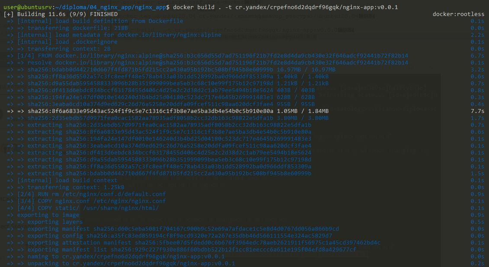  
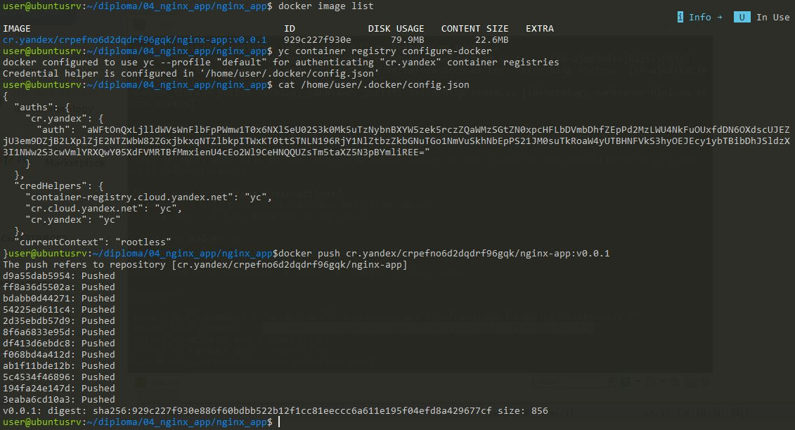  
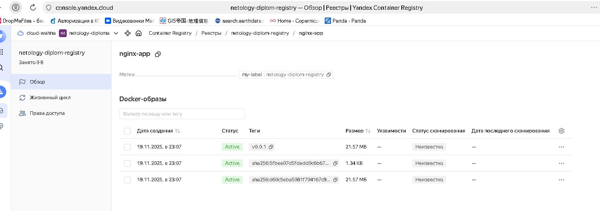  
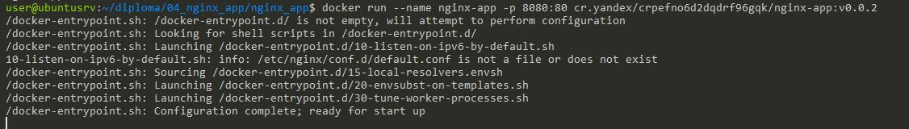  
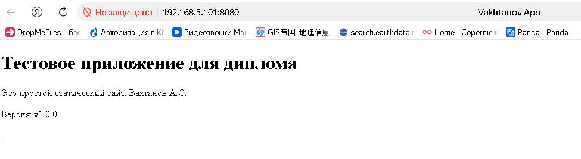  

[Yandex Container Registry nginx-app](https://console.yandex.cloud/folders/b1g0jl4hsmsh89fu01vr/container-registry/registries/crpefno6d2dqdrf96gqk/overview/nginx-app/image)

----------------------


---
### 5. Подготовка cистемы мониторинга и деплой приложения

Уже должны быть готовы конфигурации для автоматического создания облачной инфраструктуры и поднятия Kubernetes кластера.  
Теперь необходимо подготовить конфигурационные файлы для настройки нашего Kubernetes кластера.

Цель:
1. Задеплоить в кластер [prometheus](https://prometheus.io/), [grafana](https://grafana.com/), [alertmanager](https://github.com/prometheus/alertmanager), [экспортер](https://github.com/prometheus/node_exporter) основных метрик Kubernetes. ✔️
2. Задеплоить тестовое приложение, например, [nginx](https://www.nginx.com/) сервер отдающий статическую страницу. ✔️

Способ выполнения:
1. Воспользоваться пакетом [kube-prometheus](https://github.com/prometheus-operator/kube-prometheus), который уже включает в себя [Kubernetes оператор](https://operatorhub.io/) для [grafana](https://grafana.com/), [prometheus](https://prometheus.io/), [alertmanager](https://github.com/prometheus/alertmanager) и [node_exporter](https://github.com/prometheus/node_exporter). Альтернативный вариант - использовать набор helm чартов от [bitnami](https://github.com/bitnami/charts/tree/main/bitnami).


### 6. Деплой инфраструктуры в terraform pipeline

1. Если на первом этапе вы не воспользовались [Terraform Cloud](https://app.terraform.io/), то задеплойте и настройте в кластере [atlantis](https://www.runatlantis.io/) для отслеживания изменений инфраструктуры. Альтернативный вариант 3 задания: вместо Terraform Cloud или atlantis настройте на автоматический запуск и применение конфигурации terraform из вашего git-репозитория в выбранной вами CI-CD системе при любом комите в main ветку. Предоставьте скриншоты работы пайплайна из CI/CD системы.

Ожидаемый результат:
1. Git репозиторий с конфигурационными файлами для настройки Kubernetes.
2. Http доступ на 80 порту к web интерфейсу grafana.
3. Дашборды в grafana отображающие состояние Kubernetes кластера.
4. Http доступ на 80 порту к тестовому приложению.
5. Atlantis или terraform cloud или ci/cd-terraform

-------------------------
#### РЕШЕНИЕ 5

##### ЗАДАЧА 1

Для мониторнига воспользуемся Prometheus Community Kubernetes Helm Charts
https://github.com/prometheus-community/helm-charts/tree/main/charts/kube-prometheus-stack

и дополнительной статьей
https://dev.to/tinhtq97/configuring-access-to-prometheus-and-grafana-via-sub-paths-55n7?ysclid=miqmg1xc5n283448603

Заходим в дирректорию **05_monitoring_app/01kube-prometheus-stack** 

создаем файл [values_grafana.yaml](project_code/05_monitoring_app/01kube-prometheus-stack/values_grafana.yaml) с настройками для доступа к Grafana снаружи (включаем ingress и настраиваем адреса

```yaml
grafana:
  env:
    GF_SERVER_ROOT_URL: http://netology.local/grafana
    GF_SERVER_SERVE_FROM_SUB_PATH: "true"
  ingress:
    ## If true, Grafana Ingress will be created
    ##
    enabled: true
    ingressClassName: nginx
    hosts: 
      - netology.local
    path: /grafana
```

на машине с которой будем заходить в grafana прописываем в файле hosts IP нашего домена `netology.local`
в моем случае `84.201.175.124 netology.local`

Выполняем комманд для запуска системы мониторинга

``` bash
helm install kube-monitoring oci://ghcr.io/prometheus-community/charts/kube-prometheus-stack -f values_grafana.yaml -n monitoring  --create-namespace

проверяем, что сервисы все развернулись
kubectl get po -n monitoring

получаем пароль от admin
kubectl --namespace monitoring get secrets monitoring-grafana -o jsonpath="{.data.admin-password}" | base64 -d ; echo

если надо удалить мониторниг 
helm uninstall kube-monitoring -n monitoring
```


проверка подов

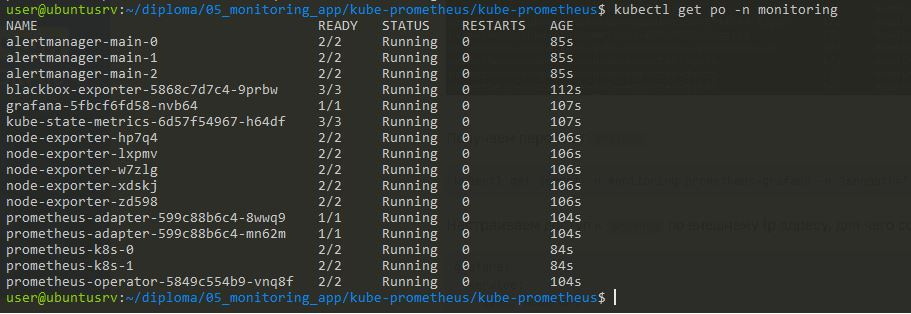

Проверяем доступ снаружи  
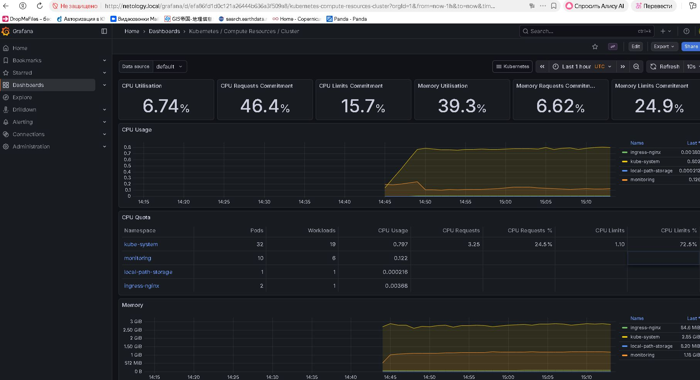

**TODO** **ДОСТУП NLB пока в работе**


##### ЗАДАЧА 2

для деплоя тестового приложения выполняем комплексный манифест  
[nginx.deploy.yaml](project_code/05_monitoring_app/02nginx-app-deploy/nginx.deploy.yaml)

проверяем

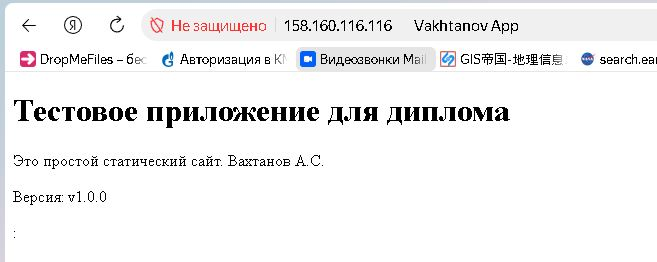


-------------------------
#### РЕШЕНИЕ 6 ATLANTIS
[Репозиторий с кодом Terraform для инициализации облака](https://github.com/vakhtanov/netology-diploma-terraform-stage1.git)

[Репозиторий с кодом Terraform для инфраструктуры](https://github.com/vakhtanov/netology-diploma-terraform-stage2.git)

**ДЕПЛОЙ ATLANTIS - это прям челендж!!! Главным образом из-за пробелов в документации**

Базовая установка особых вопросов не вызывает
[Руководство по установке](https://www.runatlantis.io/docs/installation-guide.html)

[метод деплоя через HELM](https://www.runatlantis.io/docs/deployment.html#kubernetes-helm-chart)

переходим в папку для atlantis - `project_code\05_monitoring_app\03atlantis\`

Генерируем Webhook Secret [https://www.browserling.com/tools/random-string](https://www.browserling.com/tools/random-string)  
и сохраняем в файл `webhook-secret`  
в github генерируем токен доступа и сохраняем в файл `token`  
создаем отдельный намеспейс `kubectl create namespace atlantis`  

Клонируем и обновляем репозиторий  
`helm repo add runatlantis https://runatlantis.github.io/helm-charts`
`helm repo update`

Создаем файл параметров `values.yaml`  
`helm inspect values runatlantis/atlantis > values.yaml`  

Задаем свои параметры в файле  
Основные настройки:
- git репозиторий и доступ к нему
- вебхук
- доступ к бекэнду терраформ
- доступ к яндекс облаку

итого меняем:
```
github:
  user: vakhtanov
  token: ********
  secret: ********

orgAllowlist: "github.com/vakhtanov/netology-diploma-terraform-stage2"

внешний порт доступа
service:
  type: NodePort
  annotations: {}
  port: 80
  portName: atlantis
  nodePort: 30041

креды к backend yandexcloud
aws:
   credentials: |
     [default]
     AWS_ACCESS_KEY_ID=*********
     AWS_SECRET_ACCESS_KEY=*******
     region=ru-central1

```

итого получим value.yaml приблидительн такого вида:  
[values_nocred.yaml](project_code/05_monitoring_app/03atlantis/values_nocred.yaml)

Для работы atlantis нужен PV, создаем его (вариант для тестов)  
`kubectl apply -f https://raw.githubusercontent.com/rancher/local-path-provisioner/master/deploy/local-path-storage.yaml`

определяем дефолтный storageclass:  
`kubectl patch storageclass local-path -p '{"metadata": {"annotations":{"storageclass.kubernetes.io/is-default-class":"true"}}}'`

Запускаем приложение и ждем пока поднимется  
`helm install atlantis runatlantis/atlantis -f values.yaml -n atlantis`

пару параметров (зеркало terraform и доступ к яндекс облаку) не удалось красиво передать, копируем прямо в POD  
```
kubectl cp ./.terraformrc atlantis/atlantis-0:/home/atlantis/
kubectl cp /home/user/.terraform-account-key.json atlantis/atlantis-0:/home/atlantis/
```

на сайте github настраиваем вебхук по инструкции [https://www.runatlantis.io/docs/configuring-webhooks.html](https://www.runatlantis.io/docs/configuring-webhooks.html)

если что-то пошло не так можно удалить или обновить приложение или посмотреть статус:  
```
helm delete atlantis  -n atlantis
helm upgrade atlantis runatlantis/atlantis -f values.yaml -n atlantis
helm describe po atlantis  -n atlantis
```

проверяем, что доступно снаружи  
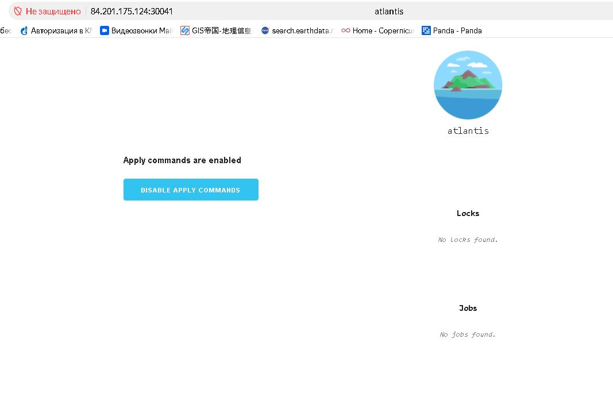

Теперь в локальной копии репоитория с инфраструктурой создаем новую ветку, вносим нужные изменения, коммитим, отправляем в github. На сайте создаем pull request на мердж в мастер. Atlantis получает сигнал скачать код, запустить terraform plan и выложить результат в комментарий. В комментах пуллрекеста получаем:  
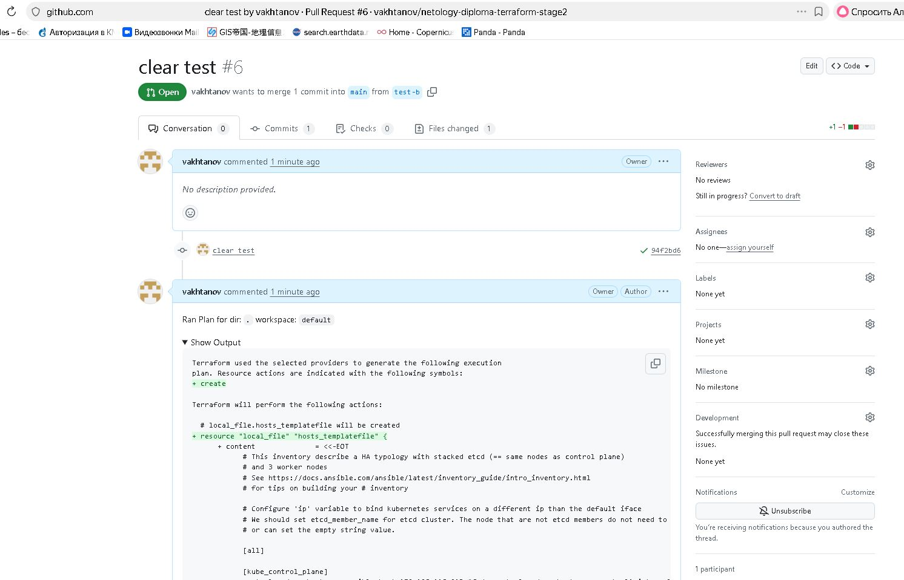  
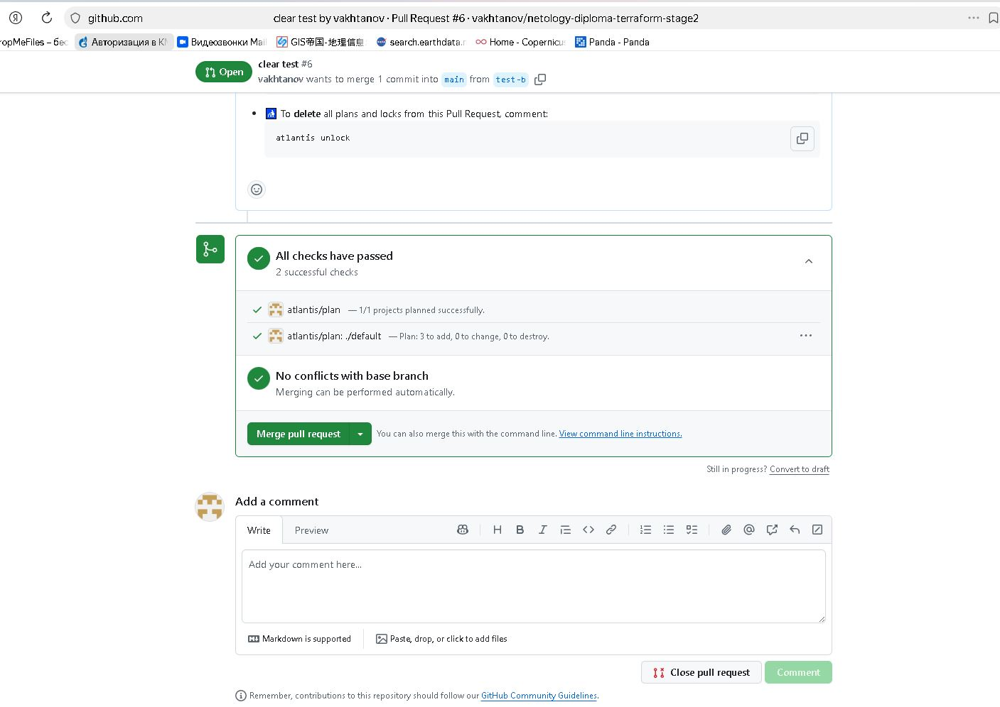  

все прошло успешно, смотрим какие машины в облаке. Эта ветка для примера создает новую VM
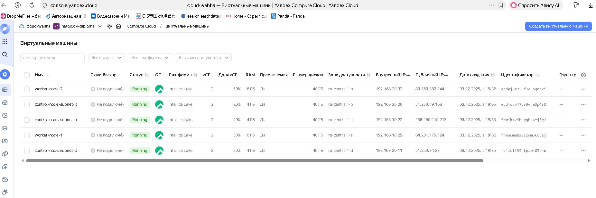  
смотрим, что на сайте atlantis  
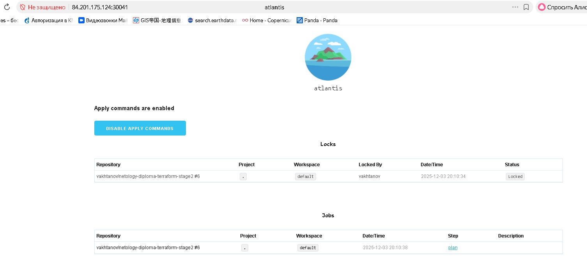  
в комментах ревеста пишем `atlantis apply d .` Пошли применяться изменения  
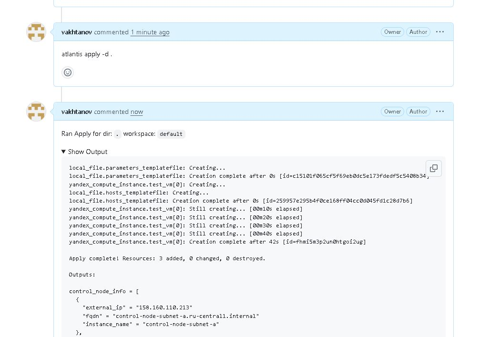  
проверяем облако - машина есть
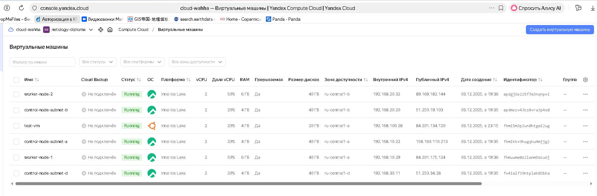  
подтверждаем пулл реквест, обновляем локальный репозиторий, смотрим историю:  
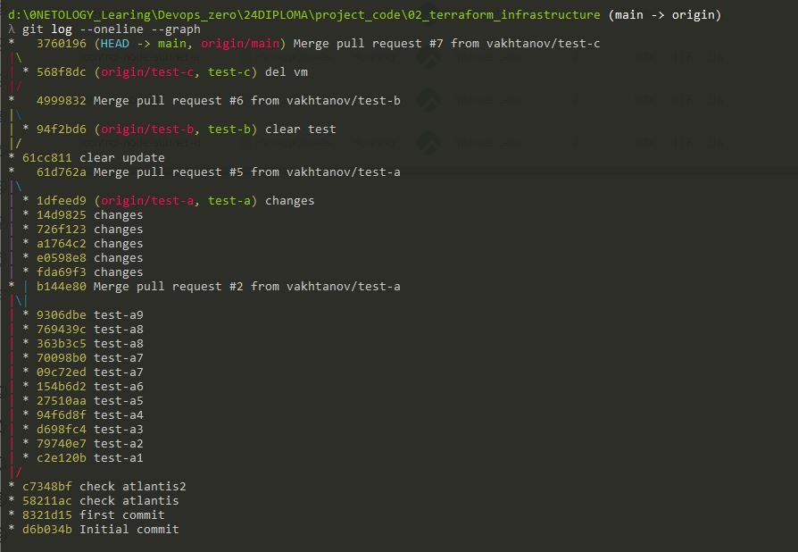  
  

ГОТОВО!

----------------------


---
### 7. Установка и настройка CI/CD

Осталось настроить ci/cd систему для автоматической сборки docker image и деплоя приложения при изменении кода.

Цель:

1. Автоматическая сборка docker образа при коммите в репозиторий с тестовым приложением.
2. Автоматический деплой нового docker образа.

Можно использовать [teamcity](https://www.jetbrains.com/ru-ru/teamcity/), [jenkins](https://www.jenkins.io/), [GitLab CI](https://about.gitlab.com/stages-devops-lifecycle/continuous-integration/) или GitHub Actions.

Ожидаемый результат:

1. Интерфейс ci/cd сервиса доступен по http.
2. При любом коммите в репозиторие с тестовым приложением происходит сборка и отправка в регистр Docker образа.
3. При создании тега (например, v1.0.0) происходит сборка и отправка с соответствующим label в регистри, а также деплой соответствующего Docker образа в кластер Kubernetes.

-------------------------
#### РЕШЕНИЕ 7


deployed pod

```bash
user@ubuntusrv:~/diploma/05_monitoring_app/02nginx-app-deploy$ kubectl describe po nginx-app-depl-7cc9c5558-26gxk
Name:             nginx-app-depl-7cc9c5558-26gxk
Namespace:        default
Priority:         0
Service Account:  default
Node:             worker-node-1/192.168.10.29
Start Time:       Wed, 10 Dec 2025 18:55:57 +0000
Labels:           app=nginx-app
                  pod-template-hash=7cc9c5558
Annotations:      cni.projectcalico.org/containerID: 438275627ad93fe75e2bd5fe020d9ad01b0a5fbf90c97b1ed32227486441195b
                  cni.projectcalico.org/podIP: 10.233.84.213/32
                  cni.projectcalico.org/podIPs: 10.233.84.213/32
Status:           Running
IP:               10.233.84.213
IPs:
  IP:           10.233.84.213
Controlled By:  ReplicaSet/nginx-app-depl-7cc9c5558
Containers:
  nginx-app-c:
    Container ID:   containerd://8a21e56c1ebf80700513cc24712c00f588bf257263cb20e641852f9d77fa4c99
    Image:          cr.yandex/crpefno6d2dqdrf96gqk/nginx-app:v0.0.9
    Image ID:       cr.yandex/crpefno6d2dqdrf96gqk/nginx-app@sha256:02623cf798546e23ce9756e15494b130ba8d6ea784aaf6dbf49b9b1826b9c537
    Port:           80/TCP
    Host Port:      0/TCP
    State:          Running
      Started:      Wed, 10 Dec 2025 18:56:00 +0000
    Ready:          True
    Restart Count:  0
    Liveness:       http-get http://:80/healthz delay=5s timeout=1s period=10s #success=1 #failure=3
    Environment:    <none>
    Mounts:
      /var/run/secrets/kubernetes.io/serviceaccount from kube-api-access-s46mh (ro)
Conditions:
  Type                        Status
  PodReadyToStartContainers   True
  Initialized                 True
  Ready                       True
  ContainersReady             True
  PodScheduled                True
Volumes:
  kube-api-access-s46mh:
    Type:                    Projected (a volume that contains injected data from multiple sources)
    TokenExpirationSeconds:  3607
    ConfigMapName:           kube-root-ca.crt
    Optional:                false
    DownwardAPI:             true
QoS Class:                   BestEffort
Node-Selectors:              <none>
Tolerations:                 node.kubernetes.io/not-ready:NoExecute op=Exists for 300s
                             node.kubernetes.io/unreachable:NoExecute op=Exists for 300s
Events:
  Type    Reason     Age    From               Message
  ----    ------     ----   ----               -------
  Normal  Scheduled  5m51s  default-scheduler  Successfully assigned default/nginx-app-depl-7cc9c5558-26gxk to worker-node-1
  Normal  Pulling    5m50s  kubelet            Pulling image "cr.yandex/crpefno6d2dqdrf96gqk/nginx-app:v0.0.9"
  Normal  Pulled     5m48s  kubelet            Successfully pulled image "cr.yandex/crpefno6d2dqdrf96gqk/nginx-app:v0.0.9" in 2.091s (2.091s including waiting). Image size: 22998606 bytes.
  Normal  Created    5m48s  kubelet            Created container: nginx-app-c
  Normal  Started    5m48s  kubelet            Started container nginx-app-c
user@ubuntusrv:~/diploma/05_monitoring_app/02nginx-app-deploy$
```


----------------------

---
## Что необходимо для сдачи задания?

1. Репозиторий с конфигурационными файлами Terraform и готовность продемонстрировать создание всех ресурсов с нуля.
2. Пример pull request с комментариями созданными atlantis'ом или снимки экрана из Terraform Cloud или вашего CI-CD-terraform pipeline.
3. Репозиторий с конфигурацией ansible, если был выбран способ создания Kubernetes кластера при помощи ansible.
4. Репозиторий с Dockerfile тестового приложения и ссылка на собранный docker image.
5. Репозиторий с конфигурацией Kubernetes кластера.
6. Ссылка на тестовое приложение и веб интерфейс Grafana с данными доступа.
7. Все репозитории рекомендуется хранить на одном ресурсе (github, gitlab)
