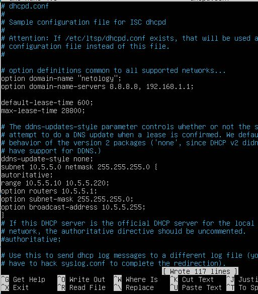

# Домашнее задание к занятию "DHCP, PXE"

Эти задания обязательные к выполнению. Пожалуйста, присылайте на проверку все задачи сразу. Любые вопросы по решению задач задавайте в чате учебной группы.

### Цели задания

1. Научиться создавать и настраивать DHCP-сервер
2. Настроить автоматическую выдачу ip-адресов для конечных устройств.

Данная практика закрепляет знания о работе протокола DHCP и настройку параметров сетевых устройств. Эти навыки пригодятся для понимания принципов построения сети и взаимодействия сетевых устройств между собой.

### Дополнительные материалы, которые могут пригодится для выполнения задания

[Статья о настройке DHCP-cервера в ОС Debian](https://aeb-blog.ru/debian/ustanovka-dhcp-servera-v-debian-10/)

### Задание 1

#### Описание задания
Перед вами стоит задача настроить DHCP-сервер в Linux.

#### Требование к результату
- Вы должны отправить файл с выполненным заданием.
- К выполненной задаче добавьте скриншоты настройки и работающего DHCP-сервера.
- Для выполнения заданий вы можете использовать дистрибутив на ваш выбор (Deb-дистрибутив или CentOs).

#### Процесс выполнения
1. Запустите программу VirtualBox
2. В программе VirtualBox загрузите операционную систему Ubuntu, если она у вас не установлена в качестве основной системы.
3. Установите DHCP-сервер:
    *sudo apt-get install isc-dhcp-server -y*

5. Настройте DHCP-сервер так, чтобы клиенту выдавался ip-адрес, ip-адрес dns-сервера и максимальное время аренды адреса было 8 часов.
   

   
7. Запустите службу DHCP:
    *sudo systemctl start isc-dhcp-server.service*

### Задание 2.

#### Описание задания
Перед вами стоит задача создать и настроить PXE-сервер.

#### Требование к результату
- Вы должны отправить файлы с выполненным заданием
- К выполненной задаче добавьте скриншоты с конфигурацией PXE-сервера и его работоспособность.
- Для выполнения заданий вы можете использовать дистрибутив на ваш выбор (Deb-дистрибутив или CentOs).

#### Процесс выполнения
1. Запустите программу VirtualBox
2. В программе VirtualBox загрузите операционную систему Ubuntu, если она у вас не установлена в качестве основной системы.
3. Установите TFTP-сервер:
   *sudo apt-get install tftpd-hpa*
4. Создайте директорию для TFTP-сервера.
5. В файле “tftp-hpa” TFTP-сервера укажите выделенный ip-адрес или адрес loopback-интерфейса.   
7. Также в дополнительных опциях TFTP-сервера разрешите создавать новые файлы.

   
9. Перезагрузите TFTP-сервер: 
   *service tftp-hpa restart*

   
10. Создайте в директории TFTP-сервера какой-нибудь файл

    
11. Проверьте работоспособность PXE-сервера, либо загрузив с него файл по сети, либо подключившись TFTP-клиентом.

    
13. Выполните скриншоты и ответ внесите в комментарии к решению задания. 

### Общие критерии оценки
Задание считается выполненным при соблюдении следующих условий:
1. Выполнено оба задания
2. К заданию прикреплено 2 файла конфигураций и скриншоты работающих серверов: по итогам выполнения каждого задания

[dhcpd.conf](dhcpd.conf)

[tftpd-hpa](tftpd-hpa)

