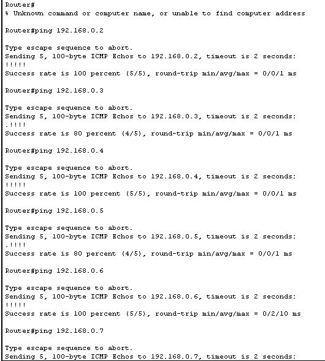
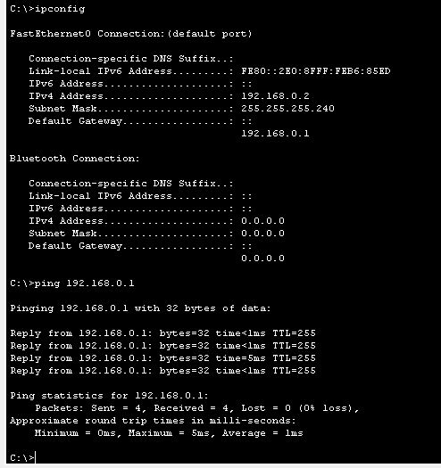
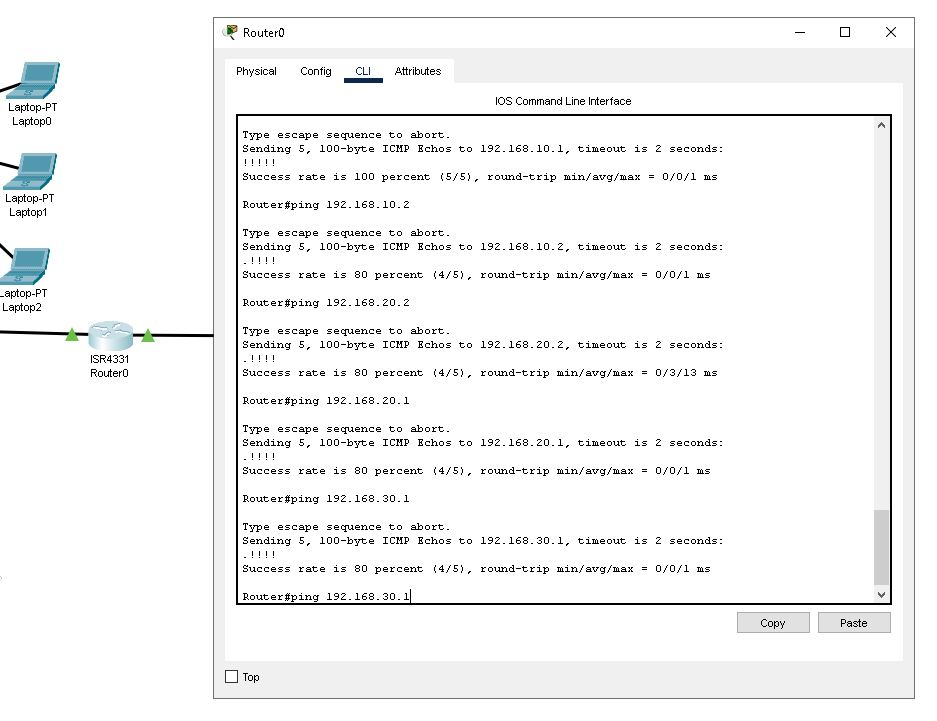
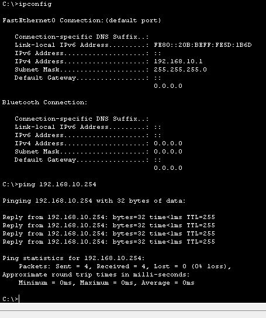
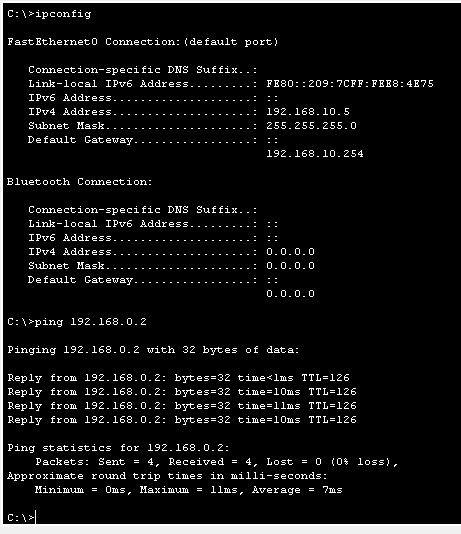
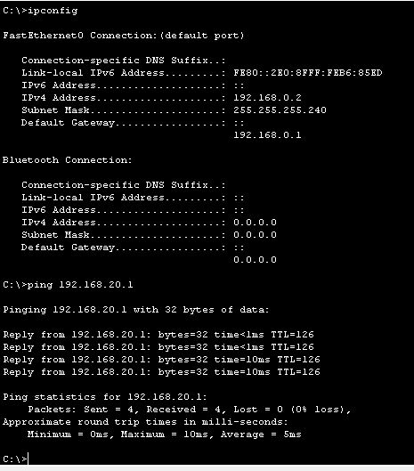

# Домашнее задание к занятию "L3-сеть"

---

### Цели задания:
- научиться правильно рассчитывать маску для выделенных подсетей,
- освоить конфигурацию сетевых интерфейсов устройств, работающих на третьем уровне модели OSI,
- научиться создавать IP-связность между устройствами.

Практика закрепляет знания о работе устройств на сетевом уровне модели OSI. Полученные навыки пригодятся для понимания принципов построения сети и создания связности сетевых устройств между собой.

### Чеклист готовности к домашнему заданию:
1. вы прочитали статью [«Основы работы с Cisco Packet Tracer»;](https://pc.ru/articles/osnovy-raboty-s-cisco-packet-tracer)
2. на вашем компьютере установлена программа Cisco Packet Tracer;
3. вы выполнили домашнее задание [«L2-сеть».](https://github.com/netology-code/snet-homeworks/blob/snet-22/4-02.md)

### Инструкция по выполнению: 
- Выполните оба задания.
- Сделайте скриншоты из Cisco Packet Tracer по итогам выполнения каждого задания.
- Отправьте на проверку в личном кабинете Нетологии два PKT-файла. Файлы прикрепите в раздел «Решение» в практическом задании.
- В комментариях к решению в личном кабинете напишите пояснения к полученным результатам. 

---

## Задание 1. Сборка локальной сети
*Важно. Задание сквозное и составлено на основе практического задания из домашней работы [«L2-сеть».](https://github.com/netology-code/snet-homeworks/blob/snet-22/4-02.md)* 

### Описание задания
Перед вами стоит задача собрать часть локальной сети главного офиса. 

В вашем распоряжении две сети:
- 192.168.0.0 — предназначена для устройств главного офиса;
- 10.0.0.0 — предназначена для сетевого оборудования главного офиса.

Необходимо из каждой выделить минимальную подсеть для 4 сетевых устройств и 10 пользовательских устройств.

### Требования к результату:
- Отправьте PKT-файл с выполненным заданием.
- Добавьте скриншоты с доступностью устройств между собой и ответ на вопрос.

### Процесс выполнения:
1. Запустите программу Cisco Packet Tracer.
2. В программе загрузите предыдущую практическую работу.
3. Добавьте два маршрутизатора, соедините и создайте между ними сетевую связность.
4. К одному из маршрутизаторов подключите гигабитным интерфейсом ещё один коммутатор, за которым подключены два ПК, два ноутбука и два принтера. Это будет сеть главного офиса.
5. Выделите минимальную подсеть для 10 пользовательских устройств.
6. Настройте сетевые интерфейсы всех оконечных устройств так, чтобы была доступность всех со всеми.
7. Проверьте доступность каждого типа устройств с маршрутизатора, к которому они подключены, командой ping.
8. Какую минимальную маску необходимо выделить для устройств и почему? Ответ внесите в комментарии к решению задания в личном кабинете.

### Топология после выполнения задания должна выглядеть так:

[Сеть к заданию 1](dz3_task1.pkt)

Пинги на роутере\

Пинги на компе\

        Для сетевого оборудования 10.0.0.0 можно выделить 6+2 адреса с маской 29. 
        *с маской 30 доступно только 4 адреса из них один широковщательный - на 4 устройства не хватит*
        Для устройств 192.168.0.0 - маску 28 на 14+2 адресов.

---

## Задание 2. Подключение локальной сети 
*Важно. Задание сквозное и составлено на основе практического задания из домашней работы [«L2-сеть».](https://github.com/netology-code/snet-homeworks/blob/snet-22/4-02.md)*

### Описание задания
Перед вами стоит задача подключить получившуюся небольшую локальную сеть к главной сети офиса. 

### Требования к результату:
- Отправьте PKT-файл с выполненным заданием.
- Добавьте скриншоты с доступностью устройств между собой и ответы на вопросы.

### Процесс выполнения:
1. Запустите программу Cisco Packet Tracer.
2. В программе загрузите предыдущую практическую работу.
3. Маршрутизатор без устройств соедините с любым коммутатором из предыдущей практической задачи домашней работы «L2-сеть». 
4. Создайте сабинтерфейсы для каждой VLAN: 10, 20, 30.
5. Назначьте IP-адреса каждому сабинтерфейсу.
6. Напишите в комментариях, какую минимальную маску необходимо указать для сабинтерфейса, обоснуйте своё решение.
7. Проверьте связь маршрутизатора с конечными устройствами в каждой VLAN командой ping.
8. Есть ли доступность между компьютерами за разными сетями маршрутизаторов? Ответ внесите в комментарии к решению задания в личном кабинете.

### Топология после выполнения задания должна иметь следующий вид:

[Сеть к заданию 2](dz3_task2.pkt)

пинги устройств vilanов\

пинг роутера с компа vlan\

       Для каждого сабинтерфеса можно было бы указать свою маску
       для 10.254 - /29 - на 8 адресов, для 20.254 и 30.254 - /30 - на 4 адреса
       но в левой части сети маска уже задана для всех сетей /24 - чтобы не менять на узлах, на сабинтерфейсах ставим ее же
       
       сети с разных сторон маршрутизатора пока другдругу не доступны - нет маршрутов на роутерах и нет шлюзов на узлах

---

## Задание 3. Создание связности между сетями 

*ВАЖНО. Задание является сквозным и составлено на основе практической задачи из домашних работ ["L2-сеть"](https://github.com/netology-code/snet-homeworks/blob/snet-22/4-02.md) и [“L3-сеть”](https://github.com/netology-code/snet-homeworks/edit/snet-22/4-03.md).* 

### Описание задания
Перед вами стоит задача создать доступность устройств небольшой локальной сети к главной сети офиса. 

### Требование к результату
- Отправьте файл .pkt с выполненным заданием.
- К выполненной задаче добавьте скриншоты с доступностью устройств между собой.

### Процесс выполнения
1. Запустите программу Cisco Packet Tracer.
2. В программе Cisco Packet Tracer загрузите предыдущую практическую работу из домашних заданий ["L2-сеть".](https://github.com/netology-code/snet-homeworks/blob/snet-22/4-02.md) и [“L3-сеть”](https://github.com/netology-code/snet-homeworks/edit/snet-22/4-03.md).
3. На маршрутизаторах добавьте статические записи маршрутизации о доступности других сетей.
4. Проверьте связь с конечного устройств за одним маршрутизатором до конечного устройства за другим маршрутизатором.

[Сеть к заданию 3](dz3_task3n.pkt)

пинг слева на право\

пинг справа на лево\

--- 

### Общие критерии оценки
Домашнее задание считается выполненным, если:
- Выполнены оба задания.
- К заданию прикреплены два PKT-файла и скриншоты доступности устройств по итогам выполнения каждого задания.
- Подсети разбиты правильно с точки зрения количества находящихся в них устройств.
- На основе задания правильно функционирует сеть: есть доступность устройств между собой в рамках одного маршрутизатора, есть доступность каждого устройства до второго маршрутизатора в рамках каждого сабинтерфейса, есть доступность устройств между собой в разных подсетях.
 
