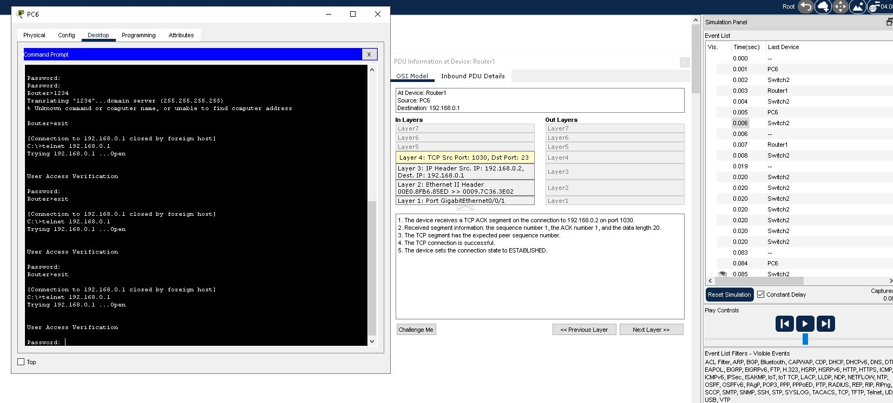

# Домашнее задание к занятию "L4-сеть"
 

### Цели задания:
- научиться правильно анализировать заголовки протоколов на четвёртом уровне модели OSI,
- выявлять ключевые моменты работы протоколов на четвёртом уровне модели OSI.

Практика закрепляет знания о работе протоколов на четвёртом уровне модели OSI. Полученные навыки пригодятся для понимания принципов работы сети и зависимостей других протоколов.

### Чеклист готовности к домашнему заданию:
1. вы прочитали статью «Основы работы с Cisco Packet Tracer»;
2. на вашем компьютере установлена программа Cisco Packet Tracer; 
3. вы выполнили домашнее задание [«L3-сеть».](https://github.com/netology-code/snet-homeworks/blob/snet-22/4-03.md)

[Полезные комнады Cisco](https://achromesite.wordpress.com/2017/01/10/useful-commands-a-cisco-to-view-info/)

---

### Задание 1. Настройка маршрутизатора
*Важно. Задание сквозное и составлено на основе практического задания из домашней работы [«L3-сеть».](https://github.com/netology-code/snet-homeworks/blob/snet-22/4-03.md)*

### Описание задания
Вам нужно создать и настроить подключение по telnet к маршрутизатору в главном офисе. 

### Требования к результату:
- Отправьте PKT-файл с выполненным заданием.
- Добавьте скриншоты с состояниями TCP-соединений и ответы на вопросы.

### Процесс выполнения:
1. Запустите программу Cisco Packet Tracer.
2. В программе загрузите предыдущую практическую работу.
3. Настройте на маршрутизаторе главного офиса возможность подключения по telnet. Желательно указывать пароль в зашифрованном виде с помощью service password-encryption.

  ```bash
  line vty 0 4
  password 1234
  login
  ```

5. В Cisco Packet Tracer запустите режим симуляции и начните из командной строки с любого ПК главного офиса процесс подключения по telnet к маршрутизатору.
6. В режиме симуляции найдите момент, когда процесс трёхстороннего рукопожатия между ПК и маршрутизатором окончен и TCP-соединение установлено.
7. В командной строке выбранного ПК выполните вход на маршрутизатор с помощью ранее указанного пароля.
8. Посмотрите на маршрутизаторе все TCP-соединения. Сделайте скриншот.
9. Продолжая работать в режиме симуляции, завершите в командной строке сеанс telnet на ПК. Укажите момент, когда процесс TCP-соединения между ПК и маршрутизатором окончен.
10. Ответы внесите в комментарии к решению задания в личном кабинете.

[схема сети](dz4_task1.pkt)

соединение с маршрутизатором\


TCP соединения\


завершение соединения\


---

### Задание 2. Анализ трафика
*Важно. Задание сквозное и составлено на основе практической задачи из домашней работы [«L3-сеть».](https://github.com/netology-code/snet-homeworks/blob/snet-22/4-03.md)*

### Описание задания
Вам нужно инициализировать в сети процесс отправки UDP-сообщений.

### Требование к результату
К выполненному заданию добавьте скриншот со структурой пакета и ответ на вопрос.

### Процесс выполнения:
1. Запустите программу Cisco Packet Tracer.
2. В программе загрузите предыдущую практическую работу.
3. Инициализируйте в командной строке любого ПК процесс отправки UDP-пакета.
4. Какие порты использует выбранный вами протокол или технология? Ответ внесите в комментарии к решению задания в личном кабинете.

UDP порт 53\


---

### Общие критерии оценки

Домашнее задание считается выполненным, если:
- Выполнены оба задания.
- К заданию прикреплён PKT-файл и скриншоты работы протоколов по итогам выполнения каждого задания.
- Отображён момент работы протокола UDP.
- Правильно выбраны одни из ключевых этапов работы протокола TCP: установлено TCP-соединение устройств между собой, процесс TCP-соединения завершён.
 
 
