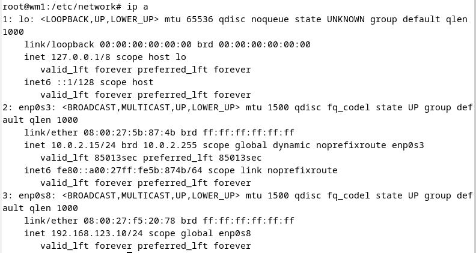
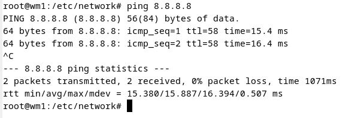
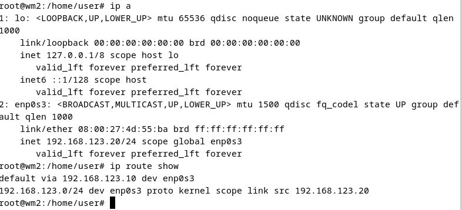
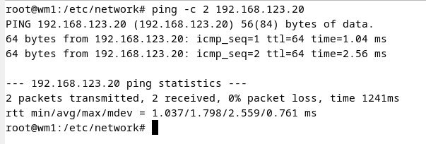
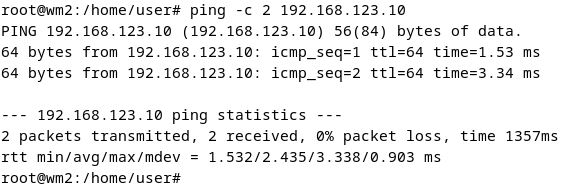
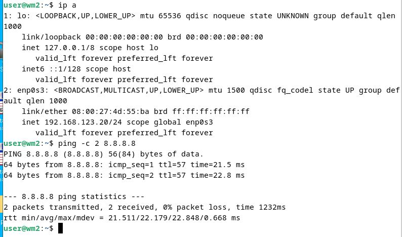
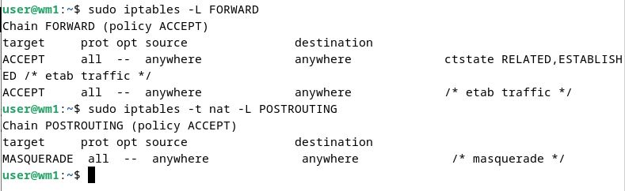

# Домашнее задание к занятию "Сеть и сетевые протоколы: Firewall"
 
Эти задания обязательные к выполнению. Пожалуйста, присылайте на проверку все задачи сразу. Любые вопросы по решению задач задавайте в чате учебной группы.

---

### Цели задания
1. Познакомиться с виртуальным окружением Virtual Box.
2. Научиться создавать виртуальные сетевые интерфейсы и их конфигурировать.
3. Реализовать проброс портов между двумя виртуальными машинами.

Данная практика закрепляет знания о создании виртуального окружения и его настройки. Эти навыки пригодятся для создания собственных сервисов и взаимодействия устройств по сети.

### Чеклист готовности к домашнему заданию
- Прочитайте статью [Инструкция по VirtualBox](https://hackware.ru/?p=3727). 
- Установите программу VirtualBox на своем компьютере.

### Инструкция по выполнению 
- Выполните оба задания.
- Сделайте скриншоты из VirtualBox по итогам выполнения каждого задания.
- Отправьте на проверку в личном кабинете Нетологии скриншоты. Файлы прикрепите в раздел "решение" в практическом задании.
- В комментариях к решению в личном кабинете Нетологии напишите пояснения к полученным результатам. 

---

## Задание 1. Создание виртуального окружения и настройка сетевых интерфейсов

### Описание задания
Перед вами стоит задача создать две виртуальные машины с операционной системой Debian и настроить управление трафиком.

### Требование к результату
Вы должны создать и настроить две виртуальные машины с операционной системой Debian. К выполненной задаче добавьте скриншоты настроек IP-адресов интерфейсов, таблиц маршрутизации, конфигурации файервола и результатов выполнения всех упомянутых проверок ping.

### Процесс выполнения
1. Запустите программу VirtualBox.
2. В программе VirtualBox создайте две виртуальные машины с Debian, назовите их vm1 и vm2
3. В VirtualBox создайте виртуальную сеть 192.168.123.0/24
4. В VirtualBox настройте сетевые интерфейсы vm1 так, чтобы один интерфейс имел доступ в интернет (bridge или NAT), а второй интерфейс смотрел в виртуальную сеть 192.168.123.0/24

`ip addr add 192.168.123.10/24 dev enp0s8`

5. В VirtualBox настройте сетевой интерфейс vm2 так, чтобы он смотрел только в виртуальную сеть 192.168.123.0
6. Для vm1: настройте статический IP адрес у интерфейса смотрящего в сеть 192.168.123.0 (адрес в сети 123.0 выберите на своё усмотрение). Настройте IP-адрес интерфейса смотрящего в вашу локальную сеть так, проверьте чтобы была доступность по ICMP c vm1 до 8.8.8.8.

\

8. Для vm2: настройте статический IP адрес у интерфейса смотрящего в сеть 192.168.123.0 (адрес в сети 123.0 выберите на своё усмотрение), шлюзом укажите IP vm1 из сети 192.168.123.0

`ip addr add 192.168.123.20/24 dev enp0s3`\
`ip route add default via 192.168.123.10 dev enp0s3`\

10. Проверьте доступность по ICMP:
 - vm2 с vm1 по IP
 - vm1 с vm2 по IP 
9. Приложите скриншоты результата.

\
\
   
10. Настройте пересылку трафика на vm1, чтобы с vm2 можно было отправить ICMP-запросы на 8.8.8.8 и приложите скриншот результата.

на vm1\
`sudo sysctl -w net.ipv4.ip_forward=1`\
`sudo iptables -A FORWARD -j ACCEPT -m conntrack --ctstate ESTABLISHED,RELATED -m comment --comment "established traffic"`\
`sudo iptables -A FORWARD -j ACCEPT -i enp0s8 -o enp0s3 -m comment --comment "forward"`\
`sudo iptables -t nat -A POSTROUTING -o enp0s3 -j MASQUERADE -m comment --comment "masquerade"`

\

11. Ответ внесите в комментарии к решению задания в личном кабинете Нетологии.

--- 

## Задание 2. Настройка проброса портов

### Описание задания
Перед вами стоит задача настроить проброс портов из локальной сети компьютера в виртуальную сеть.

### Требование к результату
К выполненной задаче добавьте скриншот настроек и успешное подключение через ssh.

### Процесс выполнения
1. Запустите программу VirtualBox.
2. В программе VirtualBox используйте результат предыдущей практической работы.
3. Настройте проброс портов из локальной сети компьютера с VirtualBox через vm1 порт 12322 в виртуальную сеть VirtualBox на 22 порт vm2.
4. Подключитесь к vm2 по ssh через Putty как было показано на уроке. Ответ внесите в комментарии к решению задания в личном кабинете Нетологии

---

### Общие критерии оценки
Задание считается выполненным при соблюдении следующих условий:
- Выполнено оба задания.
- К заданиям прикреплены скриншоты настроек виртуальных машин и их доступности после выполнения каждого задания.
- Отображены настройки конфигурации Firewall.
 
 
 
