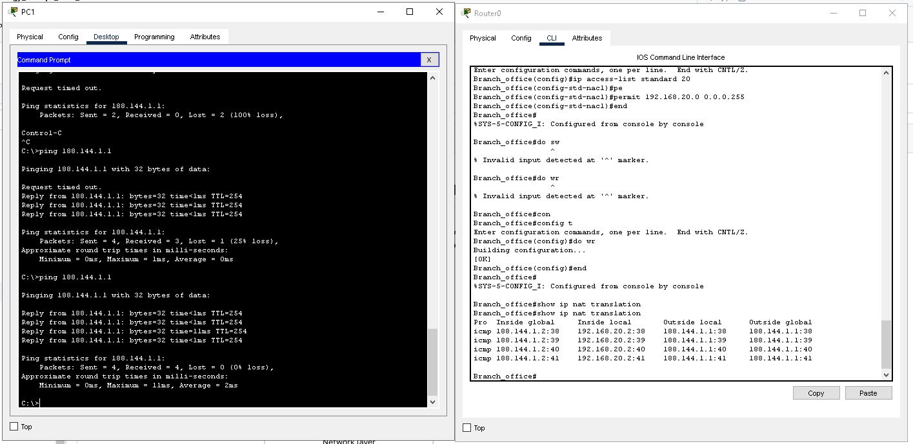

# Домашнее задание к занятию "Сеть и сетевые протоколы: NAT"
 
Эти задания обязательные к выполнению. Пожалуйста, присылайте на проверку все задачи сразу. Любые вопросы по решению задач задавайте в чате учебной группы.

---
### Цели задания
1. Научиться правильно настраивать трансляцию ip-адресов на сетевых интерфейсах.
2. Обеспечить доступность внутреннего сервера через трансляцию ip-адресов.
3. Создавать списки доступа для NAT-трансляций.

Данная практика закрепляет знания о работе технологии NAT. Эти навыки пригодятся для понимания принципов построения сети и создания связности сетевых устройств и сервисов между собой.

### Чек-лист готовности к домашнему заданию
- Прочитайте статью ["Как пользоваться программой Cisco Packet Tracer"](https://pc.ru/articles/osnovy-raboty-s-cisco-packet-tracer).
- Установите программу Cisco Packet Tracer версии 8.2.0 на своем компьютере.

### Инструкция по выполнению: 
- Выполните два задания.
- Сделайте скриншоты из Cisco Packet Tracer по итогам выполнения каждого задания.
- Отправьте на проверку в личном кабинете Нетологии два .pkt файла. Файлы прикрепите в раздел "решение" в практическом задании.
- В комментариях к решению в личном кабинете Нетологии напишите пояснения к полученным результатам. 
---

## Задание 1. Создание внешней сети и настройка NAT

### Описание задания
Перед вами стоит задача сделать подключение к интернет-провайдеру и создать для сетевых устройств доступность к “внешнему миру”

В вашем распоряжении есть две сети:
188.144.1.0/30 - интернет провайдер выделил данную сеть для подключения мини-офиса
188.144.0.0/30 - интернет провайдер выделил данную сеть для подключения  главного офиса

Необходимо подключить каждую из частей офиса подключить к интернет-провайдеру (ISP).

### Требование к результату
- Вы должны отправить файл .pkt с выполненным заданием. 
- К выполненной задаче добавьте скриншоты с доступностью “внешней сети” и ответы на вопросы.

### Процесс выполнения
1. Запустите программу Cisco Packet Tracer
2. В программе Cisco Packet Tracer загрузите [файл с сетью](https://github.com/netology-code/snet-homeworks/blob/snet-22/NAT-1%20(8.2.0).pkt)
3. Между всеми маршрутизаторами необходимо создать сетевую связность.
4. На каждом маршрутизаторе главного и мини-офиса настройте внутренние и внешние интерфейсы (inside, outside)
5. На каждом маршрутизаторе создайте списки доступа сетей, которые будут транслироваться во “внешнюю сеть”
6. На каждом маршрутизаторе создайте NAT-трансляцию с помощью вышеуказанного access-листа.
7. Проверьте доступность с любого конечного устройства доступность роутера интернет-провайдера, командой ping.
8. Во время проверки командой ping посмотрите на каждом роутере списки трансляции адресов. Сделайте скриншот.
9. Ответ внесите в комментарии к решению задания в личном кабинете Нетологии

--- 

[Сеть для задания 1](NAT-1%(8.2.0)_task1.pkt)

**Доступность роутеров от провайдера**\
\
**Доступность роутеров из большого офиса**\
\
**Доступность роутеров из малого офиса**\
\
**Доступность провайдера из сети большого офиса**\
\
**Доступность провайдера из сети малого офиса**\
\

---
 
## Задание 2. Создание внутреннего web-сервера и доступа к нему 

### Описание задания
Перед вами стоит задача обеспечить доступность внутреннего web-сервера из “внешней сети”. 

### Требование к результату
- Вы должны отправить файл .pkt с выполненным заданием
- К выполненной задаче добавьте скриншоты с доступностью устройств и ответы на вопросы.

### Процесс выполнения
1. Запустите программу Cisco Packet Tracer.
2. В программе Cisco Packet Tracer загрузите предыдущую практическую работу.
3. К коммутатору в мини-офисе добавьте сервер, включите на нем HTTP-сервис и назначьте ip-адрес в любой из vlan.
4. Создайте на маршрутизаторе этой сети static nat-трансляцию для web-сервера с указанием 80 порта.
5. Из сети главного офиса получите доступ к web-серверу по “внешнему ip-адресу” роутера мини-офиса. Сделайте скриншот.
6. Ответ внесите в комментарии к решению задания в личном кабинете Нетологии.
 
---
[Сеть для задания 2](NAT-1%(8.2.0)_task2.pkt)

**Доступность роутеров от провайдера**\
\
**Доступность роутеров из большого офиса**\
\
**Доступность роутеров из малого офиса**\
\

---

### Общие критерии оценки

Задание считается выполненным при соблюдении следующих условий:
1. Выполнены оба задания
2. К заданию прикреплено 2 файла .pkt и скриншоты по итогам выполнения каждого задания
3. NAT-трансляции созданы правильно и обеспечивают доступность устройств.
4. Правильно функционирующая сеть на основе задания:
- есть доступность устройств между собой в рамках одного маршрутизатора
- есть доступность каждого устройства до второго маршрутизатора в рамках каждого сабинтерфейса
5. Web-сервер доступен по “внешнему ip-адресу”.

 
 
 
