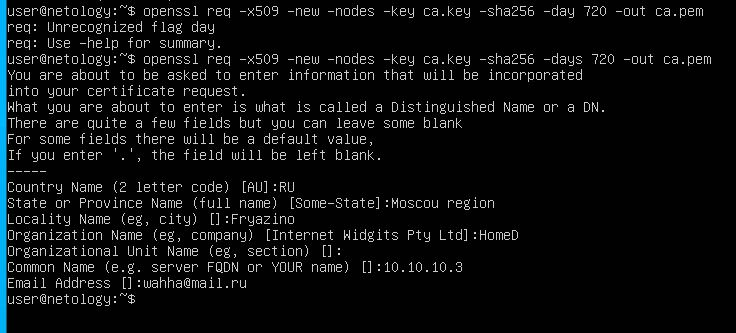
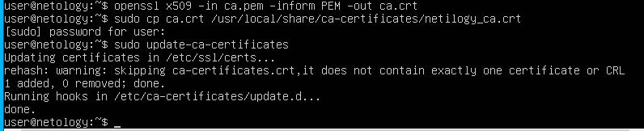
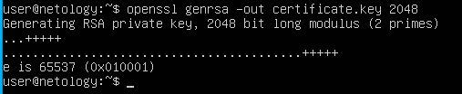
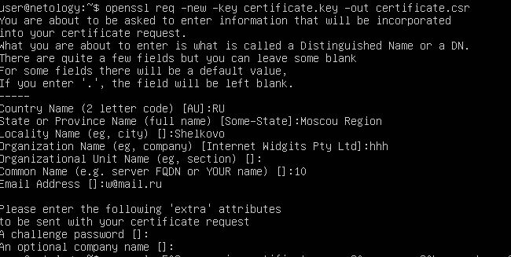
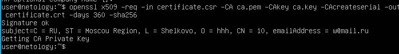
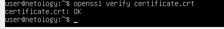
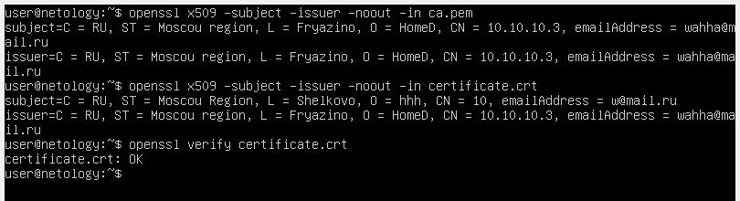

# Домашнее задание к занятию "Высокоуровневые сетевые протоколы"

Это задание обязательно к выполнению. Любые вопросы по решению задач задавайте в чате учебной группы. 

### Цели задания
1. Научиться создавать и добавлять в систему корневой сертификат.
2. Понять принцип генерации ключей и выпуск сертификата.

Данная практика закрепляет знания о работе высокоуровневых протоколов  и создании сертификата. Эти навыки пригодятся для понимания принципов построения и безопасности сети.

------

### Задание

Перед вами стоит задача создать корневой сертификат и подписать им свой сертификат.

#### Требование к результату
Вы должны отправить скриншот с выполненным заданием.

#### Процесс выполнения
- Запустите программу VirtualBox
- В программе VirtualBox загрузите операционную систему Ubuntu, если она у вас не установлена в качестве основной системы.
- В терминале выполните следующие команды:

**1. Генерируем ключ**

```
- openssl genrsa -out ca.key 2048
```


**2. Генерируем корневой сертификат. Поля в сертификате указываем любые.**

```
- openssl req -x509 -new -nodes -key ca.key -sha256 -days 720 -out ca.pem
```



**3. Сразу же сделаем сертификат в форме `crt`**

```
- openssl x509 -in ca.pem -inform PEM -out ca.crt
```


**4. Далее установим сертификат в систему. Ниже пример для `Ubuntu`/`Debian` систем**

```
- sudo cp ca.crt /usr/local/share/ca-certificates/myca.crt && sudo update-ca-certificates
```



**5. Приступим к выпуску самого сертификата:**

**5.1. Генерируем ключи**

```
- openssl genrsa -out certificate.key 2048
```



**5.2. На основе ключа создаем `CSR`**

*Обратите внимание, что subject конечного сертификата __не должен__ совпадать с subject корневого. Хотя бы в одном поле нужно указать отличающееся значение, например в common Name или email. В противном случае конечный сертификат не будет верифицироваться, поскольку будет считаться самоподписным.*

```
- openssl req -new -key certificate.key -out certificate.csr
```



**5.3. Подписываем `CSR` нашим корневым сертификатом. Тем самым создаем конечный сертификат.**

```
- openssl x509 -req -in certificate.csr -CA ca.pem -CAkey ca.key -CAcreateserial -out certificate.crt -days 360 -sha256
```



**6. Проверяем валидность сертификата**

*Эта проверка должна вернуть `OK`. Если вы видите `failed`, значит, где-то допущена ошибка.*

```
- openssl verify certificate.crt
```



*В качестве ответа приложите снимки экрана с выводом информации о сертификатах и результатом верификации:*
```
openssl x509 -subject -issuer -noout -in ca.pem
openssl x509 -subject -issuer -noout -in certificate.crt
openssl verify certificate.crt
```



------

### Общие критерии оценки
Задание считается выполненным при соблюдении следующих условий:
1. Задание выполнено полностью.
2. К заданию прикреплен скриншот с успешной проверкой сертификата.
