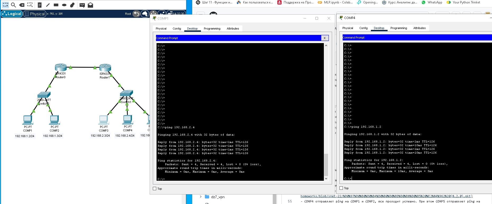
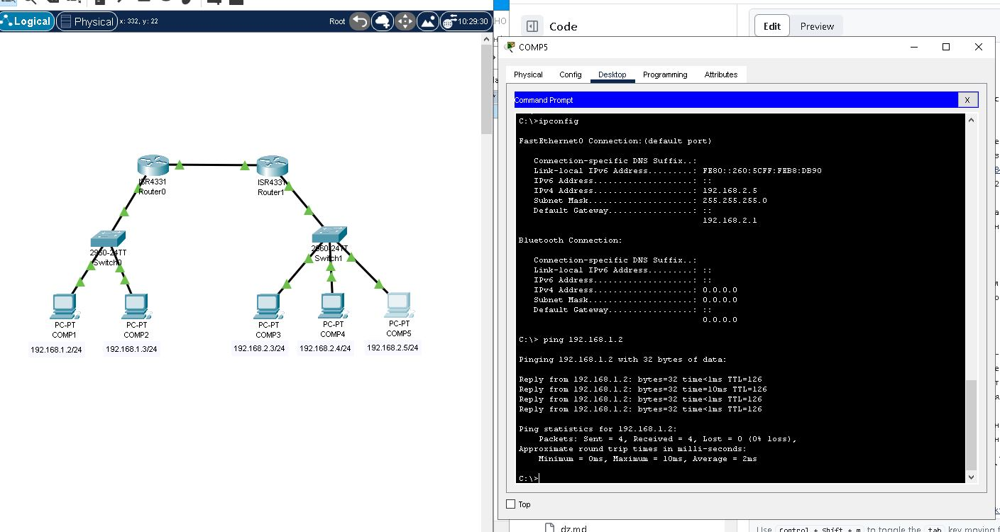
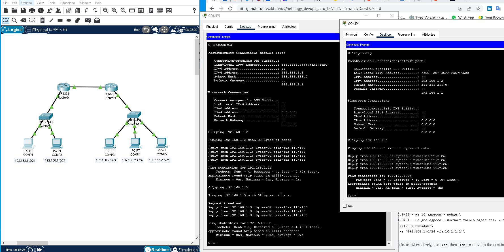
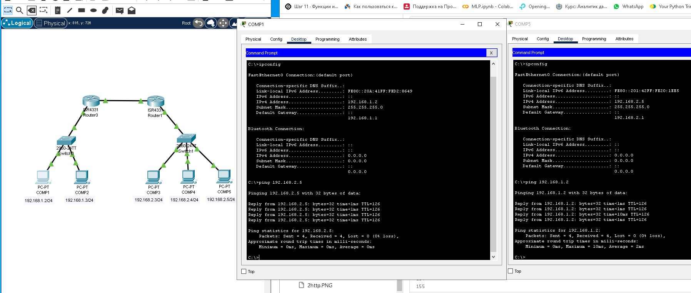

# Домашнее задание к занятию "Траблшутинг"

В этом задании есть 2 обязательных и 2 дополнительных задания (необязательных к выполнению). Задания со звездочкой никак не повлияют на получение вами зачета по этому домашнему заданию. Вы можете их выполнить, если хотите глубже и/или шире разобраться в материале.

*Пожалуйста, присылайте на проверку все задачи сразу. Любые вопросы по решению задач задавайте в чате учебной группы.*

## Цели задания
1. Научиться диагностировать и находить проблемы в сети
2. На практике познакомиться с наиболее частыми сетевыми проблемами

*Данная практика закрепляет знания о взаимодействии устройств в сети и настройку параметров сетевых устройств. Эти навыки пригодятся для понимания принципов построения сети и взаимодействия сетевых устройств между собой.*

### Инструкция по выполнению: 
1. Выполните два обязательных задания, 2 задания со звездочкой - по желанию
2. Сделайте скриншоты из Cisco Packet Tracer по итогам выполнения каждого задания
3. Отправьте на проверку в личном кабинете Нетологии .pkt файлы. Файлы прикрепите в раздел "решение" в практическом задании.
4. В комментариях к решению в личном кабинете Нетологии напишите, в чем заключалась проблема и пояснения к полученным результатам. 

---

### Задание 1
Перед вами стоит задача найти сетевую проблему и добиться связности между устройствами. 

### Процесс выполнения
- Запустите программу Cisco Packet Tracer
- В программе Cisco Packet Tracer загрузите [файл с сетью](https://github.com/netology-code/snet-homeworks/blob/snet-22/%D0%97%D0%B0%D0%B4%D0%B0%D0%BD%D0%B8%D0%B5%20%E2%84%961%20(8.2.0).pkt)
- COMP1 не может обмениваться данными с COMP4. Какую последовательность действий вы выберете для того, чтобы локализовать проблему?
- Опишите свою последовательность действий
- В чем заключалась проблема? Добейтесь, чтобы был связность между устройства, командой ping
- Ответы внесите в комментарии к решению задания в личном кабинете Нетологии

### Требование к результату
1. Вы должны отправить файл .pkt с выполненным заданием
2. К выполненной задаче добавьте скриншоты с доступностью устройств между собой и ответы на вопросы

---

физические линки есть и они работают!\
посмотрим настройки собственно хоста, маршрут по умоланию не прописан, так как компы 1 и 4 в разных сетях - маршрут пропишем\
проверим связь с узлами в одной сети - есть\
проверим связь с роутером (шлюзом) - есть в обоих сетях\
видимо не прописаны маршруты на роутерах - так и есть - пропишем\
пинг пошел\

[сеть ДЗ1](Задание%20№1%20(8.2.0)_rep.pkt)

---

### Задание 2 
Перед вами стоит задача найти проблему сетевого взаимодействия устройств в разных сетях.

### Процесс выполнения
- Запустите программу Cisco Packet Tracer
- В программе Cisco Packet Tracer загрузите [файл с сетью](https://github.com/netology-code/snet-homeworks/blob/snet-22/%D0%97%D0%B0%D0%B4%D0%B0%D0%BD%D0%B8%D0%B5%20%E2%84%962%20(8.2.0).pkt)
- COMP4 отправляет ping на COMP1 и COMP2, все проходит успешно. При этом COMP5 отправляет ping на COMP1 и COMP2 и ping не проходит. 
- Почему так происходит и в чем проблема?
- Устраните проблему и проверьте доступность каждого устройства, командой ping
- Ответ внесите в комментарии к решению задания в личном кабинете Нетологии

### Требование к результату
1. Вы должны отправить файл .pkt с выполненным заданием
2. К выполненной задаче добавьте скриншоты с доступностью устройств между собой и ответы на вопросы.
---

физические линки есть и они работают!\
посмотрим настройки собственно хоста,  - маршруы по умолчанию прописаны \
проверим связь с узлами в одной сети - есть\
проверим связь с роутером (шлюзом) - есть в обоих сетях\
поскольку пинги других хостов между сетями проходят - видимо есть блокировка специально для comp5 на роутере\
проверим Router 1 `show run` - ограничений нет\
проверим Router 0 `show run` - ограничения есть\
`access-list 1 deny host 192.168.2.5` - удаляем\
`no access-list 1 deny host 192.168.2.5`, проверяем `show run` - есть\
проверяем пинг - пинг пошел\

[сеть ДЗ2](Задание%20№2%20(8.2.0)_rep.pkt)

---

**

## Дополнительные задания (со звездочкой*)
Эти задания дополнительные (не обязательные к выполнению) и никак не повлияют на получение вами зачета по этому домашнему заданию. Вы можете их выполнить, если хотите глубже и/или шире разобраться в материале.

### Задание 3
Перед вами стоит задача найти причину и создать доступность устройств в разных сетях.

### Процесс выполнения
- Запустите программу Cisco Packet Tracer
- В программе Cisco Packet Tracer загрузите [файл с сетью](https://github.com/netology-code/snet-homeworks/blob/snet-22/%D0%97%D0%B0%D0%B4%D0%B0%D0%BD%D0%B8%D0%B5%20%E2%84%963%20(8.2.0).pkt)
- COMP5 отправляет ping на COMP1 и COMP2, при этом их шлюз по умолчанию на Router0 на ping отвечает, а COMP1 и COMP2 - нет.
- В чем причина и как ее устранить?
- Устраните проблему и проверьте доступность каждого устройства, командой ping
- Ответ внесите в комментарии к решению задания в личном кабинете Нетологии

### Требование к результату
1. Вы должны отправить файл .pkt с выполненным заданием
2. К выполненной задаче добавьте скриншоты с доступностью устройств между собой и ответы на вопросы.

---

физические линки есть и они работают!\
посмотрим настройки собственно хоста,  - маршруы по умолчанию прописаны \
проверим связь с узлами в одной сети - есть\
проверим связь с роутером (шлюзом) - есть в обоих сетях\
проверим доступность роутеров из сторонних сетей\
Router0 из сети 192.168.2.0 доступен, Router1 из сети 192.168.1.0 не доступен\
проверим маршруты на Router0 и Router1\
на Router0 - маршрут для сети 192.168.2.0/28 - на 16 адресов - пойдет\
на Router1 - маршрут для сети 192.168.1.0/31 - на два адреса - влезает только адрес сети и собственно роутера, адреса хостов формально в эту сеть не попадают\
поменяем маршрут c маской как у хостов на `192.168.1.0/24 via 10.1.1.1`\
проверяем - пинг пошел\

[сеть ДЗ3](Задание%20№3%20(8.2.0)_rep.pkt)

---

### Задание 4
Перед вами стоит задача найти причину и создать доступность устройств в разных сетях.

### Процесс выполнения
- Запустите программу Cisco Packet Tracer
- В программе Cisco Packet Tracer загрузите [файл с сетью](https://github.com/netology-code/snet-homeworks/blob/snet-22/%D0%97%D0%B0%D0%B4%D0%B0%D0%BD%D0%B8%D0%B5%20%E2%84%964%20(8.2.0).pkt)
- COMP1 отправляет ping на COMP4 и COMP5, при этом COMP4 на ping отвечает, а COMP5 - нет.
- В чем причина и как ее устранить?
- Устраните проблему и проверьте доступность каждого устройства, командой ping 
- Ответ внесите в комментарии к решению задания в личном кабинете Нетологии

### Требование к результату
1. Вы должны отправить файл .pkt с выполненным заданием
2. К выполненной задаче добавьте скриншоты с доступностью устройств между собой и ответы на вопросы

----

физические линки есть и они работают!\
посмотрим настройки собственно хоста,  - маршруы по умолчанию прописаны \
проверим связь с узлами в одной сети - проблемы\
192.168.2.3, 192.168.2.4 - между ними связь есть,  с 192.168.2.5 - нет\ 
проверим связь с роутером (шлюзом) - проблемы у 192.168.2.5 - связи нет\
похоже проблемы в настройках хоста 192.168.2.5 или в коммутаторе, поскольку  недоступные узлы в одной сети \
ни каких особенностей в настройках коммутатора и хоста не замечено, смена IP адреса не помогает, применим режим симуляции\
ARP пакет прошел, ICMP блокируется прямо на хосте!!!\
ищем настройки фаирвола - есть запрет на прием ICMP трафика с хостов 192.0.0.0 с маской 0.255.255.255\
отключаем фаирвол - пинг пошел\

**Спасибо за задачку**

[сеть ДЗ4](Задание%20№4%20(8.2.0)_rep.pkt)

---
## Общие критерии оценки
Задание считается выполненным при соблюдении следующих условий:
1. Выполнены все обязательные задания, со звездочкой - по желанию
2. К заданию прикреплены скриншоты доступности устройств между собой по итогам каждого задания
3. К заданию прикреплены файлы .pkt с выполненными заданиями
