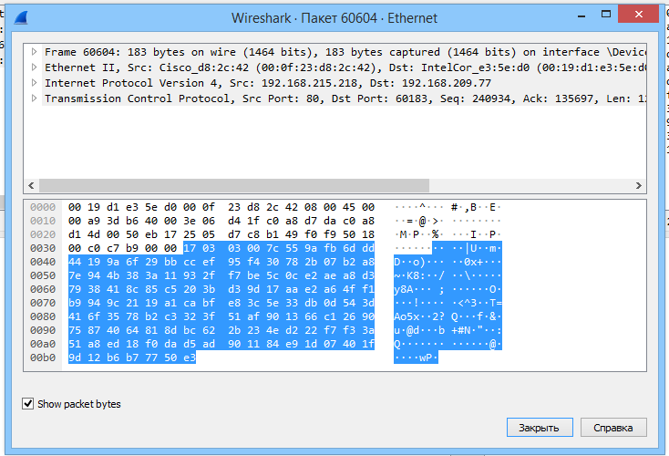

# Домашнее задание к занятию "Теоретические основы сети. Модель OSI и TCP/IP"

Эти задания дополнительные (не обязательные к выполнению) и никак не повлияют на получение вами зачёта по домашнему заданию в целом. Вы можете их выполнить, если хотите лучше разобраться в изучаемом материале. Пожалуйста, присылайте на проверку все задачи сразу. Любые вопросы по решению задач задавайте в чате учебной группы.

---

### Цели задания: 
- Научиться расшифровывать результаты анализа сетевого трафика с помощью Wireshark;
- Понять суть и увидеть варианты инкапсуляции (по модели OSI) на примерах различных протоколов. 

Такая практика помогает закрепить знания об иерархии распределения протоколов и технологий на разных уровнях модели OSI. Эти навыки пригодятся для понимания принципов сети и выполнения домашнего задания в дальнейшем.

### Чеклист готовности к домашнему заданию
1. Прочитайте статью [«Как пользоваться Wireshark для анализа трафика».](https://losst.pro/kak-polzovatsya-wireshark-dlya-analiza-trafika) 
2. Установите программу Wireshark на своём компьютере. 

### Дополнительные материалы

[Дополнительные материалы по модели OSI](https://github.com/netology-code/snet-homeworks/blob/snet-22/4-01-osi.md)

---

### Задание 1. Анализ захвата трафика

Описание задания 
Вам поставили задачу проанализировать результаты захвата трафика сетевого интерфейса. Это базовый навык при работе с сетью. В будущем он пригодится вам для того, чтобы выявлять источники проблем в сети и проверять проблемы безопасности (траблшутинг). 

### Требования к результату
- Вы должны отправить скриншоты захваченного пакета. Пример вы найдёте по ссылке.
- К скриншотам необходимо приложить комментарии с информацией, какие протоколы и уровни модели OSI вы обнаружили. 

### Процесс выполнения
1. Откройте Wireshark.
2. Запустите захват трафика с сетевого интерфейса.
3. Запустите браузер и зайдите на любой сайт.
4. Выберите какой-нибудь пакет из захваченного трафика.
5. Посмотрите разные уровни и разверните параметры при необходимости.
6. Напишите, какие протоколы и уровни модели OSI вы видите. Ответ внесите в комментарии к решению задания в личном кабинете Нетологии.

* Физический уровень - передано 183 байта попроводам
* Канальный уровень - протокол Ethernet II, фрейм 60604
* Сетевой уровень - IPv4
* Транспортный уровень - TCP
--- 

### Задание 2. Инкапсуляция данных 

Описание задания
Вам поставили задачу найти различия в инкапсуляции данных разных протоколов и технологий. Это также базовый навык при работе с сетью. Вы сможете понимать, как одни приложения и технологии зависят от других протоколов и приложений. Это позволит эффективнее решать сетевые проблемы. 

### Требования к результату
- Вы должны отправить скриншоты захваченных пакетов.
- В комментариях к скриншоту необходимо указать, чем они различаются по уровням модели OSI.

### Процесс выполнения
1. Откройте Wireshark.
2. Запустите захват трафика с сетевого интерфейса.
3. Запустите браузер и зайдите на любой сайт.
4. Сначала установите фильтр захваченного трафика по технологии DNS, затем выберите любой HTTP-поток.
5. Сравните пакеты между собой. В чём отличия с точки зрения модели OSI? Ответ внесите в комментарии к решению задания в личном кабинете Нетологии.

--- 
