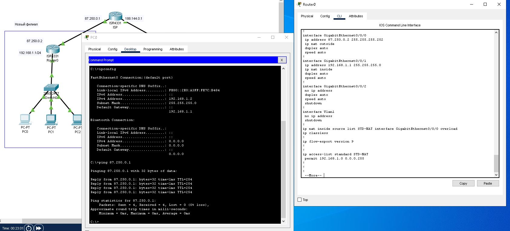
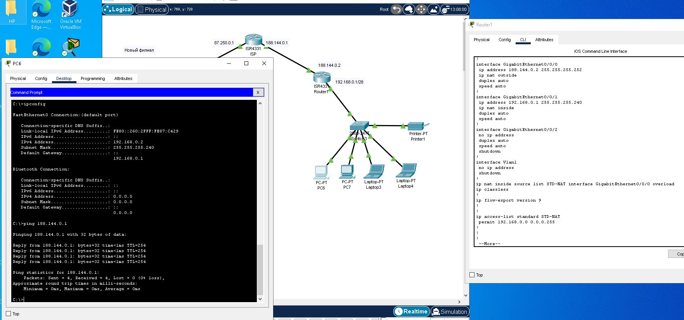
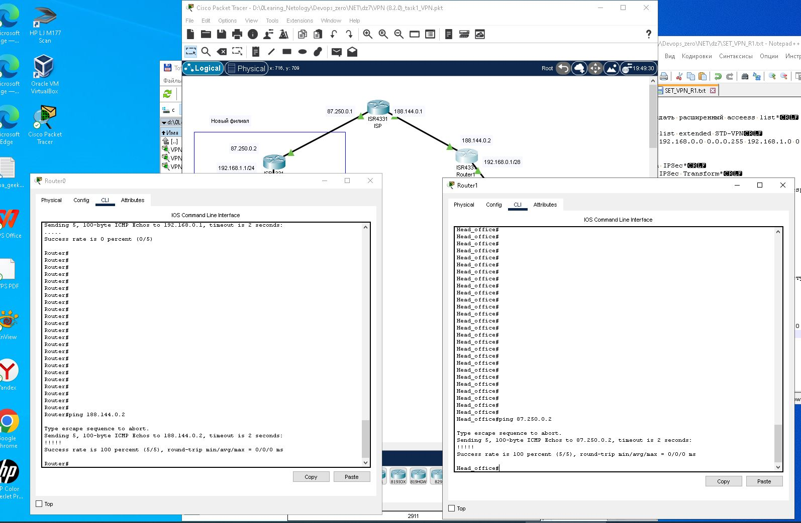
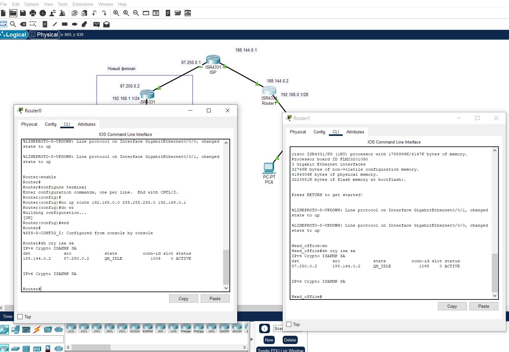
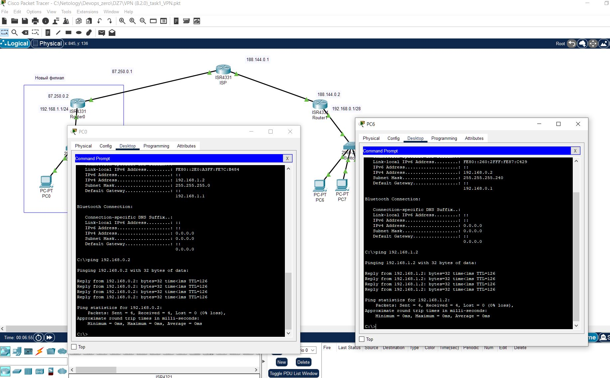
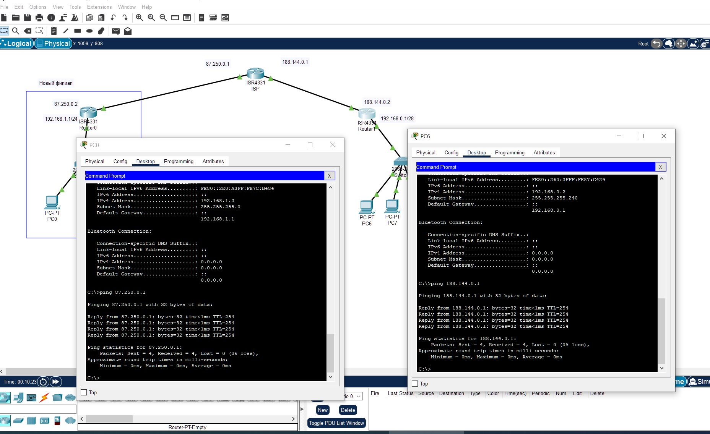

# Домашнее задание к занятию "Сеть и сетевые протоколы: VPN"
 
--- 

### Цели задания: 
1. познакомиться с процессом создания VPN (Site-to-Site);
2. научиться создавать VPN-соединение и конфигурировать ее;
3. создать VPN туннель с помощью протокола IPSec.

Данная практика закрепляет знания о создании и настройки виртуальной частной сети. Эти навыки пригодятся для создания собственных сервисов и повышению безопасности сети.

### Чеклист готовности к домашнему заданию
- Прочитайте статью ["Как пользоваться программой Cisco Packet Tracer"](https://pc.ru/articles/osnovy-raboty-s-cisco-packet-tracer)
- Установите программу Cisco Packet Tracer версии 8.2.0 на своем компьютере 
- Выполните домашние задание ["Сеть и сетевые протоколы: NAT"](https://github.com/netology-code/snet-homeworks/blob/snet-22/4-05.md)

### Инструкция по выполнению: 
- Сделайте скриншоты из Cisco Packet Tracer по итогам выполнения задания 
- Отправьте на проверку в личном кабинете Нетологии скриншоты. Файлы прикрепите в раздел "решение" в практическом задании.
- В комментариях к решению в личном кабинете Нетологии напишите пояснения к полученным результатам. 

---

## Задание. Создание дополнительного офиса и настройка ISAKMP-туннеля для согласования параметров протокола.

### Описание задания
Руководство решило открыть новый филиал в соседней области. Перед вами стоит задача  между главным офисом и филиалом создать VPN-туннель. Новый филиал подключен к тому же интернет-провайдеру. Но имеет другие “белые” ip-адреса для подключения: 87.250.0.0/30

### Требование к результату
- Вы должны отправить файл .pkt с выполненным заданием
- К выполненной задаче добавьте скриншоты с доступностью “внешней сети” и ответы на вопросы.

### Процесс выполнения
1. Запустите программу Cisco Packet Tracer
2. В программе Cisco Packet Tracer загрузите [файл с сетью](https://github.com/netology-code/snet-homeworks/blob/snet-22/VPN%20(8.2.0).pkt)
3. Настройте связность сети нового филиала, состоящую из 3 ПК, 1 коммутатора и 1 маршрутизатора.  Адресацию внутри сети филиала можно использовать любую.
4. Создайте сетевую связность между маршрутизатором филиала и маршрутизатором интернет-провайдера, согласно условиям.
5. На маршрутизаторе филиала и главного офиса создайте NAT-трансляции с помощью access-листов для внутренней сети.

---
[файл с сетью с настроенным NAT](VPN%20(8.2.0)_task1_GOODNAT_.pkt)

\
\

---
   
7. На маршрутизаторе главного офиса настройте политики ISAKMP:

*R1(config)#  crypto isakmp policy 1*

*R1(config-isakmp)# encr 3des - метод шифрования*

*R1(config-isakmp)# hash md5 - алгоритм хеширования*

*R1(config-isakmp)# authentication pre-share - использование предварительного общего ключа (PSK) в качестве метода проверки подлинности*

*R1(config-isakmp)# group 2 - группа Диффи-Хеллмана, которая будет использоваться*

*R1(config-isakmp)# lifetime 86400 - время жизни ключа сеанса*

И укажите **Pre-Shared** ключ для аутентификации с маршрутизатором филиала.Проверьте доступность с любого конечного устройства доступность роутера интернет-провайдера, командой ping.

7. Создайте набор преобразования (Transform Set), используемого для защиты наших данных.

*crypto ipsec transform-set <название> esp-3des esp-md5-hmac*

8. Создайте крипто-карту с указанием внешнего ip-адреса интерфейса и привяжите его к интерфейсу.

*R1(config)# crypto map <название> 10 ipsec-isakmp*

*R1(config-crypto-map)# set peer <ip-address>*

*R1(config-crypto-map)# set transform-set <название>*

*R1(config-crypto-map)# match address <название access-листа>*

*R1(config- if)# crypto map <название крипто-карты>*

9. Проделайте вышеуказанные операции на маршрутизаторе филиала в соответствии ip-адресов и access-листов и отключите NAT-трансляцию сетевых адресов.
10. Проверьте сетевую доступность между роутерами командой ping.
11. Проверьте установившееся VPN-соединение на каждом роутере командой: “show crypto session”. Статус должен быть UP-ACTIVE. Сделайте скриншот.
12. Ответ внесите в комментарии к решению задания в личном кабинете Нетологии

--- 

[настройки VPN для моего файла](set_vpn.md)

[файл CPT с настроеным VPN](VPN%20(8.2.0)_task1_VPN_v2.pkt)

доступность роутеров\

VPN тонель\

Ping через VPN\

Работа NAT при настроенном VPN\

---

### Общие критерии оценки
Задание считается выполненным при соблюдении следующих условий:
- Задание выполнено полностью
- К заданию прикреплены скриншоты статусов VPN-соединений и доступности сетей двух офисов.
- Отображены настройки конфигурации VPN.
 
