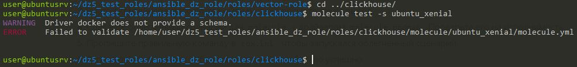
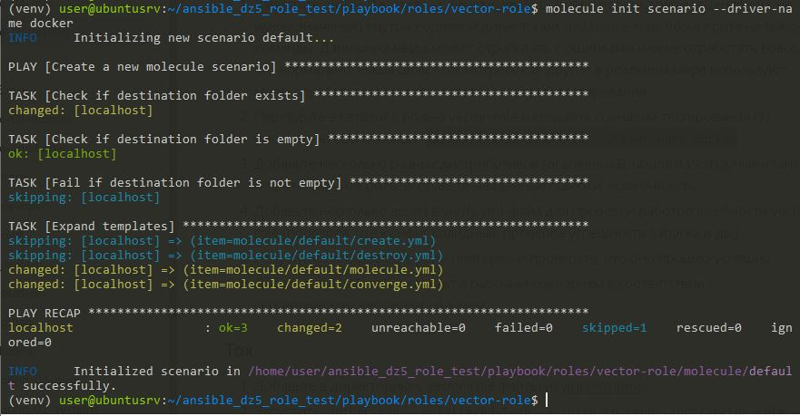
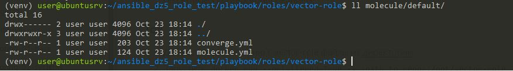
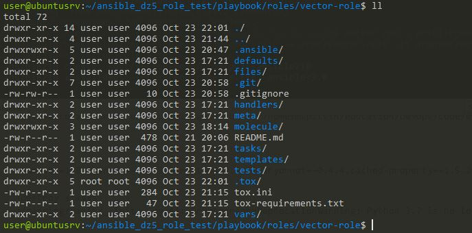

# Домашнее задание к занятию 5 «Тестирование roles»

## Подготовка к выполнению

1. Установите molecule и его драйвера: `pip3 install "molecule molecule_docker molecule_podman`.
2. Выполните `docker pull aragast/netology:latest` —  это образ с podman, tox и несколькими пайтонами (3.7 и 3.9) внутри.

## Основная часть

Ваша цель — настроить тестирование ваших ролей. 

Задача — сделать сценарии тестирования для vector. 

Ожидаемый результат — все сценарии успешно проходят тестирование ролей.

### Molecule

1. Запустите  `molecule test -s ubuntu_xenial` (или с любым другим сценарием, не имеет значения) внутри корневой директории clickhouse-role, посмотрите на вывод команды. Данная команда может отработать с ошибками или не отработать вовсе, это нормально. Наша цель - посмотреть как другие в реальном мире используют молекулу И из чего может состоять сценарий тестирования.
2. Перейдите в каталог с ролью vector-role и создайте сценарий тестирования по умолчанию при помощи `molecule init scenario --driver-name docker`.
3. Добавьте несколько разных дистрибутивов (oraclelinux:8, ubuntu:latest) для инстансов и протестируйте роль, исправьте найденные ошибки, если они есть.
4. Добавьте несколько assert в verify.yml-файл для  проверки работоспособности vector-role (проверка, что конфиг валидный, проверка успешности запуска и др.). 
5. Запустите тестирование роли повторно и проверьте, что оно прошло успешно.
5. Добавьте новый тег на коммит с рабочим сценарием в соответствии с семантическим версионированием.

### Tox

1. Добавьте в директорию с vector-role файлы из [директории](./example).
2. Запустите `docker run --privileged=True -v <path_to_repo>:/opt/vector-role -w /opt/vector-role -it aragast/netology:latest /bin/bash`, где path_to_repo — путь до корня репозитория с vector-role на вашей файловой системе.
3. Внутри контейнера выполните команду `tox`, посмотрите на вывод.
5. Создайте облегчённый сценарий для `molecule` с драйвером `molecule_podman`. Проверьте его на исполнимость.
6. Пропишите правильную команду в `tox.ini`, чтобы запускался облегчённый сценарий.
8. Запустите команду `tox`. Убедитесь, что всё отработало успешно.
9. Добавьте новый тег на коммит с рабочим сценарием в соответствии с семантическим версионированием.

После выполнения у вас должно получится два сценария molecule и один tox.ini файл в репозитории. Не забудьте указать в ответе теги решений Tox и Molecule заданий. В качестве решения пришлите ссылку на  ваш репозиторий и скриншоты этапов выполнения задания. 

## Необязательная часть

1. Проделайте схожие манипуляции для создания роли LightHouse.
2. Создайте сценарий внутри любой из своих ролей, который умеет поднимать весь стек при помощи всех ролей.
3. Убедитесь в работоспособности своего стека. Создайте отдельный verify.yml, который будет проверять работоспособность интеграции всех инструментов между ними.
4. Выложите свои roles в репозитории.

В качестве решения пришлите ссылки и скриншоты этапов выполнения задания.

---

### Как оформить решение задания

Выполненное домашнее задание пришлите в виде ссылки на .md-файл в вашем репозитории.

---
### РЕШЕНИЕ ЗАДАЧА 1

#### Установка Ansible и molecule

инструкция установки молекулы

`https://ansible.readthedocs.io/projects/molecule/installation/`

пошаговые комманды для работы

**molecule берем версии 25.6 в более старших изменилась настройка драйвера - в лекциях не проходили**

```shell
molecule version 25.6

sudo apt update
sudo apt install -y python3-pip libssl-dev python3-venv
python3 -m venv venv
source venv/bin/activate

pip3 install ansible-core
pip3 install molecule==25.6
 #для новой версии
pip3 install ansible-dev-tools

## pip install  "molecule-plugins[podman]"
pip install  "molecule-plugins[docker]"

# если нужен докер инструкция https://github.com/docker/docker-install
curl -fs https://get.docker.com -o get-docker.sh
sh get-docker.sh
sudo usermod -aG docker $USER

## Собственно молекула
## ansible-galaxy init vector-role
molecule init scenario --driver-name docker

-----------------образ для ansible------------
platforms:
  - name: instance_ubuntu
    image: "geerlingguy/docker-${MOLECULE_DISTRO:-ubuntu2204}-ansible:latest"
    command: ${MOLECULE_DOCKER_COMMAND:-""}
    volumes:
      - /sys/fs/cgroup:/sys/fs/cgroup:rw
    cgroupns_mode: host
    privileged: true
    pre_build_image: true
---------------------------------------------

molecule test
```

#### 1


#### 2






<details>
  
<summary>результат выполнения команды: molecule init scenario --driver-name docker </summary>
  
```shell
(venv) user@ubuntusrv:~/ansible_dz5_role_test/playbook/roles/vector-role$ molecule init scenario --driver-name docker
INFO     Initializing new scenario default...

PLAY [Create a new molecule scenario] ******************************************

TASK [Check if destination folder exists] **************************************
changed: [localhost]

TASK [Check if destination folder is empty] ************************************
ok: [localhost]

TASK [Fail if destination folder is not empty] *********************************
skipping: [localhost]

TASK [Expand templates] ********************************************************
skipping: [localhost] => (item=molecule/default/create.yml)
skipping: [localhost] => (item=molecule/default/destroy.yml)
changed: [localhost] => (item=molecule/default/molecule.yml)
changed: [localhost] => (item=molecule/default/converge.yml)

PLAY RECAP *********************************************************************
localhost                  : ok=3    changed=2    unreachable=0    failed=0    skipped=1    rescued=0    ignored=0

INFO     Initialized scenario in /home/user/ansible_dz5_role_test/playbook/roles/vector-role/molecule/default successfully.
```
</details>

#### 3

<details>
  
<summary>результат выполнения команды: molecule test  </summary>

```shell
(venv) user@ubuntusrv:~/ansible_dz5_role_test/playbook/roles/vector-role$ molecule test
WARNING  Driver docker does not provide a schema.
WARNING  Driver docker does not provide a schema.
INFO     default ➜ discovery: scenario test matrix: dependency, cleanup, destroy, syntax, create, prepare, converge, idempotence, side_effect, verify, cleanup, destroy
INFO     default ➜ prerun: Performing prerun with role_name_check=0...
INFO     default ➜ dependency: Executing
WARNING  default ➜ dependency: Missing roles requirements file: requirements.yml
WARNING  default ➜ dependency: Missing collections requirements file: collections.yml
WARNING  default ➜ dependency: Executed: 2 missing (Remove from test_sequence to suppress)
INFO     default ➜ cleanup: Executing
WARNING  default ➜ cleanup: Executed: Missing playbook (Remove from test_sequence to suppress)
INFO     default ➜ destroy: Executing
INFO     Sanity checks: 'docker'

PLAY [Destroy] *****************************************************************

TASK [Set async_dir for HOME env] **********************************************
ok: [localhost]

TASK [Destroy molecule instance(s)] ********************************************
changed: [localhost] => (item=instance_ubuntu)
changed: [localhost] => (item=instance_debian)

TASK [Wait for instance(s) deletion to complete] *******************************
ok: [localhost] => (item=instance_ubuntu)
ok: [localhost] => (item=instance_debian)

TASK [Delete docker networks(s)] ***********************************************
skipping: [localhost]

PLAY RECAP *********************************************************************
localhost                  : ok=3    changed=1    unreachable=0    failed=0    skipped=1    rescued=0    ignored=0

INFO     default ➜ destroy: Executed: Successful
INFO     default ➜ syntax: Executing

playbook: /home/user/ansible_dz5_role_test/playbook/roles/vector-role/molecule/default/converge.yml
INFO     default ➜ syntax: Executed: Successful
INFO     default ➜ create: Executing

PLAY [Create] ******************************************************************

TASK [Set async_dir for HOME env] **********************************************
ok: [localhost]

TASK [Log into a Docker registry] **********************************************
skipping: [localhost] => (item=None)
skipping: [localhost] => (item=None)
skipping: [localhost]

TASK [Check presence of custom Dockerfiles] ************************************
ok: [localhost] => (item=instance_ubuntu)
ok: [localhost] => (item=instance_debian)

TASK [Create Dockerfiles from image names] *************************************
skipping: [localhost] => (item=instance_ubuntu)
skipping: [localhost] => (item=instance_debian)
skipping: [localhost]

TASK [Synchronization the context] *********************************************
skipping: [localhost] => (item=instance_ubuntu)
skipping: [localhost] => (item=instance_debian)
skipping: [localhost]

TASK [Discover local Docker images] ********************************************
ok: [localhost] => (item=unix://var/run/docker.sock)
ok: [localhost] => (item=unix://var/run/docker.sock)

TASK [Create docker network(s)] ************************************************
skipping: [localhost]

TASK [Build an Ansible compatible image (new)] *********************************
skipping: [localhost] => (item=molecule_local/geerlingguy/docker-ubuntu2204-ansible:latest)
skipping: [localhost] => (item=molecule_local/geerlingguy/docker-debian13-ansible:latest)
skipping: [localhost]

TASK [Determine the CMD directives] ********************************************
ok: [localhost] => (item=instance_ubuntu)
ok: [localhost] => (item=instance_debian)

TASK [Create molecule instance(s)] *********************************************
changed: [localhost] => (item=instance_ubuntu)
changed: [localhost] => (item=instance_debian)

TASK [Wait for instance(s) creation to complete] *******************************
FAILED - RETRYING: [localhost]: Wait for instance(s) creation to complete (300 retries left).
FAILED - RETRYING: [localhost]: Wait for instance(s) creation to complete (299 retries left).
FAILED - RETRYING: [localhost]: Wait for instance(s) creation to complete (298 retries left).
FAILED - RETRYING: [localhost]: Wait for instance(s) creation to complete (297 retries left).
FAILED - RETRYING: [localhost]: Wait for instance(s) creation to complete (296 retries left).
FAILED - RETRYING: [localhost]: Wait for instance(s) creation to complete (295 retries left).
FAILED - RETRYING: [localhost]: Wait for instance(s) creation to complete (294 retries left).
FAILED - RETRYING: [localhost]: Wait for instance(s) creation to complete (293 retries left).
FAILED - RETRYING: [localhost]: Wait for instance(s) creation to complete (292 retries left).
FAILED - RETRYING: [localhost]: Wait for instance(s) creation to complete (291 retries left).
FAILED - RETRYING: [localhost]: Wait for instance(s) creation to complete (290 retries left).
FAILED - RETRYING: [localhost]: Wait for instance(s) creation to complete (289 retries left).
FAILED - RETRYING: [localhost]: Wait for instance(s) creation to complete (288 retries left).
FAILED - RETRYING: [localhost]: Wait for instance(s) creation to complete (287 retries left).
FAILED - RETRYING: [localhost]: Wait for instance(s) creation to complete (286 retries left).
FAILED - RETRYING: [localhost]: Wait for instance(s) creation to complete (285 retries left).
FAILED - RETRYING: [localhost]: Wait for instance(s) creation to complete (284 retries left).
FAILED - RETRYING: [localhost]: Wait for instance(s) creation to complete (283 retries left).
FAILED - RETRYING: [localhost]: Wait for instance(s) creation to complete (282 retries left).
FAILED - RETRYING: [localhost]: Wait for instance(s) creation to complete (281 retries left).
FAILED - RETRYING: [localhost]: Wait for instance(s) creation to complete (280 retries left).
FAILED - RETRYING: [localhost]: Wait for instance(s) creation to complete (279 retries left).
FAILED - RETRYING: [localhost]: Wait for instance(s) creation to complete (278 retries left).
FAILED - RETRYING: [localhost]: Wait for instance(s) creation to complete (277 retries left).
FAILED - RETRYING: [localhost]: Wait for instance(s) creation to complete (276 retries left).
FAILED - RETRYING: [localhost]: Wait for instance(s) creation to complete (275 retries left).
FAILED - RETRYING: [localhost]: Wait for instance(s) creation to complete (274 retries left).
FAILED - RETRYING: [localhost]: Wait for instance(s) creation to complete (273 retries left).
FAILED - RETRYING: [localhost]: Wait for instance(s) creation to complete (272 retries left).
FAILED - RETRYING: [localhost]: Wait for instance(s) creation to complete (271 retries left).
FAILED - RETRYING: [localhost]: Wait for instance(s) creation to complete (270 retries left).
FAILED - RETRYING: [localhost]: Wait for instance(s) creation to complete (269 retries left).
FAILED - RETRYING: [localhost]: Wait for instance(s) creation to complete (268 retries left).
changed: [localhost] => (item=instance_ubuntu)
FAILED - RETRYING: [localhost]: Wait for instance(s) creation to complete (300 retries left).
FAILED - RETRYING: [localhost]: Wait for instance(s) creation to complete (299 retries left).
changed: [localhost] => (item=instance_debian)

PLAY RECAP *********************************************************************
localhost                  : ok=6    changed=2    unreachable=0    failed=0    skipped=5    rescued=0    ignored=0

INFO     default ➜ create: Executed: Successful
INFO     default ➜ prepare: Executing
WARNING  default ➜ prepare: Executed: Missing playbook (Remove from test_sequence to suppress)
INFO     default ➜ converge: Executing

PLAY [Converge] ****************************************************************

TASK [/home/user/ansible_dz5_role_test/playbook/roles/vector-role : Get vector distrib] ***
changed: [instance_debian]
changed: [instance_ubuntu]

TASK [/home/user/ansible_dz5_role_test/playbook/roles/vector-role : Update apt cache] ***
changed: [instance_debian]
changed: [instance_ubuntu]

TASK [/home/user/ansible_dz5_role_test/playbook/roles/vector-role : Install vector] ***
ok: [instance_debian]
ok: [instance_ubuntu]

TASK [/home/user/ansible_dz5_role_test/playbook/roles/vector-role : Deploy vector configuration] ***
changed: [instance_debian]
changed: [instance_ubuntu]

TASK [/home/user/ansible_dz5_role_test/playbook/roles/vector-role : Flush handlers] ***

TASK [/home/user/ansible_dz5_role_test/playbook/roles/vector-role : Flush handlers] ***

RUNNING HANDLER [/home/user/ansible_dz5_role_test/playbook/roles/vector-role : Start vector service] ***
changed: [instance_ubuntu]
changed: [instance_debian]

PLAY RECAP *********************************************************************
instance_debian            : ok=5    changed=4    unreachable=0    failed=0    skipped=0    rescued=0    ignored=0
instance_ubuntu            : ok=5    changed=4    unreachable=0    failed=0    skipped=0    rescued=0    ignored=0

INFO     default ➜ converge: Executed: Successful
INFO     default ➜ idempotence: Executing

PLAY [Converge] ****************************************************************

TASK [/home/user/ansible_dz5_role_test/playbook/roles/vector-role : Get vector distrib] ***
ok: [instance_debian]
ok: [instance_ubuntu]

TASK [/home/user/ansible_dz5_role_test/playbook/roles/vector-role : Update apt cache] ***
ok: [instance_debian]
ok: [instance_ubuntu]

TASK [/home/user/ansible_dz5_role_test/playbook/roles/vector-role : Install vector] ***
ok: [instance_debian]
ok: [instance_ubuntu]

TASK [/home/user/ansible_dz5_role_test/playbook/roles/vector-role : Deploy vector configuration] ***
ok: [instance_ubuntu]
ok: [instance_debian]

TASK [/home/user/ansible_dz5_role_test/playbook/roles/vector-role : Flush handlers] ***

TASK [/home/user/ansible_dz5_role_test/playbook/roles/vector-role : Flush handlers] ***

PLAY RECAP *********************************************************************
instance_debian            : ok=4    changed=0    unreachable=0    failed=0    skipped=0    rescued=0    ignored=0
instance_ubuntu            : ok=4    changed=0    unreachable=0    failed=0    skipped=0    rescued=0    ignored=0

INFO     default ➜ idempotence: Executed: Successful
INFO     default ➜ side_effect: Executing
WARNING  default ➜ side_effect: Executed: Missing playbook (Remove from test_sequence to suppress)
INFO     default ➜ verify: Executing
WARNING  default ➜ verify: Executed: Missing playbook (Remove from test_sequence to suppress)
INFO     default ➜ cleanup: Executing
WARNING  default ➜ cleanup: Executed: Missing playbook (Remove from test_sequence to suppress)
INFO     default ➜ destroy: Executing

PLAY [Destroy] *****************************************************************

TASK [Set async_dir for HOME env] **********************************************
ok: [localhost]

TASK [Destroy molecule instance(s)] ********************************************
changed: [localhost] => (item=instance_ubuntu)
changed: [localhost] => (item=instance_debian)

TASK [Wait for instance(s) deletion to complete] *******************************
FAILED - RETRYING: [localhost]: Wait for instance(s) deletion to complete (300 retries left).
changed: [localhost] => (item=instance_ubuntu)
changed: [localhost] => (item=instance_debian)

TASK [Delete docker networks(s)] ***********************************************
skipping: [localhost]

PLAY RECAP *********************************************************************
localhost                  : ok=3    changed=2    unreachable=0    failed=0    skipped=1    rescued=0    ignored=0

INFO     default ➜ destroy: Executed: Successful
INFO     default ➜ scenario: Pruning extra files from scenario ephemeral directory
WARNING  Molecule executed 1 scenario (1 missing files)
(venv) user@ubuntusrv:~/ansible_dz5_role_test/playbook/roles/vector-role$
```
</details>

#### 4

```yaml

  - name: Check if vector is installed
  ansible.builin.command: which vector
  ignore_errors: yes
  - name: Assert Vector is installed
    ansible.builin.asserts:
      that: vector_installed.rc == 0
      msg: "Vector is not installed"
```

#### 5

<details>
  
<summary> Повторно результат выполнения команды: molecule test с проверками  </summary>

```shell
(venv) user@ubuntusrv:~/ansible_dz5_role_test/playbook/roles/vector-role$ molecule test
WARNING  Driver docker does not provide a schema.
WARNING  Driver docker does not provide a schema.
INFO     default ➜ discovery: scenario test matrix: dependency, cleanup, destroy, syntax, create, prepare, converge, idempotence, side_effect, verify, cleanup, destroy
INFO     default ➜ prerun: Performing prerun with role_name_check=0...
INFO     default ➜ dependency: Executing
WARNING  default ➜ dependency: Missing roles requirements file: requirements.yml
WARNING  default ➜ dependency: Missing collections requirements file: collections.yml
WARNING  default ➜ dependency: Executed: 2 missing (Remove from test_sequence to suppress)
INFO     default ➜ cleanup: Executing
WARNING  default ➜ cleanup: Executed: Missing playbook (Remove from test_sequence to suppress)
INFO     default ➜ destroy: Executing
INFO     Sanity checks: 'docker'

PLAY [Destroy] *****************************************************************

TASK [Set async_dir for HOME env] **********************************************
ok: [localhost]

TASK [Destroy molecule instance(s)] ********************************************
changed: [localhost] => (item=instance_ubuntu)
changed: [localhost] => (item=instance_debian)

TASK [Wait for instance(s) deletion to complete] *******************************
ok: [localhost] => (item=instance_ubuntu)
ok: [localhost] => (item=instance_debian)

TASK [Delete docker networks(s)] ***********************************************
skipping: [localhost]

PLAY RECAP *********************************************************************
localhost                  : ok=3    changed=1    unreachable=0    failed=0    skipped=1    rescued=0    ignored=0

INFO     default ➜ destroy: Executed: Successful
INFO     default ➜ syntax: Executing

playbook: /home/user/ansible_dz5_role_test/playbook/roles/vector-role/molecule/default/converge.yml
INFO     default ➜ syntax: Executed: Successful
INFO     default ➜ create: Executing

PLAY [Create] ******************************************************************

TASK [Set async_dir for HOME env] **********************************************
ok: [localhost]

TASK [Log into a Docker registry] **********************************************
skipping: [localhost] => (item=None)
skipping: [localhost] => (item=None)
skipping: [localhost]

TASK [Check presence of custom Dockerfiles] ************************************
ok: [localhost] => (item=instance_ubuntu)
ok: [localhost] => (item=instance_debian)

TASK [Create Dockerfiles from image names] *************************************
skipping: [localhost] => (item=instance_ubuntu)
skipping: [localhost] => (item=instance_debian)
skipping: [localhost]

TASK [Synchronization the context] *********************************************
skipping: [localhost] => (item=instance_ubuntu)
skipping: [localhost] => (item=instance_debian)
skipping: [localhost]

TASK [Discover local Docker images] ********************************************
ok: [localhost] => (item=unix://var/run/docker.sock)
ok: [localhost] => (item=unix://var/run/docker.sock)

TASK [Create docker network(s)] ************************************************
skipping: [localhost]

TASK [Build an Ansible compatible image (new)] *********************************
skipping: [localhost] => (item=molecule_local/geerlingguy/docker-ubuntu2204-ansible:latest)
skipping: [localhost] => (item=molecule_local/geerlingguy/docker-debian13-ansible:latest)
skipping: [localhost]

TASK [Determine the CMD directives] ********************************************
ok: [localhost] => (item=instance_ubuntu)
ok: [localhost] => (item=instance_debian)

TASK [Create molecule instance(s)] *********************************************
changed: [localhost] => (item=instance_ubuntu)
changed: [localhost] => (item=instance_debian)

TASK [Wait for instance(s) creation to complete] *******************************
changed: [localhost] => (item=instance_ubuntu)
FAILED - RETRYING: [localhost]: Wait for instance(s) creation to complete (300 retries left).
changed: [localhost] => (item=instance_debian)

PLAY RECAP *********************************************************************
localhost                  : ok=6    changed=2    unreachable=0    failed=0    skipped=5    rescued=0    ignored=0

INFO     default ➜ create: Executed: Successful
INFO     default ➜ prepare: Executing
WARNING  default ➜ prepare: Executed: Missing playbook (Remove from test_sequence to suppress)
INFO     default ➜ converge: Executing

PLAY [Converge] ****************************************************************

TASK [/home/user/ansible_dz5_role_test/playbook/roles/vector-role : Get vector distrib] ***
changed: [instance_ubuntu]
changed: [instance_debian]

TASK [/home/user/ansible_dz5_role_test/playbook/roles/vector-role : Update apt cache] ***
changed: [instance_debian]
changed: [instance_ubuntu]

TASK [/home/user/ansible_dz5_role_test/playbook/roles/vector-role : Install vector] ***
ok: [instance_debian]
ok: [instance_ubuntu]

TASK [/home/user/ansible_dz5_role_test/playbook/roles/vector-role : Deploy vector configuration] ***
changed: [instance_debian]
changed: [instance_ubuntu]

TASK [/home/user/ansible_dz5_role_test/playbook/roles/vector-role : Flush handlers] ***

TASK [/home/user/ansible_dz5_role_test/playbook/roles/vector-role : Flush handlers] ***

RUNNING HANDLER [/home/user/ansible_dz5_role_test/playbook/roles/vector-role : Start vector service] ***
changed: [instance_ubuntu]
changed: [instance_debian]

PLAY RECAP *********************************************************************
instance_debian            : ok=5    changed=4    unreachable=0    failed=0    skipped=0    rescued=0    ignored=0
instance_ubuntu            : ok=5    changed=4    unreachable=0    failed=0    skipped=0    rescued=0    ignored=0

INFO     default ➜ converge: Executed: Successful
INFO     default ➜ idempotence: Executing

PLAY [Converge] ****************************************************************

TASK [/home/user/ansible_dz5_role_test/playbook/roles/vector-role : Get vector distrib] ***
ok: [instance_ubuntu]
ok: [instance_debian]

TASK [/home/user/ansible_dz5_role_test/playbook/roles/vector-role : Update apt cache] ***
ok: [instance_debian]
ok: [instance_ubuntu]

TASK [/home/user/ansible_dz5_role_test/playbook/roles/vector-role : Install vector] ***
ok: [instance_debian]
ok: [instance_ubuntu]

TASK [/home/user/ansible_dz5_role_test/playbook/roles/vector-role : Deploy vector configuration] ***
ok: [instance_ubuntu]
ok: [instance_debian]

TASK [/home/user/ansible_dz5_role_test/playbook/roles/vector-role : Flush handlers] ***

TASK [/home/user/ansible_dz5_role_test/playbook/roles/vector-role : Flush handlers] ***

PLAY RECAP *********************************************************************
instance_debian            : ok=4    changed=0    unreachable=0    failed=0    skipped=0    rescued=0    ignored=0
instance_ubuntu            : ok=4    changed=0    unreachable=0    failed=0    skipped=0    rescued=0    ignored=0

INFO     default ➜ idempotence: Executed: Successful
INFO     default ➜ side_effect: Executing
WARNING  default ➜ side_effect: Executed: Missing playbook (Remove from test_sequence to suppress)
INFO     default ➜ verify: Executing

PLAY [Verify] ******************************************************************

TASK [Gathering Facts] *********************************************************
ok: [instance_debian]
ok: [instance_ubuntu]

TASK [Check if vector is installed] ********************************************
ok: [instance_debian]
ok: [instance_ubuntu]

TASK [Assert Vector is installed] **********************************************
ok: [instance_debian] => {
    "changed": false,
    "msg": "All assertions passed"
}
ok: [instance_ubuntu] => {
    "changed": false,
    "msg": "All assertions passed"
}

PLAY RECAP *********************************************************************
instance_debian            : ok=3    changed=0    unreachable=0    failed=0    skipped=0    rescued=0    ignored=0
instance_ubuntu            : ok=3    changed=0    unreachable=0    failed=0    skipped=0    rescued=0    ignored=0

INFO     default ➜ verify: Executed: Successful
INFO     default ➜ cleanup: Executing
WARNING  default ➜ cleanup: Executed: Missing playbook (Remove from test_sequence to suppress)
INFO     default ➜ destroy: Executing

PLAY [Destroy] *****************************************************************

TASK [Set async_dir for HOME env] **********************************************
ok: [localhost]

TASK [Destroy molecule instance(s)] ********************************************
changed: [localhost] => (item=instance_ubuntu)
changed: [localhost] => (item=instance_debian)

TASK [Wait for instance(s) deletion to complete] *******************************
FAILED - RETRYING: [localhost]: Wait for instance(s) deletion to complete (300 retries left).
changed: [localhost] => (item=instance_ubuntu)
changed: [localhost] => (item=instance_debian)

TASK [Delete docker networks(s)] ***********************************************
skipping: [localhost]

PLAY RECAP *********************************************************************
localhost                  : ok=3    changed=2    unreachable=0    failed=0    skipped=1    rescued=0    ignored=0

INFO     default ➜ destroy: Executed: Successful
INFO     default ➜ scenario: Pruning extra files from scenario ephemeral directory
WARNING  Molecule executed 1 scenario (1 missing files)
(venv) user@ubuntusrv:~/ansible_dz5_role_test/playbook/roles/vector-role$
```
</details>

#### 6
[новый коммит](https://github.com/vakhtanov/vector-role)


[теги](https://github.com/vakhtanov/vector-role/tags)

### РЕШЕНИЕ ЗАДАЧА 2

#### 1


#### 2

`docker run --privileged=True -v /home/user/ansible_dz5_role_test/playbook/roles/vector-role:/opt/vector-role -w /opt/vector-role -it aragast/netology:latest /bin/bash`

#### 3

<details>
  
<summary> результат выполнения команды: tox  </summary>

```shell
[root@92097739a938 vector-role]# tox
py37-ansible210 create: /opt/vector-role/.tox/py37-ansible210
py37-ansible210 installdeps: -rtox-requirements.txt, ansible<3.0
py37-ansible210 installed: ansible==2.10.7,ansible-base==2.10.17,ansible-compat==1.0.0,arrow==1.2.3,bcrypt==4.2.1,binaryornot==0.4.4,cached-property==1.5.2,Cerberus==1.3.7,certifi==2025.10.5,cffi==1.15.1,chardet==5.2.0,charset-normalizer==3.4.4,click==8.1.8,click-help-colors==0.9.4,cookiecutter==2.6.0,cryptography==45.0.7,distro==1.9.0,enrich==1.2.7,idna==3.10,importlib-metadata==6.7.0,Jinja2==3.1.6,jmespath==1.0.1,lxml==5.4.0,markdown-it-py==2.2.0,MarkupSafe==2.1.5,mdurl==0.1.2,molecule==3.6.1,molecule-podman==1.1.0,packaging==24.0,paramiko==2.12.0,pluggy==1.2.0,pycparser==2.21,Pygments==2.17.2,PyNaCl==1.5.0,python-dateutil==2.9.0.post0,python-slugify==8.0.4,PyYAML==6.0.1,requests==2.31.0,rich==13.8.1,selinux==0.2.1,six==1.17.0,subprocess-tee==0.3.5,text-unidecode==1.3,typing_extensions==4.7.1,urllib3==2.0.7,zipp==3.15.0
py37-ansible210 run-test-pre: PYTHONHASHSEED='2587805211'
py37-ansible210 run-test: commands[0] | molecule test -s compatibility --destroy always
/opt/vector-role/.tox/py37-ansible210/lib/python3.7/site-packages/ansible/parsing/vault/__init__.py:44: CryptographyDeprecationWarning: Python 3.7 is no longer supported by the Python core team and support for it is deprecated in cryptography. The next release of cryptography will remove support for Python 3.7.
  from cryptography.exceptions import InvalidSignature
CRITICAL 'molecule/compatibility/molecule.yml' glob failed.  Exiting.
ERROR: InvocationError for command /opt/vector-role/.tox/py37-ansible210/bin/molecule test -s compatibility --destroy always (exited with code 1)
py37-ansible30 create: /opt/vector-role/.tox/py37-ansible30
py37-ansible30 installdeps: -rtox-requirements.txt, ansible<3.1
py37-ansible30 installed: ansible==3.0.0,ansible-base==2.10.17,ansible-compat==1.0.0,arrow==1.2.3,bcrypt==4.2.1,binaryornot==0.4.4,cached-property==1.5.2,Cerberus==1.3.7,certifi==2025.10.5,cffi==1.15.1,chardet==5.2.0,charset-normalizer==3.4.4,click==8.1.8,click-help-colors==0.9.4,cookiecutter==2.6.0,cryptography==45.0.7,distro==1.9.0,enrich==1.2.7,idna==3.10,importlib-metadata==6.7.0,Jinja2==3.1.6,jmespath==1.0.1,lxml==5.4.0,markdown-it-py==2.2.0,MarkupSafe==2.1.5,mdurl==0.1.2,molecule==3.6.1,molecule-podman==1.1.0,packaging==24.0,paramiko==2.12.0,pluggy==1.2.0,pycparser==2.21,Pygments==2.17.2,PyNaCl==1.5.0,python-dateutil==2.9.0.post0,python-slugify==8.0.4,PyYAML==6.0.1,requests==2.31.0,rich==13.8.1,selinux==0.2.1,six==1.17.0,subprocess-tee==0.3.5,text-unidecode==1.3,typing_extensions==4.7.1,urllib3==2.0.7,zipp==3.15.0
py37-ansible30 run-test-pre: PYTHONHASHSEED='2587805211'
py37-ansible30 run-test: commands[0] | molecule test -s compatibility --destroy always
/opt/vector-role/.tox/py37-ansible30/lib/python3.7/site-packages/ansible/parsing/vault/__init__.py:44: CryptographyDeprecationWarning: Python 3.7 is no longer supported by the Python core team and support for it is deprecated in cryptography. The next release of cryptography will remove support for Python 3.7.
  from cryptography.exceptions import InvalidSignature
CRITICAL 'molecule/compatibility/molecule.yml' glob failed.  Exiting.
ERROR: InvocationError for command /opt/vector-role/.tox/py37-ansible30/bin/molecule test -s compatibility --destroy always (exited with code 1)
py39-ansible210 create: /opt/vector-role/.tox/py39-ansible210
py39-ansible210 installdeps: -rtox-requirements.txt, ansible<3.0
py39-ansible210 installed: ansible==2.10.7,ansible-base==2.10.17,ansible-compat==24.10.0,ansible-core==2.15.13,attrs==25.4.0,bracex==2.6,cffi==2.0.0,click==8.1.8,click-help-colors==0.9.4,cryptography==46.0.3,distro==1.9.0,enrich==1.2.7,importlib-resources==5.0.7,Jinja2==3.1.6,jmespath==1.0.1,jsonschema==4.25.1,jsonschema-specifications==2025.9.1,lxml==6.0.2,markdown-it-py==3.0.0,MarkupSafe==3.0.3,mdurl==0.1.2,molecule==6.0.3,molecule-podman==2.0.3,packaging==25.0,pluggy==1.6.0,pycparser==2.23,Pygments==2.19.2,PyYAML==6.0.3,referencing==0.36.2,resolvelib==1.0.1,rich==14.2.0,rpds-py==0.27.1,selinux==0.3.0,subprocess-tee==0.4.2,typing_extensions==4.15.0,wcmatch==10.1
py39-ansible210 run-test-pre: PYTHONHASHSEED='2587805211'
py39-ansible210 run-test: commands[0] | molecule test -s compatibility --destroy always
CRITICAL 'molecule/compatibility/molecule.yml' glob failed.  Exiting.
ERROR: InvocationError for command /opt/vector-role/.tox/py39-ansible210/bin/molecule test -s compatibility --destroy always (exited with code 1)
py39-ansible30 create: /opt/vector-role/.tox/py39-ansible30
py39-ansible30 installdeps: -rtox-requirements.txt, ansible<3.1
py39-ansible30 installed: ansible==3.0.0,ansible-base==2.10.17,ansible-compat==24.10.0,ansible-core==2.15.13,attrs==25.4.0,bracex==2.6,cffi==2.0.0,click==8.1.8,click-help-colors==0.9.4,cryptography==46.0.3,distro==1.9.0,enrich==1.2.7,importlib-resources==5.0.7,Jinja2==3.1.6,jmespath==1.0.1,jsonschema==4.25.1,jsonschema-specifications==2025.9.1,lxml==6.0.2,markdown-it-py==3.0.0,MarkupSafe==3.0.3,mdurl==0.1.2,molecule==6.0.3,molecule-podman==2.0.3,packaging==25.0,pluggy==1.6.0,pycparser==2.23,Pygments==2.19.2,PyYAML==6.0.3,referencing==0.36.2,resolvelib==1.0.1,rich==14.2.0,rpds-py==0.27.1,selinux==0.3.0,subprocess-tee==0.4.2,typing_extensions==4.15.0,wcmatch==10.1
py39-ansible30 run-test-pre: PYTHONHASHSEED='2587805211'
py39-ansible30 run-test: commands[0] | molecule test -s compatibility --destroy always
CRITICAL 'molecule/compatibility/molecule.yml' glob failed.  Exiting.
ERROR: InvocationError for command /opt/vector-role/.tox/py39-ansible30/bin/molecule test -s compatibility --destroy always (exited with code 1)
_______________________________________________________ summary ________________________________________________________ERROR:   py37-ansible210: commands failed
ERROR:   py37-ansible30: commands failed
ERROR:   py39-ansible210: commands failed
ERROR:   py39-ansible30: commands failed
[root@92097739a938 vector-role]#
```

</details>

#### 4

```yaml
# vector-role/tox/molecule.yml
---
dependency:
  name: galaxy
driver:
  name: podman
platforms:
  - name: stupefied_curie
    image: docker.io/pycontribs/debian:latest
    pre_build_image: true
provisioner:
  name: ansible
verifier:
  name: ansible
scenario:
  test_sequence:
    - destroy
    - create
    - converge
    - destroy
```


#### 5

```yaml
# vector-role/tox.ini
[tox]
minversion = 1.8
basepython = python3.6
envlist = py{39}-ansible{210,30}
skipsdist = true

[testenv]
passenv = *
deps =
    -r tox-requirements.txt
    ansible210: ansible<3.0
    ansible30: ansible<3.1
commands =
    {posargs:molecule test -s tox --destroy always}
```

#### 6
<details>
  
<summary> результат выполнения команды: tox второй раз  </summary>

```shell
[root@2c3be7f8ae51 vector-role]# tox
py37-ansible210 installed: ansible==2.10.7,ansible-base==2.10.17,ansible-compat==1.0.0,arrow==1.2.3,bcrypt==4.2.1,binaryornot==0.4.4,cached-property==1.5.2,Cerberus==1.3.7,certifi==2025.10.5,cffi==1.15.1,chardet==5.2.0,charset-normalizer==3.4.4,click==8.1.8,click-help-colors==0.9.4,cookiecutter==2.6.0,cryptography==45.0.7,distro==1.9.0,enrich==1.2.7,idna==3.10,importlib-metadata==6.7.0,Jinja2==3.1.6,jmespath==1.0.1,lxml==5.4.0,markdown-it-py==2.2.0,MarkupSafe==2.1.5,mdurl==0.1.2,molecule==3.6.1,molecule-podman==1.1.0,packaging==24.0,paramiko==2.12.0,pluggy==1.2.0,pycparser==2.21,Pygments==2.17.2,PyNaCl==1.5.0,python-dateutil==2.9.0.post0,python-slugify==8.0.4,PyYAML==6.0.1,requests==2.31.0,rich==13.8.1,selinux==0.2.1,six==1.17.0,subprocess-tee==0.3.5,text-unidecode==1.3,typing_extensions==4.7.1,urllib3==2.0.7,zipp==3.15.0
py37-ansible210 run-test-pre: PYTHONHASHSEED='2666549200'
py37-ansible210 run-test: commands[0] | molecule test -s tox --destroy always
/opt/vector-role/.tox/py37-ansible210/lib/python3.7/site-packages/ansible/parsing/vault/__init__.py:44: CryptographyDeprecationWarning: Python 3.7 is no longer supported by the Python core team and support for it is deprecated in cryptography. The next release of cryptography will remove support for Python 3.7.
  from cryptography.exceptions import InvalidSignature
INFO     tox scenario test matrix: destroy, create, converge, destroy
INFO     Performing prerun...
INFO     Set ANSIBLE_LIBRARY=/root/.cache/ansible-compat/b984a4/modules:/root/.ansible/plugins/modules:/usr/share/ansible/plugins/modules
INFO     Set ANSIBLE_COLLECTIONS_PATH=/root/.cache/ansible-compat/b984a4/collections:/root/.ansible/collections:/usr/share/ansible/collections
INFO     Set ANSIBLE_ROLES_PATH=/root/.cache/ansible-compat/b984a4/roles:/root/.ansible/roles:/usr/share/ansible/roles:/etc/ansible/roles
INFO     Using /root/.ansible/roles/vakhtanovas.vector_role symlink to current repository in order to enable Ansible to find the role using its expected full name.
INFO     Running tox > destroy
INFO     Sanity checks: 'podman'
/opt/vector-role/.tox/py37-ansible210/lib/python3.7/site-packages/ansible/parsing/vault/__init__.py:44: CryptographyDeprecationWarning: Python 3.7 is no longer supported by the Python core team and support for it is deprecated in cryptography. The next release of cryptography will remove support for Python 3.7.
  from cryptography.exceptions import InvalidSignature

PLAY [Destroy] *****************************************************************

TASK [Destroy molecule instance(s)] ********************************************
/opt/vector-role/.tox/py37-ansible210/lib/python3.7/site-packages/ansible/parsing/vault/__init__.py:44: CryptographyDeprecationWarning: Python 3.7 is no longer supported by the Python core team and support for it is deprecated in cryptography. The next release of cryptography will remove support for Python 3.7.
  from cryptography.exceptions import InvalidSignature
/opt/vector-role/.tox/py37-ansible210/lib/python3.7/site-packages/paramiko/pkey.py:82: CryptographyDeprecationWarning: TripleDES has been moved to cryptography.hazmat.decrepit.ciphers.algorithms.TripleDES and will be removed from cryptography.hazmat.primitives.ciphers.algorithms in 48.0.0.
  "cipher": algorithms.TripleDES,
/opt/vector-role/.tox/py37-ansible210/lib/python3.7/site-packages/paramiko/transport.py:253: CryptographyDeprecationWarning: TripleDES has been moved to cryptography.hazmat.decrepit.ciphers.algorithms.TripleDES and will be removed from cryptography.hazmat.primitives.ciphers.algorithms in 48.0.0.
  "class": algorithms.TripleDES,
changed: [localhost] => (item={'image': 'docker.io/pycontribs/debian:latest', 'name': 'stupefied_curie', 'pre_build_image': True})

TASK [Wait for instance(s) deletion to complete] *******************************
changed: [localhost] => (item={'started': 1, 'finished': 0, 'ansible_job_id': '818500238702.4923', 'results_file': '/root/.ansible_async/818500238702.4923', 'changed': True, 'failed': False, 'item': {'image': 'docker.io/pycontribs/debian:latest', 'name': 'stupefied_curie', 'pre_build_image': True}, 'ansible_loop_var': 'item'})

PLAY RECAP *********************************************************************
localhost                  : ok=2    changed=2    unreachable=0    failed=0    skipped=0    rescued=0
  ignored=0

INFO     Running tox > create

PLAY [Create] ******************************************************************

TASK [get podman executable path] **********************************************
/opt/vector-role/.tox/py37-ansible210/lib/python3.7/site-packages/ansible/parsing/vault/__init__.py:44: CryptographyDeprecationWarning: Python 3.7 is no longer supported by the Python core team and support for it is deprecated in cryptography. The next release of cryptography will remove support for Python 3.7.
  from cryptography.exceptions import InvalidSignature
/opt/vector-role/.tox/py37-ansible210/lib/python3.7/site-packages/paramiko/pkey.py:82: CryptographyDeprecationWarning: TripleDES has been moved to cryptography.hazmat.decrepit.ciphers.algorithms.TripleDES and will be removed from cryptography.hazmat.primitives.ciphers.algorithms in 48.0.0.
  "cipher": algorithms.TripleDES,
/opt/vector-role/.tox/py37-ansible210/lib/python3.7/site-packages/paramiko/transport.py:253: CryptographyDeprecationWarning: TripleDES has been moved to cryptography.hazmat.decrepit.ciphers.algorithms.TripleDES and will be removed from cryptography.hazmat.primitives.ciphers.algorithms in 48.0.0.
  "class": algorithms.TripleDES,
ok: [localhost]

TASK [save path to executable as fact] *****************************************
ok: [localhost]

TASK [Log into a container registry] *******************************************
skipping: [localhost] => (item="stupefied_curie registry username: None specified")

TASK [Check presence of custom Dockerfiles] ************************************
ok: [localhost] => (item=Dockerfile: None specified)

TASK [Create Dockerfiles from image names] *************************************
skipping: [localhost] => (item="Dockerfile: None specified; Image: docker.io/pycontribs/debian:latest")

TASK [Discover local Podman images] ********************************************
ok: [localhost] => (item=stupefied_curie)

TASK [Build an Ansible compatible image] ***************************************
skipping: [localhost] => (item=docker.io/pycontribs/debian:latest)

TASK [Determine the CMD directives] ********************************************
ok: [localhost] => (item="stupefied_curie command: None specified")

TASK [Remove possible pre-existing containers] *********************************
changed: [localhost]

TASK [Discover local podman networks] ******************************************
skipping: [localhost] => (item=stupefied_curie: None specified)

TASK [Create podman network dedicated to this scenario] ************************
skipping: [localhost]

TASK [Create molecule instance(s)] *********************************************
changed: [localhost] => (item=stupefied_curie)

TASK [Wait for instance(s) creation to complete] *******************************
FAILED - RETRYING: Wait for instance(s) creation to complete (300 retries left).
changed: [localhost] => (item=stupefied_curie)

PLAY RECAP *********************************************************************
localhost                  : ok=8    changed=3    unreachable=0    failed=0    skipped=5    rescued=0
  ignored=0

INFO     Running tox > converge

PLAY [Converge] ****************************************************************

TASK [/opt/vector-role : Get vector distrib] ***********************************
/opt/vector-role/.tox/py37-ansible210/lib/python3.7/site-packages/ansible/parsing/vault/__init__.py:44: CryptographyDeprecationWarning: Python 3.7 is no longer supported by the Python core team and support for it is deprecated in cryptography. The next release of cryptography will remove support for Python 3.7.
  from cryptography.exceptions import InvalidSignature
/opt/vector-role/.tox/py37-ansible210/lib/python3.7/site-packages/paramiko/pkey.py:82: CryptographyDeprecationWarning: TripleDES has been moved to cryptography.hazmat.decrepit.ciphers.algorithms.TripleDES and will be removed from cryptography.hazmat.primitives.ciphers.algorithms in 48.0.0.
  "cipher": algorithms.TripleDES,
/opt/vector-role/.tox/py37-ansible210/lib/python3.7/site-packages/paramiko/transport.py:253: CryptographyDeprecationWarning: TripleDES has been moved to cryptography.hazmat.decrepit.ciphers.algorithms.TripleDES and will be removed from cryptography.hazmat.primitives.ciphers.algorithms in 48.0.0.
  "class": algorithms.TripleDES,
changed: [stupefied_curie]

TASK [/opt/vector-role : Install vector] ***************************************
ok: [stupefied_curie]

TASK [/opt/vector-role : Deploy vector configuration] **************************
changed: [stupefied_curie]

RUNNING HANDLER [/opt/vector-role : Start vector service] **********************
fatal: [stupefied_curie]: FAILED! => {"changed": false, "msg": "Could not find the requested service vector: "}

NO MORE HOSTS LEFT *************************************************************

PLAY RECAP *********************************************************************
stupefied_curie            : ok=3    changed=2    unreachable=0    failed=1    skipped=0    rescued=0
  ignored=0

WARNING  Retrying execution failure 2 of: ansible-playbook --inventory /root/.cache/molecule/vector-role/tox/inventory --skip-tags molecule-notest,notest /opt/vector-role/molecule/tox/converge.yml
CRITICAL Ansible return code was 2, command was: ['ansible-playbook', '--inventory', '/root/.cache/molecule/vector-role/tox/inventory', '--skip-tags', 'molecule-notest,notest', '/opt/vector-role/molecule/tox/converge.yml']
WARNING  An error occurred during the test sequence action: 'converge'. Cleaning up.
INFO     Running tox > cleanup
WARNING  Skipping, cleanup playbook not configured.
INFO     Running tox > destroy

PLAY [Destroy] *****************************************************************

TASK [Destroy molecule instance(s)] ********************************************
/opt/vector-role/.tox/py37-ansible210/lib/python3.7/site-packages/ansible/parsing/vault/__init__.py:44: CryptographyDeprecationWarning: Python 3.7 is no longer supported by the Python core team and support for it is deprecated in cryptography. The next release of cryptography will remove support for Python 3.7.
  from cryptography.exceptions import InvalidSignature
/opt/vector-role/.tox/py37-ansible210/lib/python3.7/site-packages/paramiko/pkey.py:82: CryptographyDeprecationWarning: TripleDES has been moved to cryptography.hazmat.decrepit.ciphers.algorithms.TripleDES and will be removed from cryptography.hazmat.primitives.ciphers.algorithms in 48.0.0.
  "cipher": algorithms.TripleDES,
/opt/vector-role/.tox/py37-ansible210/lib/python3.7/site-packages/paramiko/transport.py:253: CryptographyDeprecationWarning: TripleDES has been moved to cryptography.hazmat.decrepit.ciphers.algorithms.TripleDES and will be removed from cryptography.hazmat.primitives.ciphers.algorithms in 48.0.0.
  "class": algorithms.TripleDES,
changed: [localhost] => (item={'image': 'docker.io/pycontribs/debian:latest', 'name': 'stupefied_curie', 'pre_build_image': True})

TASK [Wait for instance(s) deletion to complete] *******************************
FAILED - RETRYING: Wait for instance(s) deletion to complete (300 retries left).
FAILED - RETRYING: Wait for instance(s) deletion to complete (299 retries left).
changed: [localhost] => (item={'started': 1, 'finished': 0, 'ansible_job_id': '378577535851.5990', 'results_file': '/root/.ansible_async/378577535851.5990', 'changed': True, 'failed': False, 'item': {'image': 'docker.io/pycontribs/debian:latest', 'name': 'stupefied_curie', 'pre_build_image': True}, 'ansible_loop_var': 'item'})

PLAY RECAP *********************************************************************
localhost                  : ok=2    changed=2    unreachable=0    failed=0    skipped=0    rescued=0
  ignored=0

INFO     Pruning extra files from scenario ephemeral directory
ERROR: InvocationError for command /opt/vector-role/.tox/py37-ansible210/bin/molecule test -s tox --destroy always (exited with code 1)
py37-ansible30 installed: ansible==3.0.0,ansible-base==2.10.17,ansible-compat==1.0.0,arrow==1.2.3,bcrypt==4.2.1,binaryornot==0.4.4,cached-property==1.5.2,Cerberus==1.3.7,certifi==2025.10.5,cffi==1.15.1,chardet==5.2.0,charset-normalizer==3.4.4,click==8.1.8,click-help-colors==0.9.4,cookiecutter==2.6.0,cryptography==45.0.7,distro==1.9.0,enrich==1.2.7,idna==3.10,importlib-metadata==6.7.0,Jinja2==3.1.6,jmespath==1.0.1,lxml==5.4.0,markdown-it-py==2.2.0,MarkupSafe==2.1.5,mdurl==0.1.2,molecule==3.6.1,molecule-podman==1.1.0,packaging==24.0,paramiko==2.12.0,pluggy==1.2.0,pycparser==2.21,Pygments==2.17.2,PyNaCl==1.5.0,python-dateutil==2.9.0.post0,python-slugify==8.0.4,PyYAML==6.0.1,requests==2.31.0,rich==13.8.1,selinux==0.2.1,six==1.17.0,subprocess-tee==0.3.5,text-unidecode==1.3,typing_extensions==4.7.1,urllib3==2.0.7,zipp==3.15.0
py37-ansible30 run-test-pre: PYTHONHASHSEED='2666549200'
py37-ansible30 run-test: commands[0] | molecule test -s tox --destroy always
/opt/vector-role/.tox/py37-ansible30/lib/python3.7/site-packages/ansible/parsing/vault/__init__.py:44: CryptographyDeprecationWarning: Python 3.7 is no longer supported by the Python core team and support for it is deprecated in cryptography. The next release of cryptography will remove support for Python 3.7.
  from cryptography.exceptions import InvalidSignature
INFO     tox scenario test matrix: destroy, create, converge, destroy
INFO     Performing prerun...
INFO     Set ANSIBLE_LIBRARY=/root/.cache/ansible-compat/b984a4/modules:/root/.ansible/plugins/modules:/usr/share/ansible/plugins/modules
INFO     Set ANSIBLE_COLLECTIONS_PATH=/root/.cache/ansible-compat/b984a4/collections:/root/.ansible/collections:/usr/share/ansible/collections
INFO     Set ANSIBLE_ROLES_PATH=/root/.cache/ansible-compat/b984a4/roles:/root/.ansible/roles:/usr/share/ansible/roles:/etc/ansible/roles
INFO     Using /root/.ansible/roles/vakhtanovas.vector_role symlink to current repository in order to enable Ansible to find the role using its expected full name.
INFO     Running tox > destroy
INFO     Sanity checks: 'podman'
/opt/vector-role/.tox/py37-ansible30/lib/python3.7/site-packages/ansible/parsing/vault/__init__.py:44: CryptographyDeprecationWarning: Python 3.7 is no longer supported by the Python core team and support for it is deprecated in cryptography. The next release of cryptography will remove support for Python 3.7.
  from cryptography.exceptions import InvalidSignature

PLAY [Destroy] *****************************************************************

TASK [Destroy molecule instance(s)] ********************************************
/opt/vector-role/.tox/py37-ansible30/lib/python3.7/site-packages/ansible/parsing/vault/__init__.py:44: CryptographyDeprecationWarning: Python 3.7 is no longer supported by the Python core team and support for it is deprecated in cryptography. The next release of cryptography will remove support for Python 3.7.
  from cryptography.exceptions import InvalidSignature
/opt/vector-role/.tox/py37-ansible30/lib/python3.7/site-packages/paramiko/pkey.py:82: CryptographyDeprecationWarning: TripleDES has been moved to cryptography.hazmat.decrepit.ciphers.algorithms.TripleDES and will be removed from cryptography.hazmat.primitives.ciphers.algorithms in 48.0.0.
  "cipher": algorithms.TripleDES,
/opt/vector-role/.tox/py37-ansible30/lib/python3.7/site-packages/paramiko/transport.py:253: CryptographyDeprecationWarning: TripleDES has been moved to cryptography.hazmat.decrepit.ciphers.algorithms.TripleDES and will be removed from cryptography.hazmat.primitives.ciphers.algorithms in 48.0.0.
  "class": algorithms.TripleDES,
changed: [localhost] => (item={'image': 'docker.io/pycontribs/debian:latest', 'name': 'stupefied_curie', 'pre_build_image': True})

TASK [Wait for instance(s) deletion to complete] *******************************
changed: [localhost] => (item={'started': 1, 'finished': 0, 'ansible_job_id': '997581943580.6131', 'results_file': '/root/.ansible_async/997581943580.6131', 'changed': True, 'failed': False, 'item': {'image': 'docker.io/pycontribs/debian:latest', 'name': 'stupefied_curie', 'pre_build_image': True}, 'ansible_loop_var': 'item'})

PLAY RECAP *********************************************************************
localhost                  : ok=2    changed=2    unreachable=0    failed=0    skipped=0    rescued=0
  ignored=0

INFO     Running tox > create

PLAY [Create] ******************************************************************

TASK [get podman executable path] **********************************************
/opt/vector-role/.tox/py37-ansible30/lib/python3.7/site-packages/ansible/parsing/vault/__init__.py:44: CryptographyDeprecationWarning: Python 3.7 is no longer supported by the Python core team and support for it is deprecated in cryptography. The next release of cryptography will remove support for Python 3.7.
  from cryptography.exceptions import InvalidSignature
/opt/vector-role/.tox/py37-ansible30/lib/python3.7/site-packages/paramiko/pkey.py:82: CryptographyDeprecationWarning: TripleDES has been moved to cryptography.hazmat.decrepit.ciphers.algorithms.TripleDES and will be removed from cryptography.hazmat.primitives.ciphers.algorithms in 48.0.0.
  "cipher": algorithms.TripleDES,
/opt/vector-role/.tox/py37-ansible30/lib/python3.7/site-packages/paramiko/transport.py:253: CryptographyDeprecationWarning: TripleDES has been moved to cryptography.hazmat.decrepit.ciphers.algorithms.TripleDES and will be removed from cryptography.hazmat.primitives.ciphers.algorithms in 48.0.0.
  "class": algorithms.TripleDES,
ok: [localhost]

TASK [save path to executable as fact] *****************************************
ok: [localhost]

TASK [Log into a container registry] *******************************************
skipping: [localhost] => (item="stupefied_curie registry username: None specified")

TASK [Check presence of custom Dockerfiles] ************************************
ok: [localhost] => (item=Dockerfile: None specified)

TASK [Create Dockerfiles from image names] *************************************
skipping: [localhost] => (item="Dockerfile: None specified; Image: docker.io/pycontribs/debian:latest")

TASK [Discover local Podman images] ********************************************
ok: [localhost] => (item=stupefied_curie)

TASK [Build an Ansible compatible image] ***************************************
skipping: [localhost] => (item=docker.io/pycontribs/debian:latest)

TASK [Determine the CMD directives] ********************************************
ok: [localhost] => (item="stupefied_curie command: None specified")

TASK [Remove possible pre-existing containers] *********************************
changed: [localhost]

TASK [Discover local podman networks] ******************************************
skipping: [localhost] => (item=stupefied_curie: None specified)

TASK [Create podman network dedicated to this scenario] ************************
skipping: [localhost]

TASK [Create molecule instance(s)] *********************************************
changed: [localhost] => (item=stupefied_curie)

TASK [Wait for instance(s) creation to complete] *******************************
FAILED - RETRYING: Wait for instance(s) creation to complete (300 retries left).
changed: [localhost] => (item=stupefied_curie)

PLAY RECAP *********************************************************************
localhost                  : ok=8    changed=3    unreachable=0    failed=0    skipped=5    rescued=0
  ignored=0

INFO     Running tox > converge

PLAY [Converge] ****************************************************************

TASK [/opt/vector-role : Get vector distrib] ***********************************
/opt/vector-role/.tox/py37-ansible30/lib/python3.7/site-packages/ansible/parsing/vault/__init__.py:44: CryptographyDeprecationWarning: Python 3.7 is no longer supported by the Python core team and support for it is deprecated in cryptography. The next release of cryptography will remove support for Python 3.7.
  from cryptography.exceptions import InvalidSignature
/opt/vector-role/.tox/py37-ansible30/lib/python3.7/site-packages/paramiko/pkey.py:82: CryptographyDeprecationWarning: TripleDES has been moved to cryptography.hazmat.decrepit.ciphers.algorithms.TripleDES and will be removed from cryptography.hazmat.primitives.ciphers.algorithms in 48.0.0.
  "cipher": algorithms.TripleDES,
/opt/vector-role/.tox/py37-ansible30/lib/python3.7/site-packages/paramiko/transport.py:253: CryptographyDeprecationWarning: TripleDES has been moved to cryptography.hazmat.decrepit.ciphers.algorithms.TripleDES and will be removed from cryptography.hazmat.primitives.ciphers.algorithms in 48.0.0.
  "class": algorithms.TripleDES,
changed: [stupefied_curie]

TASK [/opt/vector-role : Install vector] ***************************************
ok: [stupefied_curie]

TASK [/opt/vector-role : Deploy vector configuration] **************************
changed: [stupefied_curie]

RUNNING HANDLER [/opt/vector-role : Start vector service] **********************
fatal: [stupefied_curie]: FAILED! => {"changed": false, "msg": "Could not find the requested service vector: "}

NO MORE HOSTS LEFT *************************************************************

PLAY RECAP *********************************************************************
stupefied_curie            : ok=3    changed=2    unreachable=0    failed=1    skipped=0    rescued=0
  ignored=0

WARNING  Retrying execution failure 2 of: ansible-playbook --inventory /root/.cache/molecule/vector-role/tox/inventory --skip-tags molecule-notest,notest /opt/vector-role/molecule/tox/converge.yml
CRITICAL Ansible return code was 2, command was: ['ansible-playbook', '--inventory', '/root/.cache/molecule/vector-role/tox/inventory', '--skip-tags', 'molecule-notest,notest', '/opt/vector-role/molecule/tox/converge.yml']
WARNING  An error occurred during the test sequence action: 'converge'. Cleaning up.
INFO     Running tox > cleanup
WARNING  Skipping, cleanup playbook not configured.
INFO     Running tox > destroy

PLAY [Destroy] *****************************************************************

TASK [Destroy molecule instance(s)] ********************************************
/opt/vector-role/.tox/py37-ansible30/lib/python3.7/site-packages/ansible/parsing/vault/__init__.py:44: CryptographyDeprecationWarning: Python 3.7 is no longer supported by the Python core team and support for it is deprecated in cryptography. The next release of cryptography will remove support for Python 3.7.
  from cryptography.exceptions import InvalidSignature
/opt/vector-role/.tox/py37-ansible30/lib/python3.7/site-packages/paramiko/pkey.py:82: CryptographyDeprecationWarning: TripleDES has been moved to cryptography.hazmat.decrepit.ciphers.algorithms.TripleDES and will be removed from cryptography.hazmat.primitives.ciphers.algorithms in 48.0.0.
  "cipher": algorithms.TripleDES,
/opt/vector-role/.tox/py37-ansible30/lib/python3.7/site-packages/paramiko/transport.py:253: CryptographyDeprecationWarning: TripleDES has been moved to cryptography.hazmat.decrepit.ciphers.algorithms.TripleDES and will be removed from cryptography.hazmat.primitives.ciphers.algorithms in 48.0.0.
  "class": algorithms.TripleDES,
changed: [localhost] => (item={'image': 'docker.io/pycontribs/debian:latest', 'name': 'stupefied_curie', 'pre_build_image': True})

TASK [Wait for instance(s) deletion to complete] *******************************
FAILED - RETRYING: Wait for instance(s) deletion to complete (300 retries left).
FAILED - RETRYING: Wait for instance(s) deletion to complete (299 retries left).
changed: [localhost] => (item={'started': 1, 'finished': 0, 'ansible_job_id': '22935845374.7192', 'results_file': '/root/.ansible_async/22935845374.7192', 'changed': True, 'failed': False, 'item': {'image': 'docker.io/pycontribs/debian:latest', 'name': 'stupefied_curie', 'pre_build_image': True}, 'ansible_loop_var': 'item'})

PLAY RECAP *********************************************************************
localhost                  : ok=2    changed=2    unreachable=0    failed=0    skipped=0    rescued=0
  ignored=0


[root@2c3be7f8ae51 vector-role]#

```

</details>

#### 7
[repo](https://github.com/vakhtanov/vector-role)
[tags](https://github.com/vakhtanov/vector-role/tags)
