# Домашнее задание к занятию «Обновление приложений»

### Цель задания

Выбрать и настроить стратегию обновления приложения.

### Чеклист готовности к домашнему заданию

1. Кластер K8s.

### Инструменты и дополнительные материалы, которые пригодятся для выполнения задания

1. [Документация Updating a Deployment](https://kubernetes.io/docs/concepts/workloads/controllers/deployment/#updating-a-deployment).
2. [Статья про стратегии обновлений](https://habr.com/ru/companies/flant/articles/471620/).

-----

### Задание 1. Выбрать стратегию обновления приложения и описать ваш выбор

1. Имеется приложение, состоящее из нескольких реплик, которое требуется обновить.
2. Ресурсы, выделенные для приложения, ограничены, и нет возможности их увеличить.
3. Запас по ресурсам в менее загруженный момент времени составляет 20%.
4. Обновление мажорное, новые версии приложения не умеют работать со старыми.
5. Вам нужно объяснить свой выбор стратегии обновления приложения.

-------------
### Решение задание 1

Учитывая, что старые версии приложения не работают с новыми, а также ограниченность ресурсов
выбираем стратегию Recreate. Обновление нужно согласовать с пользователями или выбрать промежутки простоя (выходные, ночное время и т.д.)


--------------

### Задание 2. Обновить приложение

1. Создать deployment приложения с контейнерами nginx и multitool. Версию nginx взять 1.19. Количество реплик — 5.
2. Обновить версию nginx в приложении до версии 1.20, сократив время обновления до минимума. Приложение должно быть доступно.
3. Попытаться обновить nginx до версии 1.28, приложение должно оставаться доступным.
4. Откатиться после неудачного обновления.

---------
### Решение задание 2

**ПОСКОЛЬКУ ВЕРСИЯ 1.28 УЖЕ ДОСТУПНА В ОТВЕТАХ БУДУТ СКРИНЫ С НЕЙ, НО В ИТОГЕ ПУНКТ 3 ВЫПОЛНЯЛ С ОБНОВЛЕНИЕМ НА ВЕРСИЮ 1.30, КОТОРОЙ ЕЩЕ НЕТ**

[deployment-svc-multi-container.yaml](deployment-svc-multi-container.yaml)

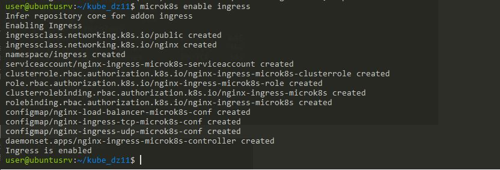
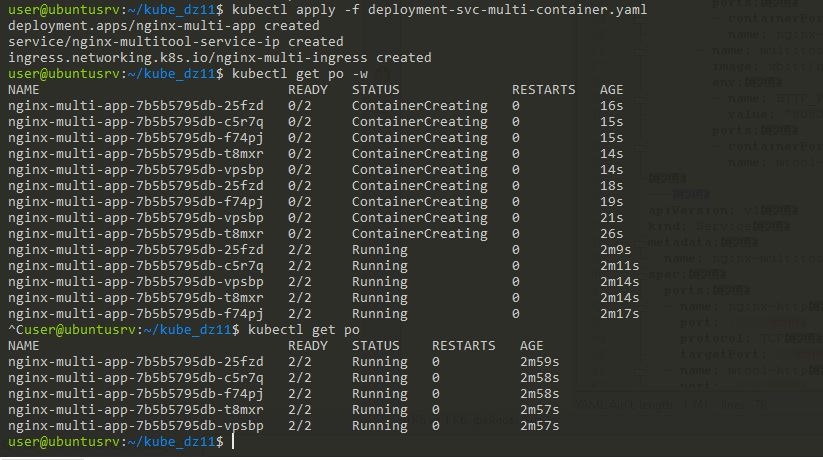

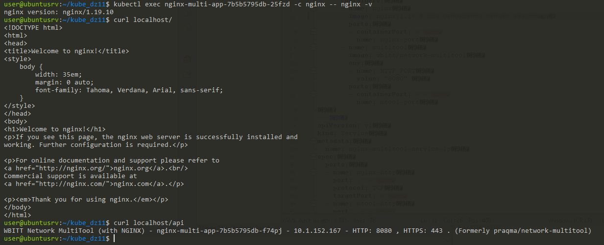


**меняем версию**

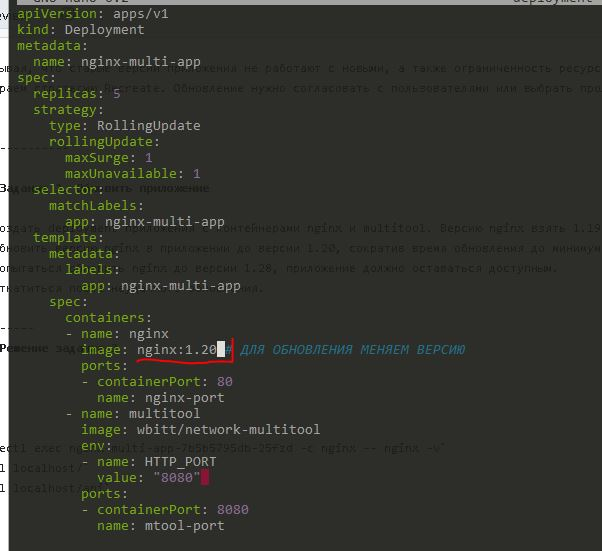

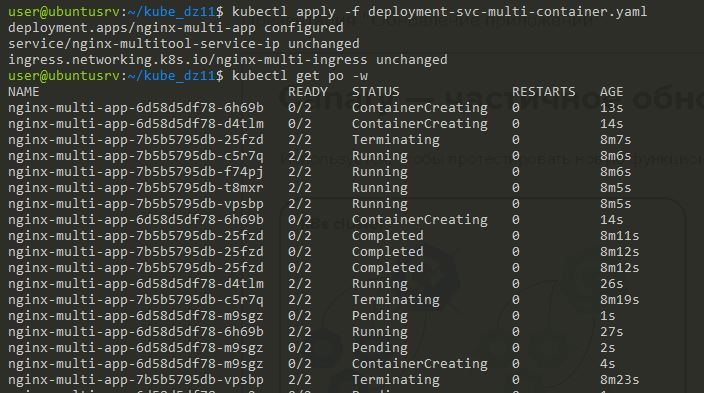


```
kubectl exec nginx-multi-app-7b5b5795db-25fzd -c nginx -- nginx -v
curl localhost/
curl localhost/api
```

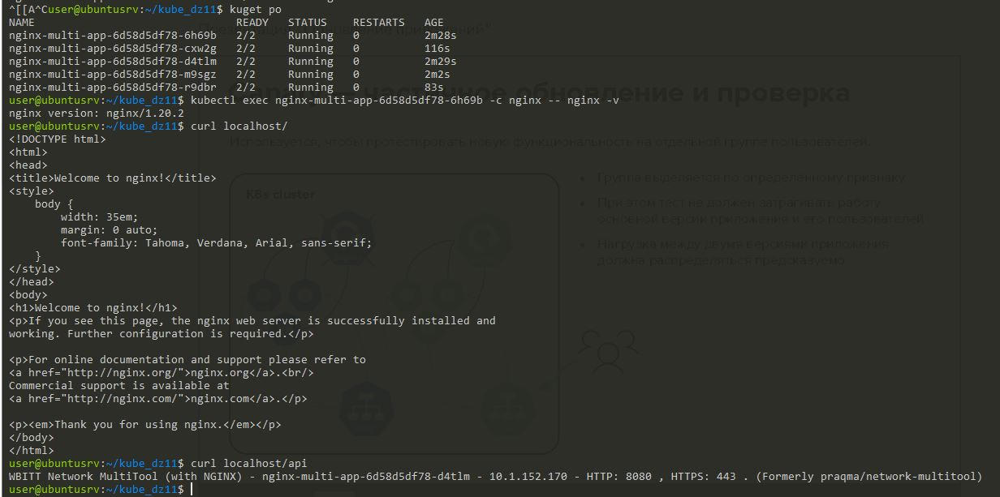


**меняем версию**

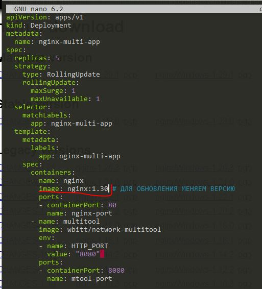

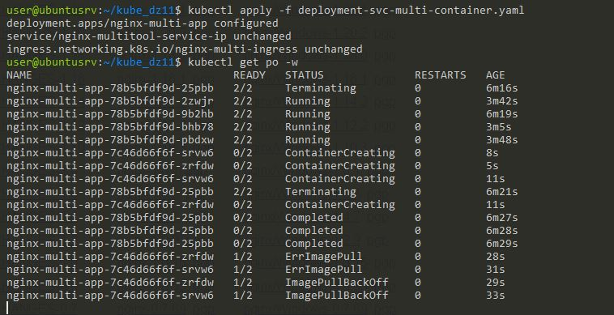

**Обновление застопорилось**
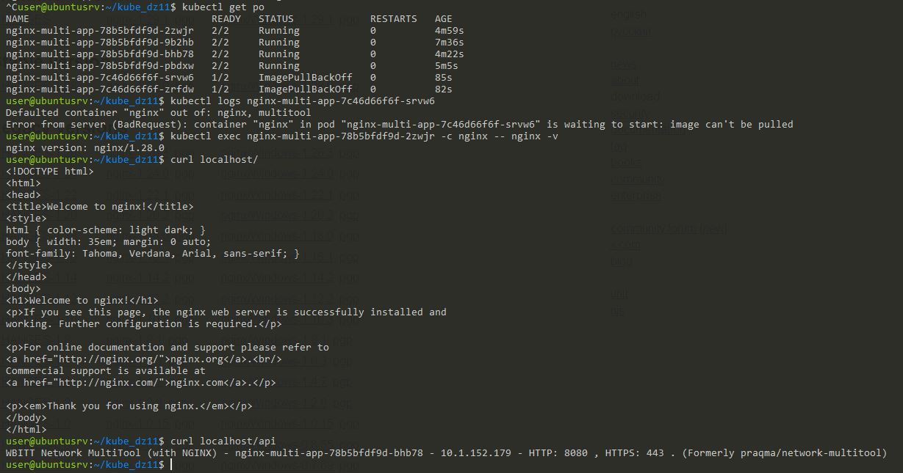


**смотрим историю и откатываемся**

'kubectl rollout history deployment'

первая запись это v 1.19, вторая 1.20, третья 1.28, четвертая - попытка на 1.30.
Откатимся на вторую, с версией 1.20.

 `kubectl rollout undo deployment nginx-multi-app --to-revision 2`

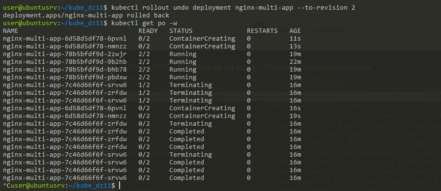


**итого получаем версию 1.20**

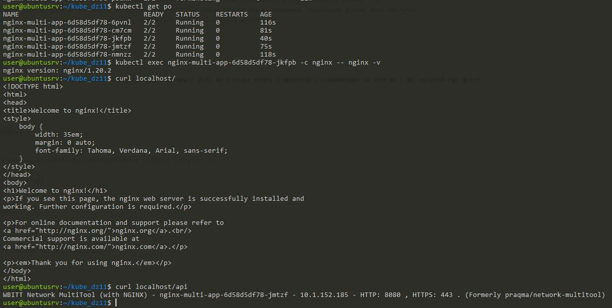

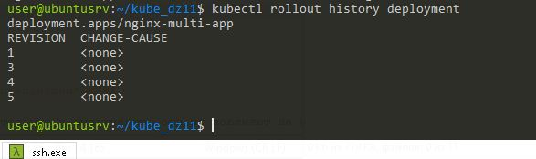

-----------


## Дополнительные задания — со звёздочкой*

Задания дополнительные, необязательные к выполнению, они не повлияют на получение зачёта по домашнему заданию. **Но мы настоятельно рекомендуем вам выполнять все задания со звёздочкой.** Это поможет лучше разобраться в материале.   

### Задание 3*. Создать Canary deployment

1. Создать два deployment'а приложения nginx.
2. При помощи разных ConfigMap сделать две версии приложения — веб-страницы.
3. С помощью ingress создать канареечный деплоймент, чтобы можно было часть трафика перебросить на разные версии приложения.

### Правила приёма работы

1. Домашняя работа оформляется в своем Git-репозитории в файле README.md. Выполненное домашнее задание пришлите ссылкой на .md-файл в вашем репозитории.
2. Файл README.md должен содержать скриншоты вывода необходимых команд, а также скриншоты результатов.
3. Репозиторий должен содержать тексты манифестов или ссылки на них в файле README.md.
