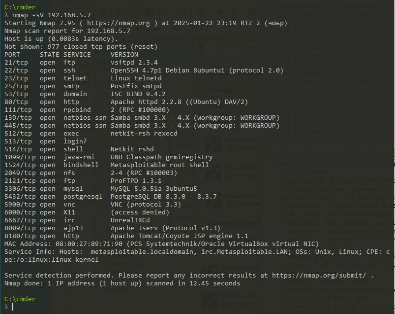

# Домашнее задание к занятию «Уязвимости и атаки на информационные системы»

### Инструкция по выполнению домашнего задания

1. Сделайте fork [репозитория c шаблоном решения](https://github.com/netology-code/sys-pattern-homework) к себе в Github и переименуйте его по названию или номеру занятия, например, https://github.com/имя-вашего-репозитория/gitlab-hw или https://github.com/имя-вашего-репозитория/8-03-hw).
2. Выполните клонирование этого репозитория к себе на ПК с помощью команды `git clone`.
3. Выполните домашнее задание и заполните у себя локально этот файл README.md:
   - впишите вверху название занятия и ваши фамилию и имя;
   - в каждом задании добавьте решение в требуемом виде: текст/код/скриншоты/ссылка;
   - для корректного добавления скриншотов воспользуйтесь инструкцией [«Как вставить скриншот в шаблон с решением»](https://github.com/netology-code/sys-pattern-homework/blob/main/screen-instruction.md);
   - при оформлении используйте возможности языка разметки md. Коротко об этом можно посмотреть в [инструкции по MarkDown](https://github.com/netology-code/sys-pattern-homework/blob/main/md-instruction.md).
4. После завершения работы над домашним заданием сделайте коммит (`git commit -m "comment"`) и отправьте его на Github (`git push origin`).
5. Для проверки домашнего задания преподавателем в личном кабинете прикрепите и отправьте ссылку на решение в виде md-файла в вашем Github.
6. Любые вопросы задавайте в чате учебной группы и/или в разделе «Вопросы по заданию» в личном кабинете.

Желаем успехов в выполнении домашнего задания.

------

### Задание 1

Скачайте и установите виртуальную машину Metasploitable: https://sourceforge.net/projects/metasploitable/.

Это типовая ОС для экспериментов в области информационной безопасности, с которой следует начать при анализе уязвимостей.

Просканируйте эту виртуальную машину, используя **nmap**.

Попробуйте найти уязвимости, которым подвержена эта виртуальная машина.

Сами уязвимости можно поискать на сайте https://www.exploit-db.com/.

Для этого нужно в поиске ввести название сетевой службы, обнаруженной на атакуемой машине, и выбрать подходящие по версии уязвимости.

Ответьте на следующие вопросы:

- Какие сетевые службы в ней разрешены?
- Какие уязвимости были вами обнаружены? (список со ссылками: достаточно трёх уязвимостей)
  
*Приведите ответ в свободной форме.*  

**Уязвимости**

[OpenSSH < 7.4 - agent Protocol Arbitrary Library Loading](https://www.exploit-db.com/exploits/40963)

[Webfroot Shoutbox < 2.32 (Apache) - Local File Inclusion / Remote Code Execution](https://www.exploit-db.com/exploits/34)

[ProFTPd IAC 1.3.x - Remote Command Execution](https://www.exploit-db.com/exploits/15449)

### Задание 2

Проведите сканирование Metasploitable в режимах SYN, FIN, Xmas, UDP.

Запишите сеансы сканирования в Wireshark.

Ответьте на следующие вопросы:

- Чем отличаются эти режимы сканирования с точки зрения сетевого трафика?
- Как отвечает сервер?

*Приведите ответ в свободной форме.*

Метод TCP SYN —  сканирование с установкой полуоткрытого соединения, так как соединение не устанавливается до конца. На исследуемый порт посылается сообщение SYN, затем идет ожидание ответа. Ответы SYN/ACK говорят о том, что порт прослушивается (открыт), а ответ RST говорит о том, что не прослушивается.

Метод FIN - устанавливается бит TCP FIN в заголовке TCP. Основан на особенности спецификации RFC 793, согласно которой при закрытом порте входящий сегмент, не содержащий RST, повлечет за собой отправку RST в ответ. Когда порт открыт, ответа не будет. Ошибка достижимости ICMP означает, что порт фильтруется. С флагом FIN можно пройти фаирволл

Метод Xmas - устанавливаются флаги FIN, PSH и URG в заголовке TCP. Основан на особенности спецификации RFC 793, согласно которой при закрытом порте входящий сегмент, не содержащий RST, повлечет за собой отправку RST в ответ. Когда порт открыт, ответа не будет. Ошибка достижимости ICMP означает, что порт фильтруется. 

Метод UDP для определения статуса порта посылается пустой UDP-заголовок, и если в ответ приходит ошибка достижимости ICMP Destination Unreachable с кодом Destination port unreachable, это значит, что порт закрыт; другие ошибки достижимости ICMP (Destination host unreachable, Destination protocol unreachable, Network administratively prohibited, Host administratively prohibited, Communication administratively prohibited) означают, что порт фильтруется. Если порт отвечает UDP-пакетом, значит, он открыт.
