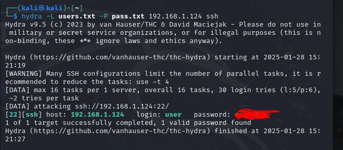
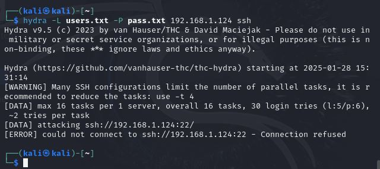

# Домашнее задание к занятию «Защита сети»

### Инструкция по выполнению домашнего задания

1. Сделайте fork [репозитория c шаблоном решения](https://github.com/netology-code/sys-pattern-homework) к себе в Github и переименуйте его по названию или номеру занятия, например, https://github.com/имя-вашего-репозитория/gitlab-hw или https://github.com/имя-вашего-репозитория/8-03-hw).
2. Выполните клонирование этого репозитория к себе на ПК с помощью команды `git clone`.
3. Выполните домашнее задание и заполните у себя локально этот файл README.md:
   - впишите вверху название занятия и ваши фамилию и имя;
   - в каждом задании добавьте решение в требуемом виде: текст/код/скриншоты/ссылка;
   - для корректного добавления скриншотов воспользуйтесь инструкцией [«Как вставить скриншот в шаблон с решением»](https://github.com/netology-code/sys-pattern-homework/blob/main/screen-instruction.md);
   - при оформлении используйте возможности языка разметки md. Коротко об этом можно посмотреть в [инструкции по MarkDown](https://github.com/netology-code/sys-pattern-homework/blob/main/md-instruction.md).
4. После завершения работы над домашним заданием сделайте коммит (`git commit -m "comment"`) и отправьте его на Github (`git push origin`).
5. Для проверки домашнего задания преподавателем в личном кабинете прикрепите и отправьте ссылку на решение в виде md-файла в вашем Github.
6. Любые вопросы задавайте в чате учебной группы и/или в разделе «Вопросы по заданию» в личном кабинете.

Желаем успехов в выполнении домашнего задания.

------

### Подготовка к выполнению заданий

1. Подготовка защищаемой системы:

- установите **Suricata**,
- установите **Fail2Ban**.

2. Подготовка системы злоумышленника: установите **nmap** и **thc-hydra** либо скачайте и установите **Kali linux**.

Обе системы должны находится в одной подсети.

------

### Задание 1

Проведите разведку системы и определите, какие сетевые службы запущены на защищаемой системе:

**sudo nmap -sA < ip-адрес >**

**sudo nmap -sT < ip-адрес >**

**sudo nmap -sS < ip-адрес >**

**sudo nmap -sV < ip-адрес >**

По желанию можете поэкспериментировать с опциями: https://nmap.org/man/ru/man-briefoptions.html.


*В качестве ответа пришлите события, которые попали в логи Suricata и Fail2Ban, прокомментируйте результат.*

```
user@ubunty-srv:~$ tail -f /var/log/suricata/fast.log
01/28/2025-20:07:25.436896  [**] [1:2010939:3] ET SCAN Suspicious inbound to PostgreSQL port 5432 [**] [Classification: Potentially Bad Traffic] [Priority: 2] {TCP} 192.168.1.146:57913 -> 192.168.1.124:5432
01/28/2025-20:07:25.482520  [**] [1:2002910:6] ET SCAN Potential VNC Scan 5800-5820 [**] [Classification: Attempted Information Leak] [Priority: 2] {TCP} 192.168.1.146:57913 -> 192.168.1.124:5801
01/28/2025-20:07:25.482520  [**] [1:2002910:6] ET SCAN Potential VNC Scan 5800-5820 [**] [Classification: Attempted Information Leak] [Priority: 2] {TCP} 192.168.1.146:57913 -> 192.168.1.124:5801
01/28/2025-20:07:25.624818  [**] [1:2010935:3] ET SCAN Suspicious inbound to MSSQL port 1433 [**] [Classification: Potentially Bad Traffic] [Priority: 2] {TCP} 192.168.1.146:57913 -> 192.168.1.124:1433
01/28/2025-20:07:25.624818  [**] [1:2010935:3] ET SCAN Suspicious inbound to MSSQL port 1433 [**] [Classification: Potentially Bad Traffic] [Priority: 2] {TCP} 192.168.1.146:57913 -> 192.168.1.124:1433
01/28/2025-20:09:17.839370  [**] [1:2010937:3] ET SCAN Suspicious inbound to mySQL port 3306 [**] [Classification: Potentially Bad Traffic] [Priority: 2] {TCP} 192.168.1.146:57697 -> 192.168.1.124:3306
01/28/2025-20:09:18.020387  [**] [1:2010936:3] ET SCAN Suspicious inbound to Oracle SQL port 1521 [**] [Classification: Potentially Bad Traffic] [Priority: 2] {TCP} 192.168.1.146:57697 -> 192.168.1.124:1521
01/28/2025-20:09:18.063662  [**] [1:2010935:3] ET SCAN Suspicious inbound to MSSQL port 1433 [**] [Classification: Potentially Bad Traffic] [Priority: 2] {TCP} 192.168.1.146:57697 -> 192.168.1.124:1433
01/28/2025-20:09:18.136858  [**] [1:2010939:3] ET SCAN Suspicious inbound to PostgreSQL port 5432 [**] [Classification: Potentially Bad Traffic] [Priority: 2] {TCP} 192.168.1.146:57697 -> 192.168.1.124:5432
01/28/2025-20:09:18.845711  [**] [1:2002910:6] ET SCAN Potential VNC Scan 5800-5820 [**] [Classification: Attempted Information Leak] [Priority: 2] {TCP} 192.168.1.146:57697 -> 192.168.1.124:5810
01/28/2025-20:11:54.184542  [**] [1:2010937:3] ET SCAN Suspicious inbound to mySQL port 3306 [**] [Classification: Potentially Bad Traffic] [Priority: 2] {TCP} 192.168.1.146:35694 -> 192.168.1.124:3306
01/28/2025-20:11:54.184542  [**] [1:2010937:3] ET SCAN Suspicious inbound to mySQL port 3306 [**] [Classification: Potentially Bad Traffic] [Priority: 2] {TCP} 192.168.1.146:35694 -> 192.168.1.124:3306
01/28/2025-20:11:54.409581  [**] [1:2010935:3] ET SCAN Suspicious inbound to MSSQL port 1433 [**] [Classification: Potentially Bad Traffic] [Priority: 2] {TCP} 192.168.1.146:35694 -> 192.168.1.124:1433
01/28/2025-20:11:54.409581  [**] [1:2010935:3] ET SCAN Suspicious inbound to MSSQL port 1433 [**] [Classification: Potentially Bad Traffic] [Priority: 2] {TCP} 192.168.1.146:35694 -> 192.168.1.124:1433
01/28/2025-20:11:54.734498  [**] [1:2010939:3] ET SCAN Suspicious inbound to PostgreSQL port 5432 [**] [Classification: Potentially Bad Traffic] [Priority: 2] {TCP} 192.168.1.146:35694 -> 192.168.1.124:5432
01/28/2025-20:11:54.734498  [**] [1:2010939:3] ET SCAN Suspicious inbound to PostgreSQL port 5432 [**] [Classification: Potentially Bad Traffic] [Priority: 2] {TCP} 192.168.1.146:35694 -> 192.168.1.124:5432
01/28/2025-20:11:54.756391  [**] [1:2002910:6] ET SCAN Potential VNC Scan 5800-5820 [**] [Classification: Attempted Information Leak] [Priority: 2] {TCP} 192.168.1.146:35694 -> 192.168.1.124:5811
01/28/2025-20:11:54.756391  [**] [1:2002910:6] ET SCAN Potential VNC Scan 5800-5820 [**] [Classification: Attempted Information Leak] [Priority: 2] {TCP} 192.168.1.146:35694 -> 192.168.1.124:5811
01/28/2025-20:11:54.868313  [**] [1:2010936:3] ET SCAN Suspicious inbound to Oracle SQL port 1521 [**] [Classification: Potentially Bad Traffic] [Priority: 2] {TCP} 192.168.1.146:35694 -> 192.168.1.124:1521
01/28/2025-20:11:54.868313  [**] [1:2010936:3] ET SCAN Suspicious inbound to Oracle SQL port 1521 [**] [Classification: Potentially Bad Traffic] [Priority: 2] {TCP} 192.168.1.146:35694 -> 192.168.1.124:1521
^@01/28/2025-20:12:43.480384  [**] [1:2010937:3] ET SCAN Suspicious inbound to mySQL port 3306 [**] [Classification: Potentially Bad Traffic] [Priority: 2] {TCP} 192.168.1.146:48322 -> 192.168.1.124:3306
01/28/2025-20:12:43.480384  [**] [1:2010937:3] ET SCAN Suspicious inbound to mySQL port 3306 [**] [Classification: Potentially Bad Traffic] [Priority: 2] {TCP} 192.168.1.146:48322 -> 192.168.1.124:3306
01/28/2025-20:12:43.856542  [**] [1:2010939:3] ET SCAN Suspicious inbound to PostgreSQL port 5432 [**] [Classification: Potentially Bad Traffic] [Priority: 2] {TCP} 192.168.1.146:51506 -> 192.168.1.124:5432
01/28/2025-20:12:43.856542  [**] [1:2010939:3] ET SCAN Suspicious inbound to PostgreSQL port 5432 [**] [Classification: Potentially Bad Traffic] [Priority: 2] {TCP} 192.168.1.146:51506 -> 192.168.1.124:5432
01/28/2025-20:12:43.908565  [**] [1:2010935:3] ET SCAN Suspicious inbound to MSSQL port 1433 [**] [Classification: Potentially Bad Traffic] [Priority: 2] {TCP} 192.168.1.146:35316 -> 192.168.1.124:1433
01/28/2025-20:12:43.908565  [**] [1:2010935:3] ET SCAN Suspicious inbound to MSSQL port 1433 [**] [Classification: Potentially Bad Traffic] [Priority: 2] {TCP} 192.168.1.146:35316 -> 192.168.1.124:1433
01/28/2025-20:12:43.951439  [**] [1:2010936:3] ET SCAN Suspicious inbound to Oracle SQL port 1521 [**] [Classification: Potentially Bad Traffic] [Priority: 2] {TCP} 192.168.1.146:58660 -> 192.168.1.124:1521
01/28/2025-20:12:43.951439  [**] [1:2010936:3] ET SCAN Suspicious inbound to Oracle SQL port 1521 [**] [Classification: Potentially Bad Traffic] [Priority: 2] {TCP} 192.168.1.146:58660 -> 192.168.1.124:1521
01/28/2025-20:13:14.327870  [**] [1:2010937:3] ET SCAN Suspicious inbound to mySQL port 3306 [**] [Classification: Potentially Bad Traffic] [Priority: 2] {TCP} 192.168.1.146:35954 -> 192.168.1.124:3306
01/28/2025-20:13:14.327870  [**] [1:2010937:3] ET SCAN Suspicious inbound to mySQL port 3306 [**] [Classification: Potentially Bad Traffic] [Priority: 2] {TCP} 192.168.1.146:35954 -> 192.168.1.124:3306
01/28/2025-20:13:14.384870  [**] [1:2010936:3] ET SCAN Suspicious inbound to Oracle SQL port 1521 [**] [Classification: Potentially Bad Traffic] [Priority: 2] {TCP} 192.168.1.146:35954 -> 192.168.1.124:1521
01/28/2025-20:13:14.384870  [**] [1:2010936:3] ET SCAN Suspicious inbound to Oracle SQL port 1521 [**] [Classification: Potentially Bad Traffic] [Priority: 2] {TCP} 192.168.1.146:35954 -> 192.168.1.124:1521
01/28/2025-20:13:14.411339  [**] [1:2010939:3] ET SCAN Suspicious inbound to PostgreSQL port 5432 [**] [Classification: Potentially Bad Traffic] [Priority: 2] {TCP} 192.168.1.146:35954 -> 192.168.1.124:5432
01/28/2025-20:13:14.411339  [**] [1:2010939:3] ET SCAN Suspicious inbound to PostgreSQL port 5432 [**] [Classification: Potentially Bad Traffic] [Priority: 2] {TCP} 192.168.1.146:35954 -> 192.168.1.124:5432
01/28/2025-20:13:14.701635  [**] [1:2002910:6] ET SCAN Potential VNC Scan 5800-5820 [**] [Classification: Attempted Information Leak] [Priority: 2] {TCP} 192.168.1.146:35954 -> 192.168.1.124:5810
01/28/2025-20:13:14.701635  [**] [1:2002910:6] ET SCAN Potential VNC Scan 5800-5820 [**] [Classification: Attempted Information Leak] [Priority: 2] {TCP} 192.168.1.146:35954 -> 192.168.1.124:5810
01/28/2025-20:13:14.828037  [**] [1:2010935:3] ET SCAN Suspicious inbound to MSSQL port 1433 [**] [Classification: Potentially Bad Traffic] [Priority: 2] {TCP} 192.168.1.146:35954 -> 192.168.1.124:1433
01/28/2025-20:13:14.828037  [**] [1:2010935:3] ET SCAN Suspicious inbound to MSSQL port 1433 [**] [Classification: Potentially Bad Traffic] [Priority: 2] {TCP} 192.168.1.146:35954 -> 192.168.1.124:1433
```

__ASK сканирование в логе не фиксируется, остальные типы сканирвоания распознаются как потенциально плохой трафик_


------

### Задание 2

Проведите атаку на подбор пароля для службы SSH:

**hydra -L users.txt -P pass.txt < ip-адрес > ssh**

1. Настройка **hydra**: 
 
 - создайте два файла: **users.txt** и **pass.txt**;
 - в каждой строчке первого файла должны быть имена пользователей, второго — пароли. В нашем случае это могут быть случайные строки, но ради эксперимента можете добавить имя и пароль существующего пользователя.

Дополнительная информация по **hydra**: https://kali.tools/?p=1847.



2. Включение защиты SSH для Fail2Ban:

-  открыть файл /etc/fail2ban/jail.conf,
-  найти секцию **ssh**,
-  установить **enabled**  в **true**.

Дополнительная информация по **Fail2Ban**:https://putty.org.ru/articles/fail2ban-ssh.html.

Подбор заблокирован


*В качестве ответа пришлите события, которые попали в логи Suricata и Fail2Ban, прокомментируйте результат.*

Лог Suricata
```
c Protocol Command Decode] [Priority: 3] {TCP} 192.168.1.124:22 -> 192.168.1.146:57772
01/28/2025-20:21:26.291161  [**] [1:2228000:1] SURICATA SSH invalid banner [**] [Classification: Generic Protocol Command Decode] [Priority: 3] {TCP} 192.168.1.124:22 -> 192.168.1.146:57772
01/28/2025-20:21:26.291161  [**] [1:2228000:1] SURICATA SSH invalid banner [**] [Classification: Generic Protocol Command Decode] [Priority: 3] {TCP} 192.168.1.124:22 -> 192.168.1.146:57772
01/28/2025-20:21:26.292140  [**] [1:2228000:1] SURICATA SSH invalid banner [**] [Classification: Generic Protocol Command Decode] [Priority: 3] {TCP} 192.168.1.146:57772 -> 192.168.1.124:22
01/28/2025-20:21:26.292140  [**] [1:2228000:1] SURICATA SSH invalid banner [**] [Classification: Generic Protocol Command Decode] [Priority: 3] {TCP} 192.168.1.146:57772 -> 192.168.1.124:22
01/28/2025-20:21:26.479223  [**] [1:2003068:7] ET SCAN Potential SSH Scan OUTBOUND [**] [Classification: Attempted Information Leak] [Priority: 2] {TCP} 192.168.1.146:57800 -> 192.168.1.124:22
01/28/2025-20:21:26.479223  [**] [1:2003068:7] ET SCAN Potential SSH Scan OUTBOUND [**] [Classification: Attempted Information Leak] [Priority: 2] {TCP} 192.168.1.146:57800 -> 192.168.1.124:22
01/28/2025-20:21:26.538691  [**] [1:2003068:7] ET SCAN Potential SSH Scan OUTBOUND [**] [Classification: Attempted Information Leak] [Priority: 2] {TCP} 192.168.1.146:57860 -> 192.168.1.124:22
01/28/2025-20:21:26.538691  [**] [1:2003068:7] ET SCAN Potential SSH Scan OUTBOUND [**] [Classification: Attempted Information Leak] [Priority: 2] {TCP} 192.168.1.146:57860 -> 192.168.1.124:22
01/28/2025-20:21:26.557424  [**] [1:2260002:1] SURICATA Applayer Detect protocol only one direction [**] [Classification: Generic Protocol Command Decode] [Priority: 3] {TCP} 192.168.1.124:22 -> 192.168.1.146:57862
01/28/2025-20:21:26.557424  [**] [1:2228000:1] SURICATA SSH invalid banner [**] [Classification: Generic Protocol Command Decode] [Priority: 3] {TCP} 192.168.1.124:22 -> 192.168.1.146:57862
01/28/2025-20:21:26.557424  [**] [1:2260002:1] SURICATA Applayer Detect protocol only one direction [**] [Classification: Generic Protocol Command Decode] [Priority: 3] {TCP} 192.168.1.124:22 -> 192.168.1.146:57862
01/28/2025-20:21:26.557424  [**] [1:2228000:1] SURICATA SSH invalid banner [**] [Classification: Generic Protocol Command Decode] [Priority: 3] {TCP} 192.168.1.124:22 -> 192.168.1.146:57862
01/28/2025-20:21:26.572495  [**] [1:2228000:1] SURICATA SSH invalid banner [**] [Classification: Generic Protocol Command Decode] [Priority: 3] {TCP} 192.168.1.146:57862 -> 192.168.1.124:22
01/28/2025-20:21:26.572495  [**] [1:2228000:1] SURICATA SSH invalid banner [**] [Classification: Generic Protocol Command Decode] [Priority: 3] {TCP} 192.168.1.146:57862 -> 192.168.1.124:22
01/28/2025-20:21:27.299314  [**] [1:2003068:7] ET SCAN Potential SSH Scan OUTBOUND [**] [Classification: Attempted Information Leak] [Priority: 2] {TCP} 192.168.1.146:57892 -> 192.168.1.124:22
01/28/2025-20:21:27.299314  [**] [1:2003068:7] ET SCAN Potential SSH Scan OUTBOUND [**] [Classification: Attempted Information Leak] [Priority: 2] {TCP} 192.168.1.146:57892 -> 192.168.1.124:22
```
ругается на сканирвоание  SSH

Лог Fail2ban


